# Generation Time Data, Tables, Figures and Statistical tests

This notebook contains all the scripts coded to produce all the data, tables and figures and perform statistical tests in the *Different historical generation intervals in human populations inferred from Neanderthal fragment lengths and patterns of mutation accumulation* manuscript.

To be able to run all chunks below, you need to have in the same directory as this Jupyter notebook the following files:

- [ Data1_archaicfragments.txt ](../Data1_archaicfragments.txt)

    This data is the collection of archaic fragments called in this manuscript for all Eurasian and American individuals in the SGDP data and 6 ancient human individuals ([Mallick S et al.](https://doi.org/10.1038/nature18964)). It is provided in this GitHub page. To produce it we followed the steps described in the manuscript and detailed in https://github.com/LauritsSkov/Introgression-detection. Specific details for the ancient genomes are explained in the Supplementary Information of the manuscript.

- [ Data2_mutation_spectrum.txt ](../Data2_mutation_spectrum.txt)

    This data is the counts of the 96-mutation types (focal mutation ancestral and derived allele with it's 5' and 3' context) for each Eurasian and American individuals in the SGDP data. The counts are further subdivided per chromosome. Particularrities for the sex chromosomes are descrived in the manuscript. This data is provided in this GitHub page. To produce it we followed the steps described in the manuscript and detailed in https://github.com/MoiColl/TheGenerationTimeProject/tree/main/MutationAccumulation.

- [ Data3_HGDParchaicfragments.txt ](../Data3_HGDParchaicfragments.txt)

    This data is the collection of archaic fragments called in this manuscript for the individuals belonging to X,Y,Z and K in the HGDP data ([Bergström A et al.](https://doi.org/10.1126/science.aay5012)). It is provided in this GitHub page. To produce it, we followed the steps described in the manuscript and detailed in https://github.com/LauritsSkov/Introgression-detection.

- [ CGenrichment.txt ](../CGenrichment.txt)

    This data corresponds to the counts of C>G and nonC>G mutations in C>G enriched regions and nonC>G enriched regions (as described in [Jónsson H et al.](https://doi.org/10.1038/nature24018) for all Eurasian and American individuals in the SGDP per chromosome. It is provided in this GitHub page. To produce it, we followed the steps described in the manuscript and detailed in https://github.com/MoiColl/TheGenerationTimeProject/tree/main/MutationAccumulation.

- SGDP.ind

    This is a modified list of the individuals used from the SGDP data ([Mallick S et al.](https://doi.org/10.1038/nature18964)). Compared to the original list, we indicate the region of each individual instead of its population of origin. The original list can be downloaded as part of the SGDP dataset from https://sharehost.hms.harvard.edu/genetics/reich_lab/sgdp/cteam_lite/cteam_lite_public3.tar. We provide our modified version in https://github.com/MoiColl/TheGenerationTimeProject/blob/main/MutationAccumulation/SGDP.ind.

- Href.fa

    This is the human reference genome in fasta format provided in the SGDP data (https://sharehost.hms.harvard.edu/genetics/reich_lab/sgdp/cteam_lite/cteam_lite_public3.tar).

- name_lat_long.txt

    This is a a modified file from the original SGDP metadata file (https://sharehost.hms.harvard.edu/genetics/reich_lab/sgdp/SGDP_metadata.279public.21signedLetter.44Fan.samples.txt) with the selected columns corresponding to the individual name and corresponding latitude and longitude. 

- [ downsampled_WestEurasia.txt ](../downsampled_WestEurasia.txt)

    This is a file produced in this Jupyter notebook with a random list of 45 WestEurasia individuals. To reproduce the results form the manuscript, we recomend to keep the original file provided in this GitHub page.


- aau1043_DataS7.tsv and aau1043_DataS5_revision1_context.tsv

    This two files correspond to the metadata and a modified version of *de novo* mutations call files provided in [Halldorsson BV et al.](https://doi.org/10.1126/science.aau1043) as suppementary data. The original aau1043_DataS5_revision1.tsv was modified such that aau1043_DataS5_revision1_context.tsv incorporated the mutational context (5' and 3' contiguous base pairs) annotated. The specific method is described in https://github.com/MoiColl/TheGenerationTimeProject/tree/main/MutationAccumulation.

- hg19/\<pop\>/*_recombination_map_hapmap_format_hg19_chr_*.txt

    The recombination maps for each population are downloaded from https://github.com/popgenmethods/pyrho#human-recombination-maps ([Spence JP & Song YS](https://doi.org/10.1126/sciadv.aaw9206)). Once the recombination maps for the hg19 assemblies were downloaded, we renamed the populations of 1000 Genomes Project according to [ SI Table 4 ](#SupTab4).


<a name="HomeHome"></a>

## Contents

0. [ Library and packages ](#Lib)
1. [ Functions ](#Fun)
    + 1. [Python Functions](#Pyf)
    + 2. [R Functions](#Rfu)
2. [ Tables ](#Tab)
    + 1. [ Supplementary Tables ](#SubTab)
            - [ SI Table 1 ](#SupTab1)
            - [ SI Table 2 ](#SupTab2)
            - [ SI Table 3 ](#SupTab3)
            - [ SI Table 4 ](#SupTab4)
            - [ SI Table 5 ](#SupTab5)
            - [ SI Table 6 ](#SupTab6)
                - [ Downsampling West Eurasian individuals ](#Down)
            - [ SI Table 7 ](#SupTab7)
            - [ SI Table 8 ](#SupTab8)
            - [ SI Table 9 ](#SupTab9)
            - [ SI Table 10 ](#SupTab10)
            - [ SI Table 11 ](#SupTab11)
            - [ SI Table 12 ](#SupTab12)
            - [ SI Table 13 ](#SupTab13)
    
3. [ Figures ](#Fig)
    + 1. [ Main figures ](#MaiFig)
        - [ Figure 1 ](#MaiFig1)
        - [ Figure 2 ](#MaiFig2)
        - [ Figure 3 ](#MaiFig3)
        - [ Figure 4 ](#MaiFig4)
    + 2. [ Supplementary Figures ](#SupFig)
        - [ SI Figure 1 ](#SupFig1)
        - [ SI Figure 2 ](#SupFig2)
        - [ SI Figure 3 ](#SupFig3)
        - [ SI Figure 4 ](#SupFig4)
        - [ SI Figure 5 ](#SupFig5)
        - [ SI Figure 6 ](#SupFig6)
        - [ SI Figure 7 ](#SupFig7)
        - [ SI Figure 8 ](#SupFig8)
        - [ SI Figure 9 ](#SupFig9)
        - [ SI Figure 10 ](#SupFig10)
        - [ SI Figure 11 ](#SupFig11)
        - [ SI Figure 12 ](#SupFig12)
        - [ SI Figure 13 ](#SupFig13)
        - [ SI Figure 14 ](#SupFig14)
        - [ SI Figure 15 ](#SupFig15)
        - [ SI Figure 16 ](#SupFig16)
        - [ SI Figure 17 ](#SupFig17)

4. [ Statistical test ](#Sta)
    + 1.  [ Difference average archaic fragment length among regions ](#Sta1)
    + 2.  [ Difference mean number archaic fragments among regions ](#Sta2)
    + 3.  [ Difference mean archaic sequence among regions ](#Sta3)
    + 4.  [ Difference average overlapping archaic fragment length among West Eurasians and East Asians ](#Sta4)
    + 5.  [ Difference accumulation of derived alleles among regions ](#Sta5)
    + 6.  [ Difference accumulation of derived alleles among West Eurasians and East Asians ](#Sta6)
    + 7.  [ Linear model slopes correlation between the SGDP and deCODE ](#Sta7)
    + 8.  [ Difference X-to-A ratio among regions ](#Sta8)
    + 9.  [ Difference CGenrichment ratio among regions ](#Sta9)
    + 10. [ Difference accumulation of derived alleles on Y chromosome among regions ](#Sta10)
    + 11. [ Adjusted R-squared for the correlation between mean archaic fragment length and fraction of TCC>TTC derived alleles ](#Sta11)
    + 12. [ Difference average archaic fragment length among regions in genetic and physical distances ](#Sta12)
    + 13. [ Difference average archaic fragment length among homogeneous populations ](#Sta13)

<a name="Lib"></a>
## 0. Library and packages


```python
#python version = 3.8.3
import pandas as pd                    #version = 1.0.4
import numpy as np                     #version = 1.18.5
from rpy2.robjects import r, pandas2ri #version = 3.3.2
import os
from collections import defaultdict

%load_ext rpy2.ipython
pandas2ri.activate()
```


```r
%%R

#Load Packages
library(ggplot2)  #r-ggplot2  version = 3.3.2
library(dplyr)    #r-dplyr    version = 1.4.4
library(tidyr)    #r-tidyr    version = 1.1.0
library(cowplot)  #r-cowplot  version = 1.0.0
library(stringr)  #r-stringr  version = 1.4.0
library(knitr)    #r-knitr    version = 1.22
library(maptools) #r-maptools version = 0.9_5
library(maps)     #r-maps     version = 3.3.0
library(ggridges) #r-ggridges version = 0.5.2
library(grid)     

#Options for dplyr summarise function
options(dplyr.summarise.inform = FALSE)

#Population colors
reg_colors <- c("WestEurasia" = "#0474bc", "SouthAsia" = "#804474", "CentralAsiaSiberia" = "#fcd337", "EastAsia" = "#34bc2c", "America" = "#fc4c3c")

#Theme set for all plots (Theme, font and font size)
theme_set(theme_light() + theme(axis.title   = element_text(family = "Helvetica", size = 7), axis.text   = element_text(family = "Helvetica", size = 5),
                                legend.title = element_text(family = "Helvetica", size = 5), legend.text = element_text(family = "Helvetica", size = 5)))

```

    R[write to console]: Registered S3 methods overwritten by 'ggplot2':
      method         from 
      [.quosures     rlang
      c.quosures     rlang
      print.quosures rlang
    
    R[write to console]: 
    Attaching package: ‘dplyr’
    
    
    R[write to console]: The following objects are masked from ‘package:stats’:
    
        filter, lag
    
    
    R[write to console]: The following objects are masked from ‘package:base’:
    
        intersect, setdiff, setequal, union
    
    
    R[write to console]: Loading required package: sp
    
    R[write to console]: Checking rgeos availability: TRUE
    


<a name="Fun"></a>
## 1. Functions and Global Variables
<a name="Pyf"></a>
### A. Python Functions and Global Variables


```python
regions   = ["WestEurasia", "SouthAsia", "America", "CentralAsiaSiberia", "EastAsia"]
ancient   = ["UstIshim", "Yana1", "Sunghir3", "Kolyma", "Loschbour", "Stuttgart"]
muttypes9 = ["T>A", "T>C", "T>G", "C>A", "C>T", "C>G", "CpG>TpG", "C>T'", "TCC>TTC"]

np.random.seed(129306)
```


```python
#1
def bootstrap(arr, iterations = 100000):
    '''
    - Input:
        - arr        : numpy array with the values which are going to be bootstraped
        - iterations : number of bootstraps performed. Default = 10e5
    - Output:
        - list with two values: 
            - mean among all bootstraped means
            - se estimation as standard deviation among all the bootstraped means
    '''
    boot = []
    for i in range(iterations):
        boot.append(np.mean(np.random.choice(arr, arr.shape[0], replace = True)))
    return [np.mean(boot), np.std(boot)]

#2
def boot_perregion(df, regions, colname, iterations = 100000):
    '''
    - Input:
        - df         : pandas DataFrame with the statistic that has to be bootstraped (colname) for and a column with the regions of each individual (reg)
        - colname    : column name of the df that will be bootstraped
        - iterations : number of bootstraps performed. Default = 10e5
    - Output
        - numpy array with the bootstraped values for the statistic for each region
    '''
    boot_region = []
    for reg in regions:
        boot_region.append(bootstrap(df[df["reg"] == reg][colname]))
    return np.array(boot_region)

#3
def two_group_diff(df):
    '''
    - Input:
        - df  : pandas Dataframe with two columns:
            - group : the values for which the data is going to be distributed in groups
            - value : values for which the difference between the groups' means is going to be computed
    - Output:
        - difference between the group means
    '''
    means = df.groupby('group', as_index=False, group_keys=False)["value"].agg('mean')
    return means["value"][1] - means["value"][0]

#4
def permutation_two_group_diff(df, n_perm = 100000):
    '''
    - Input:
        - df  : pandas Dataframe with two columns:
            - group : the values for which the data is going to be distributed in groups
            - value : values for which the difference between the groups' means is going to be computed
    - Output:
        - diffobs : observed difference between the means of the two groups
        - p       : number of permutations with the same difference value or more extreme than the obseved (diffobs)
    '''
    diffobs = two_group_diff(df)
    p       = 0
    for i in range(n_perm):
        shuffled = pd.DataFrame({"group" : df["group"], "value" : np.random.permutation(df["value"].values)})
        if two_group_diff(shuffled) >= diffobs:
            p += 1

    return diffobs, min(p, n_perm-p)

#5
def fstat(df):
    '''
    - Input:
        - df  : pandas Dataframe with two columns:
            - group : the values for which the data is going to be distributed in groups
            - value : values for which the F statisting among groups is going to be computed
    - Output:
        - F statistic among groups
    '''
    k   = len(pd.unique(df["group"]))
    dfg = k-1
    
    n = df.shape[0]
    dfe = n-k
    
    grouped = df.groupby('group', as_index=False, group_keys=False)["value"].agg(['mean', "count", "var"])
    
    SSg =  (((grouped["mean"]-df["value"].mean())**2)*grouped["count"]).sum()  
    SSe = (grouped["var"]*(grouped["count"]-1)).sum()
    
    MSg = SSg/dfg
    MSe = SSe/dfe
    
    F = MSg/MSe

    return F
#6  
def permutation_fstat(df, n_perm = 100000):
    '''
    - Input:
        - df  : pandas Dataframe with two columns:
            - group : the values for which the data is going to be distributed in groups
            - value : values for which the F statisting among groups is going to be computed
    - Output:
        - Fobs : observed F statistic among the groups
        - p    : number of permutations with the same F statistic value or more extreme than the obseved (Fobs)
    '''
    Fobs = fstat(df)
    p    = 0
    for i in range(n_perm):
        shuffled = pd.DataFrame({"group" : df["group"], "value" : np.random.permutation(df["value"].values)})
        if fstat(shuffled) >= Fobs:
            p += 1

    return Fobs, p
```

<a name="Rfu"></a>
### B. R Functions


```r
%%R

#1.
archaicfragmentstatisticsperind <- function(){
    
    #Returns a dataframe with the different statistics about the archaic fragments in the extant individuals of the SGDP data
    
    read.table("Data1_archaicfragments.txt", head = T)  %>% 
        filter(region %in% c("WestEurasia", "SouthAsia", "America", "CentralAsiaSiberia", "EastAsia")) %>%
        group_by(name, region) %>%
        summarize(num_frag = n(), arch_seq = sum(length), mean_len = mean(length)) %>%
        mutate(region = factor(region, levels = c("WestEurasia", "SouthAsia", "America", "CentralAsiaSiberia", "EastAsia")))
}


#2. 
mutation_spectrum_mean_len_perind <- function(){
    
    #Returns a dataframe with the mean fragment length and number of mutations of each mutation type per individual in the SGDP data
    
    read.table("Data2_mutation_spectrum.txt", header = T) %>% 
            filter(chrom != "X", chrom != "Y") %>%
            mutate(mutation = ifelse(paste(fiv, anc, thr, der,  sep = "") == "TCCT",  "TCCzTTC",  
                                        ifelse(paste(anc, thr, der, sep = "") == "CGT", "CpGzTpG", paste(anc, der, sep = "z")))) %>% 

            group_by(ind, reg, mutation) %>%
            summarise(counts = sum(counts)) %>% 
            spread(mutation, counts) %>%
            mutate(CzTt = CpGzTpG+CzT+TCCzTTC) %>%
            gather("mutation", "counts", 3:11) %>%
            mutate(mutation = str_replace(mutation, "z", ">"),
                   mutation = ifelse(mutation == "C>T", "C>T'", mutation),
                   mutation = ifelse(mutation == "C>Tt", "C>T", mutation),
                   total    = ifelse(mutation %in% c("C>T'", "CpG>TpG", "TCC>TTC"), 0, counts)) %>%
            group_by(ind, reg) %>%
            mutate(total = sum(total)) %>%
            ungroup() %>%
            mutate(frac = counts/total) %>%
            mutate(mutation = factor(mutation, levels = c("T>A", "T>C", "T>G", "C>A", "C>T", "C>G", "C>T'", "CpG>TpG", "TCC>TTC"))) %>%
            full_join(archaicfragmentstatisticsperind() %>% select(ind = name, mean_len), by = c("ind"))
}

#3. 
deCODE_mutation_spectrum_mean_age <- function(min_probands = 2, max_age_diff = 100){
    
    #It outputs the fraction for each mutation type per group of individuals with the same mean parental age
    #The data can be filtered for difference in maternal to paternal age and the minimum number of probands for a particular age
    
    merge(read.table("aau1043_DataS5_revision1_context.tsv", header = T, sep = "\t"),
          read.table("aau1043_DataS7.tsv", header = T, sep = "\t"), by = c("Proband_id")) %>%
        filter(indel == 0) %>%
        mutate(age = (Mother_age+Father_age)/2,
               age_diff = abs(Mother_age-Father_age),
               mutation = ifelse(paste(fiv, ref, thr, alt,  sep = "") == "TCCT",  "TCCzTTC",  
                                            ifelse(paste(ref, thr, alt, sep = "") == "CGT", "CpGzTpG", paste(ref, alt, sep = "z")))) %>%
        filter(age_diff < max_age_diff) %>%
        group_by(Proband_id, age, mutation) %>%
        summarise(counts = n()) %>% 
        spread(mutation, counts, fill = 0) %>%
        mutate(CzTt = CpGzTpG+CzT+TCCzTTC) %>%
        group_by(age) %>%
        mutate(n_probands = n()) %>%
        ungroup() %>%
        gather("mutation", "counts", 3:11) %>%
        mutate(mutation = str_replace(mutation, "z", ">"),
               mutation = ifelse(mutation == "C>T", "C>T'", mutation),
               mutation = ifelse(mutation == "C>Tt", "C>T", mutation)) %>%

        group_by(age, n_probands, mutation) %>%
        summarise(counts = sum(counts)) %>%
        ungroup() %>%
        mutate(total  = ifelse(mutation %in% c("C>T'", "CpG>TpG", "TCC>TTC"), 0, counts)) %>%
        group_by(age, n_probands) %>%
        mutate(total = sum(total),
               frac  = counts/total) %>%
        ungroup() %>%
        filter(n_probands >= min_probands) 
}
```

[](#HomeHome) &nbsp;

&nbsp;

<a name="Tab"></a>
## 2. Tables

<a name="SubTab"></a>
### A. Supplementary Tables

<a name="SupTab1"></a>
#### SI Table 1


```python
archstats = pd.DataFrame({"sample"      : [  "UstIshim",      "Yana1",    "Sunghir3",    "Anzick1",     "Kolyma",  "Loschbour",  "Stuttgart"],
                          "age"         : [     45000  ,      39000  ,      34000   ,      13000  ,      10000  ,       8000  ,       7000  ],
                          "coverage"    : [        37.4,         26.3,         10.75,         14.4,         15.3,         19.9,         18.1],
                          "calledbases" : [1222190614  , 1114080903  , 1245732121   , 1144597852  , 1206453295  , 1241269102  , 1243802585  ],
                          "Ts"          : [     33744  ,      38540  ,      26773   ,      38223  ,      41704  ,      40777  ,      41796  ],
                          "Tv"          : [     17531  ,      18447  ,      13500   ,      14804  ,      20400  ,      19211  ,      19244  ]})

archstats["Ts+Tv"] = archstats["Ts"]+archstats["Tv"]
archstats["Ts/Tv"] = archstats["Ts"]/archstats["Tv"]  

archstats.to_csv("SITab1.txt", sep='\t', index=False)

archstats
```


<div>
<style scoped>
    .dataframe tbody tr th:only-of-type {
        vertical-align: middle;
    }

    .dataframe tbody tr th {
        vertical-align: top;
    }

    .dataframe thead th {
        text-align: right;
    }
</style>
<table border="1" class="dataframe">
  <thead>
    <tr style="text-align: right;">
      <th></th>
      <th>sample</th>
      <th>age</th>
      <th>coverage</th>
      <th>calledbases</th>
      <th>Ts</th>
      <th>Tv</th>
      <th>Ts+Tv</th>
      <th>Ts/Tv</th>
    </tr>
  </thead>
  <tbody>
    <tr>
      <th>0</th>
      <td>UstIshim</td>
      <td>45000</td>
      <td>37.40</td>
      <td>1222190614</td>
      <td>33744</td>
      <td>17531</td>
      <td>51275</td>
      <td>1.924819</td>
    </tr>
    <tr>
      <th>1</th>
      <td>Yana1</td>
      <td>39000</td>
      <td>26.30</td>
      <td>1114080903</td>
      <td>38540</td>
      <td>18447</td>
      <td>56987</td>
      <td>2.089229</td>
    </tr>
    <tr>
      <th>2</th>
      <td>Sunghir3</td>
      <td>34000</td>
      <td>10.75</td>
      <td>1245732121</td>
      <td>26773</td>
      <td>13500</td>
      <td>40273</td>
      <td>1.983185</td>
    </tr>
    <tr>
      <th>3</th>
      <td>Anzick1</td>
      <td>13000</td>
      <td>14.40</td>
      <td>1144597852</td>
      <td>38223</td>
      <td>14804</td>
      <td>53027</td>
      <td>2.581937</td>
    </tr>
    <tr>
      <th>4</th>
      <td>Kolyma</td>
      <td>10000</td>
      <td>15.30</td>
      <td>1206453295</td>
      <td>41704</td>
      <td>20400</td>
      <td>62104</td>
      <td>2.044314</td>
    </tr>
    <tr>
      <th>5</th>
      <td>Loschbour</td>
      <td>8000</td>
      <td>19.90</td>
      <td>1241269102</td>
      <td>40777</td>
      <td>19211</td>
      <td>59988</td>
      <td>2.122586</td>
    </tr>
    <tr>
      <th>6</th>
      <td>Stuttgart</td>
      <td>7000</td>
      <td>18.10</td>
      <td>1243802585</td>
      <td>41796</td>
      <td>19244</td>
      <td>61040</td>
      <td>2.171898</td>
    </tr>
  </tbody>
</table>
</div>


<a name="SupTab2"></a>
#### SI Table 2


```python
archfrag_perind = %R archaicfragmentstatisticsperind() %>% rename(reg = region)
archfrag_perind
```


<div>
<style scoped>
    .dataframe tbody tr th:only-of-type {
        vertical-align: middle;
    }

    .dataframe tbody tr th {
        vertical-align: top;
    }

    .dataframe thead th {
        text-align: right;
    }
</style>
<table border="1" class="dataframe">
  <thead>
    <tr style="text-align: right;">
      <th></th>
      <th>name</th>
      <th>reg</th>
      <th>num_frag</th>
      <th>arch_seq</th>
      <th>mean_len</th>
    </tr>
  </thead>
  <tbody>
    <tr>
      <th>1</th>
      <td>S_Abkhasian-1</td>
      <td>WestEurasia</td>
      <td>961</td>
      <td>70614000</td>
      <td>73479.708637</td>
    </tr>
    <tr>
      <th>2</th>
      <td>S_Abkhasian-2</td>
      <td>WestEurasia</td>
      <td>921</td>
      <td>67290000</td>
      <td>73061.889251</td>
    </tr>
    <tr>
      <th>3</th>
      <td>S_Adygei-1</td>
      <td>WestEurasia</td>
      <td>1038</td>
      <td>78044000</td>
      <td>75186.897881</td>
    </tr>
    <tr>
      <th>4</th>
      <td>S_Adygei-2</td>
      <td>WestEurasia</td>
      <td>1050</td>
      <td>79456000</td>
      <td>75672.380952</td>
    </tr>
    <tr>
      <th>5</th>
      <td>S_Albanian-1</td>
      <td>WestEurasia</td>
      <td>963</td>
      <td>75458000</td>
      <td>78357.217030</td>
    </tr>
    <tr>
      <th>...</th>
      <td>...</td>
      <td>...</td>
      <td>...</td>
      <td>...</td>
      <td>...</td>
    </tr>
    <tr>
      <th>198</th>
      <td>S_Yemenite_Jew-2</td>
      <td>WestEurasia</td>
      <td>943</td>
      <td>70898000</td>
      <td>75183.457052</td>
    </tr>
    <tr>
      <th>199</th>
      <td>S_Yi-1</td>
      <td>EastAsia</td>
      <td>1049</td>
      <td>84272000</td>
      <td>80335.557674</td>
    </tr>
    <tr>
      <th>200</th>
      <td>S_Yi-2</td>
      <td>EastAsia</td>
      <td>1181</td>
      <td>97466000</td>
      <td>82528.365792</td>
    </tr>
    <tr>
      <th>201</th>
      <td>S_Zapotec-1</td>
      <td>America</td>
      <td>1153</td>
      <td>87130000</td>
      <td>75568.083261</td>
    </tr>
    <tr>
      <th>202</th>
      <td>S_Zapotec-2</td>
      <td>America</td>
      <td>1088</td>
      <td>88850000</td>
      <td>81663.602941</td>
    </tr>
  </tbody>
</table>
<p>202 rows × 5 columns</p>
</div>


```python
archfrag_perreg = defaultdict(lambda : None)

for stat in ["num_frag", "arch_seq", "mean_len"]:
    archfrag_perreg[stat] = boot_perregion(archfrag_perind, regions,  stat)
```


```python
archfrag_perreg_df = pd.DataFrame({
    "region"        : regions,
    "n_samples"     : [np.sum((archfrag_perind["reg"] == reg)) for reg in regions],
    "n_frag_mean"   : archfrag_perreg["num_frag"][:, 0],
    "n_frag_se"     : archfrag_perreg["num_frag"][:, 1],
    "arch_seq_mean" : archfrag_perreg["arch_seq"][:, 0],
    "arch_seq_se"   : archfrag_perreg["arch_seq"][:, 1],
    "mean_len_mean" : archfrag_perreg["mean_len"][:, 0],
    "mean_len_se"   : archfrag_perreg["mean_len"][:, 1]
})

archfrag_perreg_df.to_csv("SITab2.txt", sep='\t', index=False)

archfrag_perreg_df
```


<div>
<style scoped>
    .dataframe tbody tr th:only-of-type {
        vertical-align: middle;
    }

    .dataframe tbody tr th {
        vertical-align: top;
    }

    .dataframe thead th {
        text-align: right;
    }
</style>
<table border="1" class="dataframe">
  <thead>
    <tr style="text-align: right;">
      <th></th>
      <th>region</th>
      <th>n_samples</th>
      <th>n_frag_mean</th>
      <th>n_frag_se</th>
      <th>arch_seq_mean</th>
      <th>arch_seq_se</th>
      <th>mean_len_mean</th>
      <th>mean_len_se</th>
    </tr>
  </thead>
  <tbody>
    <tr>
      <th>0</th>
      <td>WestEurasia</td>
      <td>71</td>
      <td>980.969891</td>
      <td>6.942584</td>
      <td>7.212957e+07</td>
      <td>7.456718e+05</td>
      <td>73449.231189</td>
      <td>373.074920</td>
    </tr>
    <tr>
      <th>1</th>
      <td>SouthAsia</td>
      <td>39</td>
      <td>1123.004915</td>
      <td>11.251470</td>
      <td>8.456617e+07</td>
      <td>1.130742e+06</td>
      <td>75221.838060</td>
      <td>411.090280</td>
    </tr>
    <tr>
      <th>2</th>
      <td>America</td>
      <td>20</td>
      <td>1078.841005</td>
      <td>10.219468</td>
      <td>8.632479e+07</td>
      <td>8.067815e+05</td>
      <td>80058.467623</td>
      <td>563.050590</td>
    </tr>
    <tr>
      <th>3</th>
      <td>CentralAsiaSiberia</td>
      <td>27</td>
      <td>1133.260560</td>
      <td>8.831037</td>
      <td>9.242843e+07</td>
      <td>9.399930e+05</td>
      <td>81543.883371</td>
      <td>459.913714</td>
    </tr>
    <tr>
      <th>4</th>
      <td>EastAsia</td>
      <td>45</td>
      <td>1161.588826</td>
      <td>6.703758</td>
      <td>9.554801e+07</td>
      <td>7.088718e+05</td>
      <td>82259.378819</td>
      <td>401.917771</td>
    </tr>
  </tbody>
</table>
</div>


<a name="SupTab3"></a>
#### SI Table 3


```python
archfrag_perind = pd.read_csv("Data1_archaicfragments.txt", sep = "\t")
archfrag_perind
```


<div>
<style scoped>
    .dataframe tbody tr th:only-of-type {
        vertical-align: middle;
    }

    .dataframe tbody tr th {
        vertical-align: top;
    }

    .dataframe thead th {
        text-align: right;
    }
</style>
<table border="1" class="dataframe">
  <thead>
    <tr style="text-align: right;">
      <th></th>
      <th>name</th>
      <th>region</th>
      <th>chrom</th>
      <th>start</th>
      <th>end</th>
      <th>length</th>
      <th>MeanProb</th>
      <th>snps</th>
      <th>Altai</th>
      <th>Denisova</th>
      <th>Vindija</th>
    </tr>
  </thead>
  <tbody>
    <tr>
      <th>0</th>
      <td>S_Lezgin-1</td>
      <td>WestEurasia</td>
      <td>1</td>
      <td>3425000</td>
      <td>3450000</td>
      <td>25000</td>
      <td>0.896726</td>
      <td>13</td>
      <td>11</td>
      <td>1</td>
      <td>10</td>
    </tr>
    <tr>
      <th>1</th>
      <td>S_Lezgin-1</td>
      <td>WestEurasia</td>
      <td>1</td>
      <td>3586000</td>
      <td>3600000</td>
      <td>14000</td>
      <td>0.857020</td>
      <td>8</td>
      <td>0</td>
      <td>0</td>
      <td>0</td>
    </tr>
    <tr>
      <th>2</th>
      <td>S_Lezgin-1</td>
      <td>WestEurasia</td>
      <td>1</td>
      <td>7141000</td>
      <td>7159000</td>
      <td>18000</td>
      <td>0.582438</td>
      <td>6</td>
      <td>0</td>
      <td>0</td>
      <td>0</td>
    </tr>
    <tr>
      <th>3</th>
      <td>S_Lezgin-1</td>
      <td>WestEurasia</td>
      <td>1</td>
      <td>7585000</td>
      <td>7593000</td>
      <td>8000</td>
      <td>0.576098</td>
      <td>5</td>
      <td>0</td>
      <td>0</td>
      <td>0</td>
    </tr>
    <tr>
      <th>4</th>
      <td>S_Lezgin-1</td>
      <td>WestEurasia</td>
      <td>1</td>
      <td>14022000</td>
      <td>14138000</td>
      <td>116000</td>
      <td>0.945749</td>
      <td>29</td>
      <td>0</td>
      <td>0</td>
      <td>0</td>
    </tr>
    <tr>
      <th>...</th>
      <td>...</td>
      <td>...</td>
      <td>...</td>
      <td>...</td>
      <td>...</td>
      <td>...</td>
      <td>...</td>
      <td>...</td>
      <td>...</td>
      <td>...</td>
      <td>...</td>
    </tr>
    <tr>
      <th>223215</th>
      <td>Yana1</td>
      <td>Yana1</td>
      <td>X</td>
      <td>32460000</td>
      <td>32521000</td>
      <td>61000</td>
      <td>0.891950</td>
      <td>12</td>
      <td>10</td>
      <td>0</td>
      <td>11</td>
    </tr>
    <tr>
      <th>223216</th>
      <td>Yana1</td>
      <td>Yana1</td>
      <td>X</td>
      <td>55242000</td>
      <td>55263000</td>
      <td>21000</td>
      <td>0.583173</td>
      <td>3</td>
      <td>0</td>
      <td>0</td>
      <td>0</td>
    </tr>
    <tr>
      <th>223217</th>
      <td>Yana1</td>
      <td>Yana1</td>
      <td>X</td>
      <td>71840000</td>
      <td>71903000</td>
      <td>63000</td>
      <td>0.871457</td>
      <td>7</td>
      <td>0</td>
      <td>0</td>
      <td>0</td>
    </tr>
    <tr>
      <th>223218</th>
      <td>Yana1</td>
      <td>Yana1</td>
      <td>X</td>
      <td>83570000</td>
      <td>83681000</td>
      <td>111000</td>
      <td>0.934313</td>
      <td>14</td>
      <td>0</td>
      <td>0</td>
      <td>0</td>
    </tr>
    <tr>
      <th>223219</th>
      <td>Yana1</td>
      <td>Yana1</td>
      <td>X</td>
      <td>126219000</td>
      <td>126278000</td>
      <td>59000</td>
      <td>0.758207</td>
      <td>5</td>
      <td>0</td>
      <td>0</td>
      <td>0</td>
    </tr>
  </tbody>
</table>
<p>223220 rows × 11 columns</p>
</div>


```python
archfrag_perancsamp = []
for name in ancient:
    archfrag_perancsamp.append(bootstrap(archfrag_perind[archfrag_perind["name"] == name]["length"]))
archfrag_perancsamp = np.array(archfrag_perancsamp)
```


```python
archfrag_perancsamp_df = pd.DataFrame({
    "samples"  : ancient,
    "n_frag"   : [np.sum((archfrag_perind["name"] == name)) for name in ancient],
    "arch_seq" : [np.sum(archfrag_perind[archfrag_perind["name"] == name]["length"])         for name in ancient],
    "len_mean" : archfrag_perancsamp[:, 0],
    "len_se"   : archfrag_perancsamp[:, 1]
})

archfrag_perancsamp_df.to_csv("SITab3.txt", sep='\t', index=False)

archfrag_perancsamp_df
```


<div>
<style scoped>
    .dataframe tbody tr th:only-of-type {
        vertical-align: middle;
    }

    .dataframe tbody tr th {
        vertical-align: top;
    }

    .dataframe thead th {
        text-align: right;
    }
</style>
<table border="1" class="dataframe">
  <thead>
    <tr style="text-align: right;">
      <th></th>
      <th>samples</th>
      <th>n_frag</th>
      <th>arch_seq</th>
      <th>len_mean</th>
      <th>len_se</th>
    </tr>
  </thead>
  <tbody>
    <tr>
      <th>0</th>
      <td>UstIshim</td>
      <td>646</td>
      <td>121078000</td>
      <td>187390.833978</td>
      <td>12363.505131</td>
    </tr>
    <tr>
      <th>1</th>
      <td>Yana1</td>
      <td>847</td>
      <td>115006000</td>
      <td>135785.004699</td>
      <td>6229.818005</td>
    </tr>
    <tr>
      <th>2</th>
      <td>Sunghir3</td>
      <td>593</td>
      <td>67174000</td>
      <td>113280.875497</td>
      <td>5082.353851</td>
    </tr>
    <tr>
      <th>3</th>
      <td>Kolyma</td>
      <td>948</td>
      <td>87830000</td>
      <td>92673.620601</td>
      <td>3982.941448</td>
    </tr>
    <tr>
      <th>4</th>
      <td>Loschbour</td>
      <td>802</td>
      <td>76115000</td>
      <td>94918.941596</td>
      <td>3675.411556</td>
    </tr>
    <tr>
      <th>5</th>
      <td>Stuttgart</td>
      <td>755</td>
      <td>65449000</td>
      <td>86681.356623</td>
      <td>3812.451385</td>
    </tr>
  </tbody>
</table>
</div>


<a name="SupTab4"></a>
#### SI Tab 4


```python
sgdp21kgp = {"Dai"      : {"1KGP" : "CDX"},
             "Han"      : {"1KGP" : "CHB"},
             "Japanese" : {"1KGP" : "JPT"},
             "Kinh"     : {"1KGP" : "KHV"},
             "Finnish"  : {"1KGP" : "FIN"},
             "English"  : {"1KGP" : "GBR"},
             "Spanish"  : {"1KGP" : "IBS"},
             "Tuscan"   : {"1KGP" : "TSI"},
             "Bengali"  : {"1KGP" : "BEB"},
             "Punjabi"  : {"1KGP" : "PJL"}}


pd.read_csv("SGDP.ind", sep = "\t", names = ["ind", "sex", "reg"])
with open("SGDP.ind") as file:
    for line in file:
        ind, sex, reg = line.strip().split()
        ind = ind.split("_")[-1].split("-")[0]
        for key in sgdp21kgp:
            if key == ind:
                if "reg" not in sgdp21kgp[key]:
                    sgdp21kgp[key]["reg"] =  reg
                    sgdp21kgp[key]["n"]   =  0
                sgdp21kgp[key]["n"] += 1


                
pd.DataFrame({"region" : [sgdp21kgp[k]["reg"]  for k in sgdp21kgp],
              "n"      : [sgdp21kgp[k]["n"]    for k in sgdp21kgp],
              "SGDP"   : [k                    for k in sgdp21kgp],
              "1KGP"   : [sgdp21kgp[k]["1KGP"] for k in sgdp21kgp]}).to_csv("SITab4.txt", sep='\t', index=False)

pd.read_csv("SITab4.txt", sep = "\t")
```


<div>
<style scoped>
    .dataframe tbody tr th:only-of-type {
        vertical-align: middle;
    }

    .dataframe tbody tr th {
        vertical-align: top;
    }

    .dataframe thead th {
        text-align: right;
    }
</style>
<table border="1" class="dataframe">
  <thead>
    <tr style="text-align: right;">
      <th></th>
      <th>region</th>
      <th>n</th>
      <th>SGDP</th>
      <th>1KGP</th>
    </tr>
  </thead>
  <tbody>
    <tr>
      <th>0</th>
      <td>EastAsia</td>
      <td>3</td>
      <td>Dai</td>
      <td>CDX</td>
    </tr>
    <tr>
      <th>1</th>
      <td>EastAsia</td>
      <td>2</td>
      <td>Han</td>
      <td>CHB</td>
    </tr>
    <tr>
      <th>2</th>
      <td>EastAsia</td>
      <td>3</td>
      <td>Japanese</td>
      <td>JPT</td>
    </tr>
    <tr>
      <th>3</th>
      <td>EastAsia</td>
      <td>2</td>
      <td>Kinh</td>
      <td>KHV</td>
    </tr>
    <tr>
      <th>4</th>
      <td>WestEurasia</td>
      <td>3</td>
      <td>Finnish</td>
      <td>FIN</td>
    </tr>
    <tr>
      <th>5</th>
      <td>WestEurasia</td>
      <td>2</td>
      <td>English</td>
      <td>GBR</td>
    </tr>
    <tr>
      <th>6</th>
      <td>WestEurasia</td>
      <td>2</td>
      <td>Spanish</td>
      <td>IBS</td>
    </tr>
    <tr>
      <th>7</th>
      <td>WestEurasia</td>
      <td>2</td>
      <td>Tuscan</td>
      <td>TSI</td>
    </tr>
    <tr>
      <th>8</th>
      <td>SouthAsia</td>
      <td>2</td>
      <td>Bengali</td>
      <td>BEB</td>
    </tr>
    <tr>
      <th>9</th>
      <td>SouthAsia</td>
      <td>4</td>
      <td>Punjabi</td>
      <td>PJL</td>
    </tr>
  </tbody>
</table>
</div>


<a name="SupTab5"></a>
#### SI Tab 5


```r
%%R

homogeneouspopdist <- function(){
    rbind(
        read.table("Data1_archaicfragments.txt", header = TRUE) %>% 
            filter(region %in% c("WestEurasia", "EastAsia")) %>% 
            group_by(name, region) %>%
            summarize(n_frag = n(), total_seq = sum(length), mean_len = mean(length)) %>%
            gather("frag", "value", n_frag, total_seq, mean_len) %>%
            group_by(region, frag) %>%
            summarize(mean = mean(value), sd = sd(value)) %>%
            gather("stat", "value", mean, sd) %>%
            unite("stat", c(frag, stat), sep = "_") %>%
            spread(stat, value) %>%
            mutate(dataset = "SGDP", population = "-") %>%
            select(dataset, population, region, n_frag_mean, n_frag_sd, total_seq_mean, total_seq_sd, mean_len_mean, mean_len_sd),

        read.table("Data3_HGDParchaicfragments.txt", header = T) %>%
            group_by(name, population, region) %>%
            summarize(n_frag = n(), total_seq = sum(length), mean_len = mean(length)) %>%
            gather("frag", "value", n_frag, total_seq, mean_len) %>%
            group_by(population, region, frag) %>%
            summarize(mean = mean(value), sd = sd(value)) %>%
            gather("stat", "value", mean, sd) %>%
            unite("stat", c(frag, stat), sep = "_") %>%
            spread(stat, value) %>%
            mutate(dataset = "HGDP") %>%
            select(dataset, population, region, n_frag_mean, n_frag_sd, total_seq_mean, total_seq_sd, mean_len_mean, mean_len_sd)) 
}
```


```python
homogeneouspopdist = %R homogeneouspopdist()

homogeneouspopdist.to_csv("SITab5.txt", sep='\t', index=False)

homogeneouspopdist
```


<div>
<style scoped>
    .dataframe tbody tr th:only-of-type {
        vertical-align: middle;
    }

    .dataframe tbody tr th {
        vertical-align: top;
    }

    .dataframe thead th {
        text-align: right;
    }
</style>
<table border="1" class="dataframe">
  <thead>
    <tr style="text-align: right;">
      <th></th>
      <th>dataset</th>
      <th>population</th>
      <th>region</th>
      <th>n_frag_mean</th>
      <th>n_frag_sd</th>
      <th>total_seq_mean</th>
      <th>total_seq_sd</th>
      <th>mean_len_mean</th>
      <th>mean_len_sd</th>
    </tr>
  </thead>
  <tbody>
    <tr>
      <th>1</th>
      <td>SGDP</td>
      <td>-</td>
      <td>EastAsia</td>
      <td>1161.577778</td>
      <td>45.384964</td>
      <td>9.554913e+07</td>
      <td>4.820292e+06</td>
      <td>82259.243285</td>
      <td>2723.393625</td>
    </tr>
    <tr>
      <th>2</th>
      <td>SGDP</td>
      <td>-</td>
      <td>WestEurasia</td>
      <td>980.929577</td>
      <td>58.974649</td>
      <td>7.213339e+07</td>
      <td>6.332052e+06</td>
      <td>73450.201238</td>
      <td>3174.571458</td>
    </tr>
    <tr>
      <th>3</th>
      <td>HGDP</td>
      <td>Han</td>
      <td>EAST_ASIA</td>
      <td>1241.121212</td>
      <td>47.322535</td>
      <td>1.058498e+08</td>
      <td>4.611438e+06</td>
      <td>85354.279961</td>
      <td>3904.236908</td>
    </tr>
    <tr>
      <th>4</th>
      <td>HGDP</td>
      <td>Lahu</td>
      <td>EAST_ASIA</td>
      <td>1259.375000</td>
      <td>42.704759</td>
      <td>1.081366e+08</td>
      <td>5.480052e+06</td>
      <td>85907.759066</td>
      <td>4395.199869</td>
    </tr>
    <tr>
      <th>5</th>
      <td>HGDP</td>
      <td>Palestinian</td>
      <td>MIDDLE_EAST</td>
      <td>1044.152174</td>
      <td>62.614506</td>
      <td>7.301154e+07</td>
      <td>3.644923e+06</td>
      <td>70076.649036</td>
      <td>4032.194938</td>
    </tr>
    <tr>
      <th>6</th>
      <td>HGDP</td>
      <td>Sardinian</td>
      <td>EUROPE</td>
      <td>1013.178571</td>
      <td>51.662762</td>
      <td>7.628857e+07</td>
      <td>3.624999e+06</td>
      <td>75467.910354</td>
      <td>4985.066865</td>
    </tr>
  </tbody>
</table>
</div>


<a name="SupTab6"></a>
#### SI Tab 6

<a name="Down"></a>
#### Downsampling West Eurasian individuals


```python
if not os.path.isfile('downsampled_WestEurasia.txt'):
    (pd.read_csv("SGDP.ind", sep = "\t", names = ["ind", "sex", "reg"])
         .query("reg == 'WestEurasia'")
         .sample(n=45)["ind"]
         .sort_values()
         .to_csv("downsampled_WestEurasia.txt", sep='\t', index=False, header = False))
    
pd.read_csv("downsampled_WestEurasia.txt", sep = "\t", names = ["ind"])
```


<div>
<style scoped>
    .dataframe tbody tr th:only-of-type {
        vertical-align: middle;
    }

    .dataframe tbody tr th {
        vertical-align: top;
    }

    .dataframe thead th {
        text-align: right;
    }
</style>
<table border="1" class="dataframe">
  <thead>
    <tr style="text-align: right;">
      <th></th>
      <th>ind</th>
    </tr>
  </thead>
  <tbody>
    <tr>
      <th>0</th>
      <td>S_Abkhasian-1</td>
    </tr>
    <tr>
      <th>1</th>
      <td>S_Adygei-1</td>
    </tr>
    <tr>
      <th>2</th>
      <td>S_Adygei-2</td>
    </tr>
    <tr>
      <th>3</th>
      <td>S_Albanian-1</td>
    </tr>
    <tr>
      <th>4</th>
      <td>S_Armenian-1</td>
    </tr>
    <tr>
      <th>5</th>
      <td>S_Armenian-2</td>
    </tr>
    <tr>
      <th>6</th>
      <td>S_Basque-1</td>
    </tr>
    <tr>
      <th>7</th>
      <td>S_Basque-2</td>
    </tr>
    <tr>
      <th>8</th>
      <td>S_BedouinB-1</td>
    </tr>
    <tr>
      <th>9</th>
      <td>S_BedouinB-2</td>
    </tr>
    <tr>
      <th>10</th>
      <td>S_Bergamo-1</td>
    </tr>
    <tr>
      <th>11</th>
      <td>S_Bulgarian-2</td>
    </tr>
    <tr>
      <th>12</th>
      <td>S_Druze-2</td>
    </tr>
    <tr>
      <th>13</th>
      <td>S_English-1</td>
    </tr>
    <tr>
      <th>14</th>
      <td>S_English-2</td>
    </tr>
    <tr>
      <th>15</th>
      <td>S_Estonian-1</td>
    </tr>
    <tr>
      <th>16</th>
      <td>S_Estonian-2</td>
    </tr>
    <tr>
      <th>17</th>
      <td>S_Finnish-1</td>
    </tr>
    <tr>
      <th>18</th>
      <td>S_Finnish-2</td>
    </tr>
    <tr>
      <th>19</th>
      <td>S_Finnish-3</td>
    </tr>
    <tr>
      <th>20</th>
      <td>S_French-1</td>
    </tr>
    <tr>
      <th>21</th>
      <td>S_French-2</td>
    </tr>
    <tr>
      <th>22</th>
      <td>S_Georgian-2</td>
    </tr>
    <tr>
      <th>23</th>
      <td>S_Greek-2</td>
    </tr>
    <tr>
      <th>24</th>
      <td>S_Icelandic-1</td>
    </tr>
    <tr>
      <th>25</th>
      <td>S_Iraqi_Jew-2</td>
    </tr>
    <tr>
      <th>26</th>
      <td>S_Jordanian-1</td>
    </tr>
    <tr>
      <th>27</th>
      <td>S_Jordanian-2</td>
    </tr>
    <tr>
      <th>28</th>
      <td>S_Lezgin-1</td>
    </tr>
    <tr>
      <th>29</th>
      <td>S_North_Ossetian-2</td>
    </tr>
    <tr>
      <th>30</th>
      <td>S_Norwegian-1</td>
    </tr>
    <tr>
      <th>31</th>
      <td>S_Orcadian-1</td>
    </tr>
    <tr>
      <th>32</th>
      <td>S_Orcadian-2</td>
    </tr>
    <tr>
      <th>33</th>
      <td>S_Palestinian-1</td>
    </tr>
    <tr>
      <th>34</th>
      <td>S_Palestinian-2</td>
    </tr>
    <tr>
      <th>35</th>
      <td>S_Palestinian-3</td>
    </tr>
    <tr>
      <th>36</th>
      <td>S_Polish-1</td>
    </tr>
    <tr>
      <th>37</th>
      <td>S_Russian-1</td>
    </tr>
    <tr>
      <th>38</th>
      <td>S_Saami-1</td>
    </tr>
    <tr>
      <th>39</th>
      <td>S_Samaritan-1</td>
    </tr>
    <tr>
      <th>40</th>
      <td>S_Sardinian-2</td>
    </tr>
    <tr>
      <th>41</th>
      <td>S_Spanish-1</td>
    </tr>
    <tr>
      <th>42</th>
      <td>S_Spanish-2</td>
    </tr>
    <tr>
      <th>43</th>
      <td>S_Tuscan-2</td>
    </tr>
    <tr>
      <th>44</th>
      <td>S_Yemenite_Jew-1</td>
    </tr>
  </tbody>
</table>
</div>


```bash
%%bash

egrep -f downsampled_WestEurasia.txt Data1_archaicfragments.txt > archaicfragments_WE.txt
egrep "EastAsia" Data1_archaicfragments.txt > archaicfragments_EA.txt
```


```bash
%%bash

echo "Number samples WestEurasia"
cut -f 1 archaicfragments_WE.txt | uniq | wc -l
echo "Number samples EastAsia"
cut -f 1 archaicfragments_EA.txt | uniq | wc -l
```

    Number samples WestEurasia
    45
    Number samples EastAsia
    45


Total archaic sequence in WestEurasia


```bash
%%bash

awk '{print $3"\t"$4"\t"$5}' archaicfragments_WE.txt | bedtools sort | bedtools merge > archaicfragments_joined_WE.bed 

awk '{sum = sum+($3-$2)}END{print sum}' archaicfragments_joined_WE.bed
```

    866945000


Total archaic sequence in EastAsia


```bash
%%bash

awk '{print $3"\t"$4"\t"$5}' archaicfragments_EA.txt | bedtools sort | bedtools merge > archaicfragments_joined_EA.bed 

awk '{sum = sum+($3-$2)}END{print sum}' archaicfragments_joined_EA.bed
```

    916369000


Shared archaic sequence between East Asia and West Eurasia


```bash
%%bash

bedtools intersect -a archaicfragments_joined_WE.bed -b archaicfragments_joined_EA.bed  > archaicfragments_shared_WEEA.bed

awk '{sum = sum+($3-$2)}END{print sum}' archaicfragments_shared_WEEA.bed
```

    485255000


```python
two_regions = ["WestEurasia", "EastAsia"]

archfrag_sharedprivateall_joined_perreg_df = pd.DataFrame({
    "region"        : ["WestEurasia", "EastAsia"]*3,
    "n_samples"     : [45, 45]*3,
    "type"          : ["Shared", "Shared", "Private", "Private", "All", "All"],
    "arch_seq"      : [485255000, 485255000, 866945000-485255000, 916369000-485255000, 866945000, 916369000]
})

archfrag_sharedprivateall_joined_perreg_df.sort_values(["region"], ascending = False).to_csv("SITab6.txt", sep='\t', index=False)

archfrag_sharedprivateall_joined_perreg_df.sort_values(["region"], ascending = False)
```


<div>
<style scoped>
    .dataframe tbody tr th:only-of-type {
        vertical-align: middle;
    }

    .dataframe tbody tr th {
        vertical-align: top;
    }

    .dataframe thead th {
        text-align: right;
    }
</style>
<table border="1" class="dataframe">
  <thead>
    <tr style="text-align: right;">
      <th></th>
      <th>region</th>
      <th>n_samples</th>
      <th>type</th>
      <th>arch_seq</th>
    </tr>
  </thead>
  <tbody>
    <tr>
      <th>0</th>
      <td>WestEurasia</td>
      <td>45</td>
      <td>Shared</td>
      <td>485255000</td>
    </tr>
    <tr>
      <th>2</th>
      <td>WestEurasia</td>
      <td>45</td>
      <td>Private</td>
      <td>381690000</td>
    </tr>
    <tr>
      <th>4</th>
      <td>WestEurasia</td>
      <td>45</td>
      <td>All</td>
      <td>866945000</td>
    </tr>
    <tr>
      <th>1</th>
      <td>EastAsia</td>
      <td>45</td>
      <td>Shared</td>
      <td>485255000</td>
    </tr>
    <tr>
      <th>3</th>
      <td>EastAsia</td>
      <td>45</td>
      <td>Private</td>
      <td>431114000</td>
    </tr>
    <tr>
      <th>5</th>
      <td>EastAsia</td>
      <td>45</td>
      <td>All</td>
      <td>916369000</td>
    </tr>
  </tbody>
</table>
</div>


<a name="SupTab7"></a>
#### SI Tab 7

Shared individual archaic fragments


```bash
%%bash

head archaicfragments_ind_all_WEEA.txt
```

    name	region	chrom	start	end	length	MeanProb	snps	Altai	Denisova	Vindija
    S_Ami-1	EastAsia	1	842000	873000	31000	0.90220536621	13	0	0	4
    S_Ami-1	EastAsia	1	1544000	1569000	25000	0.732672810404	6	3	0	0
    S_Ami-1	EastAsia	1	2781000	2801000	20000	0.910329936978	14	9	0	9
    S_Ami-1	EastAsia	1	3165000	3242000	77000	0.864463473708	28	17	4	16
    S_Ami-1	EastAsia	1	3350000	3404000	54000	0.906470402449	18	8	1	7
    S_Ami-1	EastAsia	1	3540000	3593000	53000	0.934327773917	14	4	2	4
    S_Ami-1	EastAsia	1	3794000	3860000	66000	0.840709732395	12	4	0	0
    S_Ami-1	EastAsia	1	4304000	4355000	51000	0.855079679346	12	9	9	6
    S_Ami-1	EastAsia	1	10837000	10876000	39000	0.892812113686	13	0	0	0


```bash
%%bash

bedtools intersect -u -a <(awk '{print $3"\t"$4"\t"$5"\t"$1"\t"$2"\t"$9"\t"$10"\t"$11}' archaicfragments_WE.txt) -b archaicfragments_joined_EA.bed \
    | awk 'BEGIN{print "name\tregion\tchrom\tstart\tend\tlength\tAltai\tDenisova\tVindija"}{print $4"\t"$5"\t"$1"\t"$2"\t"$3"\t"$3-$2"\t"$6"\t"$7"\t"$8}' > archaicfragments_ind_shared_WEEA.txt

bedtools intersect -u -a <(awk '{print $3"\t"$4"\t"$5"\t"$1"\t"$2"\t"$9"\t"$10"\t"$11}' archaicfragments_EA.txt) -b archaicfragments_joined_WE.bed \
    | awk '{print $4"\t"$5"\t"$1"\t"$2"\t"$3"\t"$3-$2"\t"$6"\t"$7"\t"$8}' >> archaicfragments_ind_shared_WEEA.txt
```


```python
archfrag_shared_perind = %R read.table("archaicfragments_ind_shared_WEEA.txt", header = T) %>% group_by(name, region) %>% summarize(num_frag = n(), arch_seq = sum(length), mean_len = mean(length)) %>% rename(reg = region) %>% ungroup()
archfrag_shared_perind
```


<div>
<style scoped>
    .dataframe tbody tr th:only-of-type {
        vertical-align: middle;
    }

    .dataframe tbody tr th {
        vertical-align: top;
    }

    .dataframe thead th {
        text-align: right;
    }
</style>
<table border="1" class="dataframe">
  <thead>
    <tr style="text-align: right;">
      <th></th>
      <th>name</th>
      <th>reg</th>
      <th>num_frag</th>
      <th>arch_seq</th>
      <th>mean_len</th>
    </tr>
  </thead>
  <tbody>
    <tr>
      <th>1</th>
      <td>S_Abkhasian-1</td>
      <td>WestEurasia</td>
      <td>758</td>
      <td>60736000</td>
      <td>80126.649077</td>
    </tr>
    <tr>
      <th>2</th>
      <td>S_Adygei-1</td>
      <td>WestEurasia</td>
      <td>792</td>
      <td>64701000</td>
      <td>81693.181818</td>
    </tr>
    <tr>
      <th>3</th>
      <td>S_Adygei-2</td>
      <td>WestEurasia</td>
      <td>820</td>
      <td>67194000</td>
      <td>81943.902439</td>
    </tr>
    <tr>
      <th>4</th>
      <td>S_Albanian-1</td>
      <td>WestEurasia</td>
      <td>749</td>
      <td>64438000</td>
      <td>86032.042724</td>
    </tr>
    <tr>
      <th>5</th>
      <td>S_Ami-1</td>
      <td>EastAsia</td>
      <td>883</td>
      <td>78023000</td>
      <td>88361.268403</td>
    </tr>
    <tr>
      <th>...</th>
      <td>...</td>
      <td>...</td>
      <td>...</td>
      <td>...</td>
      <td>...</td>
    </tr>
    <tr>
      <th>86</th>
      <td>S_Xibo-1</td>
      <td>EastAsia</td>
      <td>928</td>
      <td>84318000</td>
      <td>90859.913793</td>
    </tr>
    <tr>
      <th>87</th>
      <td>S_Xibo-2</td>
      <td>EastAsia</td>
      <td>907</td>
      <td>81920000</td>
      <td>90319.735391</td>
    </tr>
    <tr>
      <th>88</th>
      <td>S_Yemenite_Jew-1</td>
      <td>WestEurasia</td>
      <td>685</td>
      <td>50541000</td>
      <td>73782.481752</td>
    </tr>
    <tr>
      <th>89</th>
      <td>S_Yi-1</td>
      <td>EastAsia</td>
      <td>810</td>
      <td>72125000</td>
      <td>89043.209877</td>
    </tr>
    <tr>
      <th>90</th>
      <td>S_Yi-2</td>
      <td>EastAsia</td>
      <td>910</td>
      <td>82055000</td>
      <td>90170.329670</td>
    </tr>
  </tbody>
</table>
<p>90 rows × 5 columns</p>
</div>


```python
archfrag_shared_perreg = defaultdict(lambda : None)

for stat in ["num_frag", "arch_seq", "mean_len"]:
    archfrag_shared_perreg[stat] = boot_perregion(archfrag_shared_perind, two_regions, stat)
```

Private individual archaic fragments


```bash
%%bash

bedtools intersect -v -a <(awk '{print $3"\t"$4"\t"$5"\t"$1"\t"$2}' archaicfragments_WE.txt) -b archaicfragments_joined_EA.bed \
    | awk 'BEGIN{print "name\tregion\tchrom\tstart\tend\tlength"}{print $4"\t"$5"\t"$1"\t"$2"\t"$3"\t"$3-$2}' > archaicfragments_ind_private_WEEA.txt

bedtools intersect -v -a <(awk '{print $3"\t"$4"\t"$5"\t"$1"\t"$2}' archaicfragments_EA.txt) -b archaicfragments_joined_WE.bed \
    | awk '{print $4"\t"$5"\t"$1"\t"$2"\t"$3"\t"$3-$2}' >> archaicfragments_ind_private_WEEA.txt
```


```python
archfrag_private_perind = %R read.table("archaicfragments_ind_private_WEEA.txt", header = T) %>% group_by(name, region) %>% summarize(num_frag = n(), arch_seq = sum(length), mean_len = mean(length)) %>% rename(reg = region) %>% ungroup()
archfrag_private_perind
```


<div>
<style scoped>
    .dataframe tbody tr th:only-of-type {
        vertical-align: middle;
    }

    .dataframe tbody tr th {
        vertical-align: top;
    }

    .dataframe thead th {
        text-align: right;
    }
</style>
<table border="1" class="dataframe">
  <thead>
    <tr style="text-align: right;">
      <th></th>
      <th>name</th>
      <th>reg</th>
      <th>num_frag</th>
      <th>arch_seq</th>
      <th>mean_len</th>
    </tr>
  </thead>
  <tbody>
    <tr>
      <th>1</th>
      <td>S_Abkhasian-1</td>
      <td>WestEurasia</td>
      <td>203</td>
      <td>9878000</td>
      <td>48660.098522</td>
    </tr>
    <tr>
      <th>2</th>
      <td>S_Adygei-1</td>
      <td>WestEurasia</td>
      <td>246</td>
      <td>13343000</td>
      <td>54239.837398</td>
    </tr>
    <tr>
      <th>3</th>
      <td>S_Adygei-2</td>
      <td>WestEurasia</td>
      <td>230</td>
      <td>12262000</td>
      <td>53313.043478</td>
    </tr>
    <tr>
      <th>4</th>
      <td>S_Albanian-1</td>
      <td>WestEurasia</td>
      <td>214</td>
      <td>11020000</td>
      <td>51495.327103</td>
    </tr>
    <tr>
      <th>5</th>
      <td>S_Ami-1</td>
      <td>EastAsia</td>
      <td>255</td>
      <td>13072000</td>
      <td>51262.745098</td>
    </tr>
    <tr>
      <th>...</th>
      <td>...</td>
      <td>...</td>
      <td>...</td>
      <td>...</td>
      <td>...</td>
    </tr>
    <tr>
      <th>86</th>
      <td>S_Xibo-1</td>
      <td>EastAsia</td>
      <td>228</td>
      <td>12974000</td>
      <td>56903.508772</td>
    </tr>
    <tr>
      <th>87</th>
      <td>S_Xibo-2</td>
      <td>EastAsia</td>
      <td>218</td>
      <td>13751000</td>
      <td>63077.981651</td>
    </tr>
    <tr>
      <th>88</th>
      <td>S_Yemenite_Jew-1</td>
      <td>WestEurasia</td>
      <td>288</td>
      <td>16806000</td>
      <td>58354.166667</td>
    </tr>
    <tr>
      <th>89</th>
      <td>S_Yi-1</td>
      <td>EastAsia</td>
      <td>239</td>
      <td>12147000</td>
      <td>50824.267782</td>
    </tr>
    <tr>
      <th>90</th>
      <td>S_Yi-2</td>
      <td>EastAsia</td>
      <td>271</td>
      <td>15411000</td>
      <td>56867.158672</td>
    </tr>
  </tbody>
</table>
<p>90 rows × 5 columns</p>
</div>


```python
archfrag_private_perreg = defaultdict(lambda : None)

for stat in ["num_frag", "arch_seq", "mean_len"]:
    archfrag_private_perreg[stat] = boot_perregion(archfrag_private_perind, two_regions, stat)
```

All individual archaic fragments


```bash
%%bash

head -n 1 Data1_archaicfragments.txt > archaicfragments_ind_all_WEEA.txt
cat archaicfragments_EA.txt archaicfragments_WE.txt >> archaicfragments_ind_all_WEEA.txt
```


```python
archfrag_all_perind = %R read.table("archaicfragments_ind_all_WEEA.txt", header = T) %>% group_by(name, region) %>% summarize(num_frag = n(), arch_seq = sum(length), mean_len = mean(length)) %>% rename(reg = region) %>% ungroup()
archfrag_all_perind
```


<div>
<style scoped>
    .dataframe tbody tr th:only-of-type {
        vertical-align: middle;
    }

    .dataframe tbody tr th {
        vertical-align: top;
    }

    .dataframe thead th {
        text-align: right;
    }
</style>
<table border="1" class="dataframe">
  <thead>
    <tr style="text-align: right;">
      <th></th>
      <th>name</th>
      <th>reg</th>
      <th>num_frag</th>
      <th>arch_seq</th>
      <th>mean_len</th>
    </tr>
  </thead>
  <tbody>
    <tr>
      <th>1</th>
      <td>S_Abkhasian-1</td>
      <td>WestEurasia</td>
      <td>961</td>
      <td>70614000</td>
      <td>73479.708637</td>
    </tr>
    <tr>
      <th>2</th>
      <td>S_Adygei-1</td>
      <td>WestEurasia</td>
      <td>1038</td>
      <td>78044000</td>
      <td>75186.897881</td>
    </tr>
    <tr>
      <th>3</th>
      <td>S_Adygei-2</td>
      <td>WestEurasia</td>
      <td>1050</td>
      <td>79456000</td>
      <td>75672.380952</td>
    </tr>
    <tr>
      <th>4</th>
      <td>S_Albanian-1</td>
      <td>WestEurasia</td>
      <td>963</td>
      <td>75458000</td>
      <td>78357.217030</td>
    </tr>
    <tr>
      <th>5</th>
      <td>S_Ami-1</td>
      <td>EastAsia</td>
      <td>1138</td>
      <td>91095000</td>
      <td>80048.330404</td>
    </tr>
    <tr>
      <th>...</th>
      <td>...</td>
      <td>...</td>
      <td>...</td>
      <td>...</td>
      <td>...</td>
    </tr>
    <tr>
      <th>86</th>
      <td>S_Xibo-1</td>
      <td>EastAsia</td>
      <td>1156</td>
      <td>97292000</td>
      <td>84162.629758</td>
    </tr>
    <tr>
      <th>87</th>
      <td>S_Xibo-2</td>
      <td>EastAsia</td>
      <td>1125</td>
      <td>95671000</td>
      <td>85040.888889</td>
    </tr>
    <tr>
      <th>88</th>
      <td>S_Yemenite_Jew-1</td>
      <td>WestEurasia</td>
      <td>973</td>
      <td>67347000</td>
      <td>69215.827338</td>
    </tr>
    <tr>
      <th>89</th>
      <td>S_Yi-1</td>
      <td>EastAsia</td>
      <td>1049</td>
      <td>84272000</td>
      <td>80335.557674</td>
    </tr>
    <tr>
      <th>90</th>
      <td>S_Yi-2</td>
      <td>EastAsia</td>
      <td>1181</td>
      <td>97466000</td>
      <td>82528.365792</td>
    </tr>
  </tbody>
</table>
<p>90 rows × 5 columns</p>
</div>


```python
archfrag_all_perreg = defaultdict(lambda : None)

for stat in ["num_frag", "arch_seq", "mean_len"]:
    archfrag_all_perreg[stat] = boot_perregion(archfrag_all_perind, two_regions, stat)
```


```python
archfrag_sharedprivateall_individual_perreg_df = pd.DataFrame({
    "region"        : two_regions*3,
    "n_samples"     : [np.sum((archfrag_shared_perind["reg"] == reg)) for reg in two_regions]*3,
    "type"          : ["Shared", "Shared", "Private", "Private", "All", "All"],
    "n_frag_mean"   : list(archfrag_shared_perreg["num_frag"][:, 0]) + list(archfrag_private_perreg["num_frag"][:, 0]) + list(archfrag_all_perreg["num_frag"][:, 0]),
    "n_frag_se"     : list(archfrag_shared_perreg["num_frag"][:, 1]) + list(archfrag_private_perreg["num_frag"][:, 1]) + list(archfrag_all_perreg["num_frag"][:, 1]),
    "arch_seq_mean" : list(archfrag_shared_perreg["arch_seq"][:, 0]) + list(archfrag_private_perreg["arch_seq"][:, 0]) + list(archfrag_all_perreg["arch_seq"][:, 0]),
    "arch_seq_se"   : list(archfrag_shared_perreg["arch_seq"][:, 1]) + list(archfrag_private_perreg["arch_seq"][:, 1]) + list(archfrag_all_perreg["arch_seq"][:, 1]),
    "mean_len_mean" : list(archfrag_shared_perreg["mean_len"][:, 0]) + list(archfrag_private_perreg["mean_len"][:, 0]) + list(archfrag_all_perreg["mean_len"][:, 0]),
    "mean_len_se"   : list(archfrag_shared_perreg["mean_len"][:, 1]) + list(archfrag_private_perreg["mean_len"][:, 1]) + list(archfrag_all_perreg["mean_len"][:, 1])
})

archfrag_sharedprivateall_individual_perreg_df.sort_values(["region"], ascending = False).to_csv("SITab7.txt", sep='\t', index=False)

archfrag_sharedprivateall_individual_perreg_df.sort_values(["region"], ascending = False)
```


<div>
<style scoped>
    .dataframe tbody tr th:only-of-type {
        vertical-align: middle;
    }

    .dataframe tbody tr th {
        vertical-align: top;
    }

    .dataframe thead th {
        text-align: right;
    }
</style>
<table border="1" class="dataframe">
  <thead>
    <tr style="text-align: right;">
      <th></th>
      <th>region</th>
      <th>n_samples</th>
      <th>type</th>
      <th>n_frag_mean</th>
      <th>n_frag_se</th>
      <th>arch_seq_mean</th>
      <th>arch_seq_se</th>
      <th>mean_len_mean</th>
      <th>mean_len_se</th>
    </tr>
  </thead>
  <tbody>
    <tr>
      <th>0</th>
      <td>WestEurasia</td>
      <td>45</td>
      <td>Shared</td>
      <td>756.200007</td>
      <td>9.439607</td>
      <td>5.987829e+07</td>
      <td>956290.186232</td>
      <td>79061.497392</td>
      <td>479.814621</td>
    </tr>
    <tr>
      <th>2</th>
      <td>WestEurasia</td>
      <td>45</td>
      <td>Private</td>
      <td>221.563478</td>
      <td>2.855489</td>
      <td>1.147626e+07</td>
      <td>241069.153686</td>
      <td>51736.335365</td>
      <td>738.838513</td>
    </tr>
    <tr>
      <th>4</th>
      <td>WestEurasia</td>
      <td>45</td>
      <td>All</td>
      <td>977.740269</td>
      <td>9.765152</td>
      <td>7.136074e+07</td>
      <td>992105.260985</td>
      <td>72878.361967</td>
      <td>445.447335</td>
    </tr>
    <tr>
      <th>1</th>
      <td>EastAsia</td>
      <td>45</td>
      <td>Shared</td>
      <td>913.795892</td>
      <td>5.091155</td>
      <td>8.172641e+07</td>
      <td>586299.594055</td>
      <td>89450.848530</td>
      <td>477.091853</td>
    </tr>
    <tr>
      <th>3</th>
      <td>EastAsia</td>
      <td>45</td>
      <td>Private</td>
      <td>247.790226</td>
      <td>3.758068</td>
      <td>1.382808e+07</td>
      <td>250216.663953</td>
      <td>55783.232336</td>
      <td>572.334395</td>
    </tr>
    <tr>
      <th>5</th>
      <td>EastAsia</td>
      <td>45</td>
      <td>All</td>
      <td>1161.573449</td>
      <td>6.674199</td>
      <td>9.554987e+07</td>
      <td>710273.364571</td>
      <td>82256.352744</td>
      <td>401.749709</td>
    </tr>
  </tbody>
</table>
</div>


<a name="SupTab8"></a>
#### SI Tab 8


```bash
%%bash

awk '{sum = sum + ($3-$2)}END{print sum}' archaicfragments_joined_EA.bed 
```

    916369000


```bash
%%bash

egrep "WestEurasia" archaicfragments_ind_all_WEEA.txt \
    | awk '{print $3"\t"$4"\t"$5}'  \
    | bedtools sort \
    | bedtools merge \
    | awk '{sum = sum + $3-$2}END{print sum}'

egrep "WestEurasia" archaicfragments_ind_all_WEEA.txt \
    | awk '{if($10 > $9 && $10 > $11){print $3"\t"$4"\t"$5}}'  \
    | bedtools sort \
    | bedtools merge \
    | awk '{sum = sum + $3-$2}END{print sum}'

egrep "WestEurasia" archaicfragments_ind_all_WEEA.txt \
    | awk '{if($10 <= $9 || $10 <= $11 || $10 == 0){print $3"\t"$4"\t"$5}}'  \
    | bedtools sort \
    | bedtools merge \
    | awk '{sum = sum + $3-$2}END{print sum}'

egrep "WestEurasia" archaicfragments_ind_all_WEEA.txt \
    | awk '{if($10 < $9 || $10 < $11){print $3"\t"$4"\t"$5}}'  \
    | bedtools sort \
    | bedtools merge \
    | awk '{sum = sum + $3-$2}END{print sum}'
```

    866945000
    36850000
    850028000
    604518000


```bash
%%bash

bedtools intersect -a <(awk '{print $3"\t"$4"\t"$5}' archaicfragments_WE.txt | bedtools sort | bedtools merge) \
                   -b <(awk '{print $3"\t"$4"\t"$5}' archaicfragments_EA.txt | bedtools sort | bedtools merge) \
    | awk '{sum = sum + $3-$2}END{print sum}'

bedtools intersect -a <(awk '{if($10 > $9 && $10 > $11){print $3"\t"$4"\t"$5}}' archaicfragments_WE.txt | bedtools sort | bedtools merge) \
                   -b <(awk '{if($10 > $9 && $10 > $11){print $3"\t"$4"\t"$5}}' archaicfragments_EA.txt | bedtools sort | bedtools merge) \
    | awk '{sum = sum + $3-$2}END{print sum}'

bedtools intersect -a <(awk '{if($10 <= $9 || $10 <= $11 || $10 == 0){print $3"\t"$4"\t"$5}}' archaicfragments_WE.txt | bedtools sort | bedtools merge) \
                   -b <(awk '{if($10 <= $9 || $10 <= $11 || $10 == 0){print $3"\t"$4"\t"$5}}' archaicfragments_EA.txt | bedtools sort | bedtools merge) \
    | awk '{sum = sum + $3-$2}END{print sum}'

bedtools intersect -a <(awk '{if($10 < $9 || $10 < $11){print $3"\t"$4"\t"$5}}' archaicfragments_WE.txt | bedtools sort | bedtools merge) \
                   -b <(awk '{if($10 < $9 || $10 < $11){print $3"\t"$4"\t"$5}}' archaicfragments_EA.txt | bedtools sort | bedtools merge) \
    | awk '{sum = sum + $3-$2}END{print sum}'
```

    485255000
    16004000
    460490000
    309043000


```python
joined_EastAsia        = np.array([916369000, 107695000, 853065000, 646710000])
joined_WestEurasia     = np.array([866945000,  36850000, 850028000, 604518000])
shared_joined_arch_seq = np.array([485255000,  16004000, 460490000, 309043000])

archfrag_affinitytoarchaics = pd.DataFrame({
    "joined_EastAsia"        : joined_EastAsia,
    "joined_WestEurasia"     : joined_WestEurasia,
    "fold_diff"              : joined_EastAsia/joined_WestEurasia,
    "shared_joined_arch_seq" : shared_joined_arch_seq,
    "EastAsia_shared"        : shared_joined_arch_seq*100/joined_EastAsia,
    "WestEurasia_shared"     : shared_joined_arch_seq*100/joined_WestEurasia
})

archfrag_affinitytoarchaics.to_csv("SITab8.txt", sep='\t', index=False)

archfrag_affinitytoarchaics
```


<div>
<style scoped>
    .dataframe tbody tr th:only-of-type {
        vertical-align: middle;
    }

    .dataframe tbody tr th {
        vertical-align: top;
    }

    .dataframe thead th {
        text-align: right;
    }
</style>
<table border="1" class="dataframe">
  <thead>
    <tr style="text-align: right;">
      <th></th>
      <th>joined_EastAsia</th>
      <th>joined_WestEurasia</th>
      <th>fold_diff</th>
      <th>shared_joined_arch_seq</th>
      <th>EastAsia_shared</th>
      <th>WestEurasia_shared</th>
    </tr>
  </thead>
  <tbody>
    <tr>
      <th>0</th>
      <td>916369000</td>
      <td>866945000</td>
      <td>1.057009</td>
      <td>485255000</td>
      <td>52.954105</td>
      <td>55.972986</td>
    </tr>
    <tr>
      <th>1</th>
      <td>107695000</td>
      <td>36850000</td>
      <td>2.922524</td>
      <td>16004000</td>
      <td>14.860486</td>
      <td>43.430122</td>
    </tr>
    <tr>
      <th>2</th>
      <td>853065000</td>
      <td>850028000</td>
      <td>1.003573</td>
      <td>460490000</td>
      <td>53.980646</td>
      <td>54.173510</td>
    </tr>
    <tr>
      <th>3</th>
      <td>646710000</td>
      <td>604518000</td>
      <td>1.069794</td>
      <td>309043000</td>
      <td>47.786952</td>
      <td>51.122216</td>
    </tr>
  </tbody>
</table>
</div>


<a name="SupTab9"></a>
#### SI Tab 9


```python
derivedalleles_perind = %R read.table("Data2_mutation_spectrum.txt", header = T) %>% filter(chrom != "X", chrom != "Y") %>% group_by(ind, reg) %>% summarize(counts = sum(counts))
derivedalleles_perind
```


<div>
<style scoped>
    .dataframe tbody tr th:only-of-type {
        vertical-align: middle;
    }

    .dataframe tbody tr th {
        vertical-align: top;
    }

    .dataframe thead th {
        text-align: right;
    }
</style>
<table border="1" class="dataframe">
  <thead>
    <tr style="text-align: right;">
      <th></th>
      <th>ind</th>
      <th>reg</th>
      <th>counts</th>
    </tr>
  </thead>
  <tbody>
    <tr>
      <th>1</th>
      <td>S_Abkhasian-1</td>
      <td>WestEurasia</td>
      <td>30491</td>
    </tr>
    <tr>
      <th>2</th>
      <td>S_Abkhasian-2</td>
      <td>WestEurasia</td>
      <td>30920</td>
    </tr>
    <tr>
      <th>3</th>
      <td>S_Adygei-1</td>
      <td>WestEurasia</td>
      <td>32200</td>
    </tr>
    <tr>
      <th>4</th>
      <td>S_Adygei-2</td>
      <td>WestEurasia</td>
      <td>32463</td>
    </tr>
    <tr>
      <th>5</th>
      <td>S_Albanian-1</td>
      <td>WestEurasia</td>
      <td>31007</td>
    </tr>
    <tr>
      <th>...</th>
      <td>...</td>
      <td>...</td>
      <td>...</td>
    </tr>
    <tr>
      <th>198</th>
      <td>S_Yemenite_Jew-2</td>
      <td>WestEurasia</td>
      <td>31425</td>
    </tr>
    <tr>
      <th>199</th>
      <td>S_Yi-1</td>
      <td>EastAsia</td>
      <td>29398</td>
    </tr>
    <tr>
      <th>200</th>
      <td>S_Yi-2</td>
      <td>EastAsia</td>
      <td>30189</td>
    </tr>
    <tr>
      <th>201</th>
      <td>S_Zapotec-1</td>
      <td>America</td>
      <td>31483</td>
    </tr>
    <tr>
      <th>202</th>
      <td>S_Zapotec-2</td>
      <td>America</td>
      <td>30879</td>
    </tr>
  </tbody>
</table>
<p>202 rows × 3 columns</p>
</div>


```python
derivedalleles_perreg = boot_perregion(derivedalleles_perind, regions, "counts")
```


```python
derivedalleles_perreg_df = pd.DataFrame({
    "reg"            : regions,
    "n_samples"      : [np.sum(derivedalleles_perind["reg"] == reg) for reg in regions],
    "derallele_mean" : derivedalleles_perreg[:, 0],
    "derallele_se"   : derivedalleles_perreg[:, 1]
})

derivedalleles_perreg_df.to_csv("SITab9.txt", sep='\t', index=False)

derivedalleles_perreg_df
```


<div>
<style scoped>
    .dataframe tbody tr th:only-of-type {
        vertical-align: middle;
    }

    .dataframe tbody tr th {
        vertical-align: top;
    }

    .dataframe thead th {
        text-align: right;
    }
</style>
<table border="1" class="dataframe">
  <thead>
    <tr style="text-align: right;">
      <th></th>
      <th>reg</th>
      <th>n_samples</th>
      <th>derallele_mean</th>
      <th>derallele_se</th>
    </tr>
  </thead>
  <tbody>
    <tr>
      <th>0</th>
      <td>WestEurasia</td>
      <td>71</td>
      <td>31408.114492</td>
      <td>62.550304</td>
    </tr>
    <tr>
      <th>1</th>
      <td>SouthAsia</td>
      <td>39</td>
      <td>31418.135798</td>
      <td>55.815399</td>
    </tr>
    <tr>
      <th>2</th>
      <td>America</td>
      <td>20</td>
      <td>31418.164938</td>
      <td>83.022455</td>
    </tr>
    <tr>
      <th>3</th>
      <td>CentralAsiaSiberia</td>
      <td>27</td>
      <td>31074.558962</td>
      <td>88.842367</td>
    </tr>
    <tr>
      <th>4</th>
      <td>EastAsia</td>
      <td>45</td>
      <td>31070.033149</td>
      <td>81.182845</td>
    </tr>
  </tbody>
</table>
</div>


<a name="SupTab10"></a>
#### SI Tab 10


```python
derivedalleles_9mutspectrum_perind = %R mutation_spectrum_mean_len_perind()
derivedalleles_9mutspectrum_perind
```


<div>
<style scoped>
    .dataframe tbody tr th:only-of-type {
        vertical-align: middle;
    }

    .dataframe tbody tr th {
        vertical-align: top;
    }

    .dataframe thead th {
        text-align: right;
    }
</style>
<table border="1" class="dataframe">
  <thead>
    <tr style="text-align: right;">
      <th></th>
      <th>ind</th>
      <th>reg</th>
      <th>mutation</th>
      <th>counts</th>
      <th>total</th>
      <th>frac</th>
      <th>mean_len</th>
    </tr>
  </thead>
  <tbody>
    <tr>
      <th>1</th>
      <td>S_Abkhasian-1</td>
      <td>WestEurasia</td>
      <td>CpG&gt;TpG</td>
      <td>3998</td>
      <td>30491.0</td>
      <td>0.131121</td>
      <td>73479.708637</td>
    </tr>
    <tr>
      <th>2</th>
      <td>S_Abkhasian-2</td>
      <td>WestEurasia</td>
      <td>CpG&gt;TpG</td>
      <td>4034</td>
      <td>30920.0</td>
      <td>0.130466</td>
      <td>73061.889251</td>
    </tr>
    <tr>
      <th>3</th>
      <td>S_Adygei-1</td>
      <td>WestEurasia</td>
      <td>CpG&gt;TpG</td>
      <td>4277</td>
      <td>32200.0</td>
      <td>0.132826</td>
      <td>75186.897881</td>
    </tr>
    <tr>
      <th>4</th>
      <td>S_Adygei-2</td>
      <td>WestEurasia</td>
      <td>CpG&gt;TpG</td>
      <td>4101</td>
      <td>32463.0</td>
      <td>0.126328</td>
      <td>75672.380952</td>
    </tr>
    <tr>
      <th>5</th>
      <td>S_Albanian-1</td>
      <td>WestEurasia</td>
      <td>CpG&gt;TpG</td>
      <td>4016</td>
      <td>31007.0</td>
      <td>0.129519</td>
      <td>78357.217030</td>
    </tr>
    <tr>
      <th>...</th>
      <td>...</td>
      <td>...</td>
      <td>...</td>
      <td>...</td>
      <td>...</td>
      <td>...</td>
      <td>...</td>
    </tr>
    <tr>
      <th>1814</th>
      <td>S_Yemenite_Jew-2</td>
      <td>WestEurasia</td>
      <td>C&gt;T</td>
      <td>12525</td>
      <td>31425.0</td>
      <td>0.398568</td>
      <td>75183.457052</td>
    </tr>
    <tr>
      <th>1815</th>
      <td>S_Yi-1</td>
      <td>EastAsia</td>
      <td>C&gt;T</td>
      <td>11347</td>
      <td>29398.0</td>
      <td>0.385979</td>
      <td>80335.557674</td>
    </tr>
    <tr>
      <th>1816</th>
      <td>S_Yi-2</td>
      <td>EastAsia</td>
      <td>C&gt;T</td>
      <td>11677</td>
      <td>30189.0</td>
      <td>0.386797</td>
      <td>82528.365792</td>
    </tr>
    <tr>
      <th>1817</th>
      <td>S_Zapotec-1</td>
      <td>America</td>
      <td>C&gt;T</td>
      <td>12107</td>
      <td>31483.0</td>
      <td>0.384557</td>
      <td>75568.083261</td>
    </tr>
    <tr>
      <th>1818</th>
      <td>S_Zapotec-2</td>
      <td>America</td>
      <td>C&gt;T</td>
      <td>12048</td>
      <td>30879.0</td>
      <td>0.390168</td>
      <td>81663.602941</td>
    </tr>
  </tbody>
</table>
<p>1818 rows × 7 columns</p>
</div>


```python
derivedalleles_9mutspectrum_perreg = defaultdict(lambda : [])
for mut in muttypes9:
    print(mut)
    for stat in ["counts", "frac"]:
        derivedalleles_9mutspectrum_perreg[mut].append(boot_perregion(derivedalleles_9mutspectrum_perind[derivedalleles_9mutspectrum_perind["mutation"] == mut], regions, stat))
```

    T>A
    T>C
    T>G
    C>A
    C>T
    C>G
    CpG>TpG
    C>T'
    TCC>TTC


```python
derivedalleles_9mutspectrum_perreg_df = pd.DataFrame({"reg" : regions})

for mut in muttypes9:
    derivedalleles_9mutspectrum_perreg_df["{}_{}_mean".format(mut, "counts")] = derivedalleles_9mutspectrum_perreg[mut][0][:, 0]
    derivedalleles_9mutspectrum_perreg_df["{}_{}_se".format(mut, "counts")]   = derivedalleles_9mutspectrum_perreg[mut][0][:, 1]
    derivedalleles_9mutspectrum_perreg_df["{}_{}_mean".format(mut, "frac")]   = derivedalleles_9mutspectrum_perreg[mut][1][:, 0]
    derivedalleles_9mutspectrum_perreg_df["{}_{}_se".format(mut, "frac")]     = derivedalleles_9mutspectrum_perreg[mut][1][:, 1]

derivedalleles_9mutspectrum_perreg_df.to_csv("SITab10.txt", sep='\t', index=False)
    
derivedalleles_9mutspectrum_perreg_df
```


<div>
<style scoped>
    .dataframe tbody tr th:only-of-type {
        vertical-align: middle;
    }

    .dataframe tbody tr th {
        vertical-align: top;
    }

    .dataframe thead th {
        text-align: right;
    }
</style>
<table border="1" class="dataframe">
  <thead>
    <tr style="text-align: right;">
      <th></th>
      <th>reg</th>
      <th>T&gt;A_counts_mean</th>
      <th>T&gt;A_counts_se</th>
      <th>T&gt;A_frac_mean</th>
      <th>T&gt;A_frac_se</th>
      <th>T&gt;C_counts_mean</th>
      <th>T&gt;C_counts_se</th>
      <th>T&gt;C_frac_mean</th>
      <th>T&gt;C_frac_se</th>
      <th>T&gt;G_counts_mean</th>
      <th>...</th>
      <th>CpG&gt;TpG_frac_mean</th>
      <th>CpG&gt;TpG_frac_se</th>
      <th>C&gt;T'_counts_mean</th>
      <th>C&gt;T'_counts_se</th>
      <th>C&gt;T'_frac_mean</th>
      <th>C&gt;T'_frac_se</th>
      <th>TCC&gt;TTC_counts_mean</th>
      <th>TCC&gt;TTC_counts_se</th>
      <th>TCC&gt;TTC_frac_mean</th>
      <th>TCC&gt;TTC_frac_se</th>
    </tr>
  </thead>
  <tbody>
    <tr>
      <th>0</th>
      <td>WestEurasia</td>
      <td>2121.027956</td>
      <td>8.076731</td>
      <td>0.067529</td>
      <td>0.000204</td>
      <td>8945.032664</td>
      <td>18.605123</td>
      <td>0.284808</td>
      <td>0.000355</td>
      <td>2238.924683</td>
      <td>...</td>
      <td>0.130368</td>
      <td>0.000277</td>
      <td>7684.899040</td>
      <td>17.158211</td>
      <td>0.244683</td>
      <td>0.000316</td>
      <td>817.329134</td>
      <td>4.417354</td>
      <td>0.026025</td>
      <td>0.000137</td>
    </tr>
    <tr>
      <th>1</th>
      <td>SouthAsia</td>
      <td>2178.665696</td>
      <td>10.367755</td>
      <td>0.069339</td>
      <td>0.000275</td>
      <td>9052.309180</td>
      <td>18.859504</td>
      <td>0.288132</td>
      <td>0.000486</td>
      <td>2249.064077</td>
      <td>...</td>
      <td>0.130615</td>
      <td>0.000264</td>
      <td>7528.184663</td>
      <td>19.022584</td>
      <td>0.239615</td>
      <td>0.000410</td>
      <td>701.843256</td>
      <td>8.427065</td>
      <td>0.022337</td>
      <td>0.000262</td>
    </tr>
    <tr>
      <th>2</th>
      <td>America</td>
      <td>2279.479512</td>
      <td>13.646287</td>
      <td>0.072546</td>
      <td>0.000296</td>
      <td>9073.848202</td>
      <td>22.324591</td>
      <td>0.288830</td>
      <td>0.000640</td>
      <td>2340.384072</td>
      <td>...</td>
      <td>0.130327</td>
      <td>0.000510</td>
      <td>7353.327546</td>
      <td>18.340678</td>
      <td>0.234071</td>
      <td>0.000650</td>
      <td>629.968324</td>
      <td>4.818990</td>
      <td>0.020055</td>
      <td>0.000164</td>
    </tr>
    <tr>
      <th>3</th>
      <td>CentralAsiaSiberia</td>
      <td>2237.162577</td>
      <td>12.379645</td>
      <td>0.071999</td>
      <td>0.000389</td>
      <td>8998.013379</td>
      <td>30.524348</td>
      <td>0.289559</td>
      <td>0.000507</td>
      <td>2257.203989</td>
      <td>...</td>
      <td>0.130790</td>
      <td>0.000516</td>
      <td>7341.550015</td>
      <td>27.956112</td>
      <td>0.236260</td>
      <td>0.000651</td>
      <td>642.077081</td>
      <td>10.482383</td>
      <td>0.020663</td>
      <td>0.000331</td>
    </tr>
    <tr>
      <th>4</th>
      <td>EastAsia</td>
      <td>2263.403683</td>
      <td>10.881792</td>
      <td>0.072842</td>
      <td>0.000255</td>
      <td>9009.674924</td>
      <td>25.473241</td>
      <td>0.289992</td>
      <td>0.000417</td>
      <td>2305.840201</td>
      <td>...</td>
      <td>0.130894</td>
      <td>0.000339</td>
      <td>7252.853820</td>
      <td>19.848167</td>
      <td>0.233453</td>
      <td>0.000399</td>
      <td>591.156990</td>
      <td>4.472141</td>
      <td>0.019027</td>
      <td>0.000139</td>
    </tr>
  </tbody>
</table>
<p>5 rows × 37 columns</p>
</div>


<a name="SupTab11"></a>
#### SI Tab 11


```r
%%R

linear_model_table <- function(data_sets, labels){
    coef_dataset <- data.frame()
    for(i in 1:length(labels)){
        for(mut in c("T>A", "T>C", "T>G", "C>A", "C>T", "C>G", "CpG>TpG", "C>T'", "TCC>TTC")){
            data_sets[[i]] %>%
                filter(mutation == mut) -> data
            if(str_sub(labels[i], 1, 6) == "deCODE"){
                data %>% lm(formula = frac~age, weights = n_probands) -> data
            }else{
                data %>% mutate(mean_len = mean_len/1000) %>% lm(formula = frac~mean_len) -> data
            }
            data %>%
                summary() %>% 
                .$coefficients %>%
                as.data.frame() %>%
                tibble::rownames_to_column() %>%
                select(coefficient = "rowname", estimate = "Estimate", std = "Std. Error", t_val = "t value", p_val = "Pr(>|t|)") %>%
                mutate(coefficient = ifelse(coefficient == "(Intercept)", "intercept", "slope"),
                       mutation = mut,
                       data_set = labels[i]) %>%
                bind_rows(coef_dataset) -> coef_dataset
        }
    }
    coef_dataset
}


linear_model_table(list(mutation_spectrum_mean_len_perind(), deCODE_mutation_spectrum_mean_age()), c("SGDP",    "deCODE")) %>%
    mutate(mutation = factor(mutation, levels = c("T>A", "T>C", "T>G", "C>A", "C>T", "C>G", "CpG>TpG", "C>T'", "TCC>TTC"))) %>%
    arrange(coefficient, mutation, data_set) %>%
    select(coefficient, mutation, data_set, estimate, std, t_val, p_val) %>%
    gather(stat, value, 4:7) %>%
    spread(stat, value) %>%
    select(coefficient, mutation, data_set, estimate, std, t_val, p_val) -> linearmodels_SGDP_deCODE
    
write.table(linearmodels_SGDP_deCODE, "SITab11.txt", quote = FALSE, sep = "\t", row.names = FALSE)

linearmodels_SGDP_deCODE
```

       coefficient mutation data_set      estimate          std       t_val
    1    intercept      T>A   deCODE  6.722697e-02 2.864718e-03  23.4672237
    2    intercept      T>A     SGDP  3.713202e-02 2.342264e-03  15.8530473
    3    intercept      T>C   deCODE  2.458085e-01 4.328325e-03  56.7906739
    4    intercept      T>C     SGDP  2.576943e-01 3.629635e-03  70.9973108
    5    intercept      T>G   deCODE  5.343352e-02 2.325203e-03  22.9801555
    6    intercept      T>G     SGDP  5.638153e-02 4.221347e-03  13.3562892
    7    intercept      C>A   deCODE  8.789916e-02 2.629121e-03  33.4329034
    8    intercept      C>A     SGDP  7.608625e-02 2.292442e-03  33.1900399
    9    intercept      C>T   deCODE  4.686488e-01 4.618192e-03 101.4788443
    10   intercept      C>T     SGDP  4.901758e-01 6.917485e-03  70.8604027
    11   intercept      C>G   deCODE  7.698310e-02 2.829168e-03  27.2105086
    12   intercept      C>G     SGDP  8.253011e-02 1.827418e-03  45.1621395
    13   intercept  CpG>TpG   deCODE  1.818477e-01 3.714171e-03  48.9605110
    14   intercept  CpG>TpG     SGDP  1.289852e-01 2.616584e-03  49.2952560
    15   intercept     C>T'   deCODE  2.649203e-01 4.271697e-03  62.0175832
    16   intercept     C>T'     SGDP  3.006774e-01 4.518840e-03  66.5386074
    17   intercept  TCC>TTC   deCODE  2.188074e-02 1.247800e-03  17.5354501
    18   intercept  TCC>TTC     SGDP  6.051325e-02 2.408107e-03  25.1289763
    19       slope      T>A   deCODE -3.919732e-05 9.523308e-05  -0.4115936
    20       slope      T>A     SGDP  4.261692e-04 3.017004e-05  14.1255754
    21       slope      T>C   deCODE  5.304545e-04 1.438884e-04   3.6865690
    22       slope      T>C     SGDP  3.864291e-04 4.675230e-05   8.2654563
    23       slope      T>G   deCODE  3.323233e-04 7.729774e-05   4.2992627
    24       slope      T>G     SGDP  2.077109e-04 5.437399e-05   3.8200422
    25       slope      C>A   deCODE  5.547681e-05 8.740105e-05   0.6347385
    26       slope      C>A     SGDP  1.966354e-04 2.952830e-05   6.6592158
    27       slope      C>T   deCODE -1.447857e-03 1.535246e-04  -9.4307811
    28       slope      C>T     SGDP -1.266195e-03 8.910218e-05 -14.2105899
    29       slope      C>G   deCODE  5.687996e-04 9.405129e-05   6.0477594
    30       slope      C>G     SGDP  4.924993e-05 2.353846e-05   2.0923175
    31       slope  CpG>TpG   deCODE -2.137072e-04 1.234718e-04  -1.7308173
    32       slope  CpG>TpG     SGDP  2.065180e-05 3.370348e-05   0.6127499
    33       slope     C>T'   deCODE -1.136993e-03 1.420059e-04  -8.0066563
    34       slope     C>T'     SGDP -7.955985e-04 5.820591e-05 -13.6686894
    35       slope  TCC>TTC   deCODE -9.715709e-05 4.148118e-05  -2.3421966
    36       slope  TCC>TTC     SGDP -4.912478e-04 3.101814e-05 -15.8374344
               p_val
    1   9.696241e-34
    2   3.395817e-37
    3   9.271168e-58
    4  8.394488e-144
    5   3.335690e-33
    6   1.662532e-29
    7   4.264471e-43
    8   2.771244e-83
    9   3.345616e-74
    10 1.216949e-143
    11  1.371105e-37
    12 7.187410e-107
    13  1.324658e-53
    14 7.497855e-114
    15  3.084853e-60
    16 2.136995e-138
    17  1.552576e-26
    18  8.482619e-64
    19  6.819709e-01
    20  7.036846e-32
    21  4.612176e-04
    22  1.905081e-14
    23  5.774576e-05
    24  1.780187e-04
    25  5.277933e-01
    26  2.599414e-10
    27  7.516627e-14
    28  3.846186e-32
    29  7.657916e-08
    30  3.767192e-02
    31  8.815740e-02
    32  5.407379e-01
    33  2.576020e-11
    34  1.808361e-30
    35  2.219691e-02
    36  3.791126e-37


<a name="SupTab12"></a>
#### SI Tab 12


```python
derivedalleles_perind_X = %R read.table("Data2_mutation_spectrum.txt", header = T) %>% filter(chrom == "X") %>% group_by(ind, reg) %>% summarize(counts = sum(counts))
derivedalleles_perind_X
```


<div>
<style scoped>
    .dataframe tbody tr th:only-of-type {
        vertical-align: middle;
    }

    .dataframe tbody tr th {
        vertical-align: top;
    }

    .dataframe thead th {
        text-align: right;
    }
</style>
<table border="1" class="dataframe">
  <thead>
    <tr style="text-align: right;">
      <th></th>
      <th>ind</th>
      <th>reg</th>
      <th>counts</th>
    </tr>
  </thead>
  <tbody>
    <tr>
      <th>1</th>
      <td>S_Adygei-2</td>
      <td>WestEurasia</td>
      <td>2751</td>
    </tr>
    <tr>
      <th>2</th>
      <td>S_Albanian-1</td>
      <td>WestEurasia</td>
      <td>3050</td>
    </tr>
    <tr>
      <th>3</th>
      <td>S_Aleut-2</td>
      <td>CentralAsiaSiberia</td>
      <td>2814</td>
    </tr>
    <tr>
      <th>4</th>
      <td>S_Basque-2</td>
      <td>WestEurasia</td>
      <td>2634</td>
    </tr>
    <tr>
      <th>5</th>
      <td>S_BedouinB-2</td>
      <td>WestEurasia</td>
      <td>2819</td>
    </tr>
    <tr>
      <th>...</th>
      <td>...</td>
      <td>...</td>
      <td>...</td>
    </tr>
    <tr>
      <th>76</th>
      <td>S_Ulchi-2</td>
      <td>CentralAsiaSiberia</td>
      <td>2894</td>
    </tr>
    <tr>
      <th>77</th>
      <td>S_Uygur-1</td>
      <td>EastAsia</td>
      <td>2812</td>
    </tr>
    <tr>
      <th>78</th>
      <td>S_Yakut-1</td>
      <td>CentralAsiaSiberia</td>
      <td>2658</td>
    </tr>
    <tr>
      <th>79</th>
      <td>S_Yemenite_Jew-1</td>
      <td>WestEurasia</td>
      <td>2682</td>
    </tr>
    <tr>
      <th>80</th>
      <td>S_Yi-2</td>
      <td>EastAsia</td>
      <td>2844</td>
    </tr>
  </tbody>
</table>
<p>80 rows × 3 columns</p>
</div>


```python
derivedalleles_perreg_X = boot_perregion(derivedalleles_perind_X, regions, "counts")

derivedalleles_perreg_X_df = pd.DataFrame({
    "reg"            : regions,
    "n_samples"      : [np.sum(derivedalleles_perind_X["reg"] == reg) for reg in regions],
    "derallele_mean" : derivedalleles_perreg_X[:, 0],
    "derallele_se"   : derivedalleles_perreg_X[:, 1]
})


derivedalleles_perreg_X_df.to_csv("SITab12.txt", sep='\t', index=False)

derivedalleles_perreg_X_df
```


<div>
<style scoped>
    .dataframe tbody tr th:only-of-type {
        vertical-align: middle;
    }

    .dataframe tbody tr th {
        vertical-align: top;
    }

    .dataframe thead th {
        text-align: right;
    }
</style>
<table border="1" class="dataframe">
  <thead>
    <tr style="text-align: right;">
      <th></th>
      <th>reg</th>
      <th>n_samples</th>
      <th>derallele_mean</th>
      <th>derallele_se</th>
    </tr>
  </thead>
  <tbody>
    <tr>
      <th>0</th>
      <td>WestEurasia</td>
      <td>23</td>
      <td>2820.375522</td>
      <td>21.199855</td>
    </tr>
    <tr>
      <th>1</th>
      <td>SouthAsia</td>
      <td>8</td>
      <td>2911.267555</td>
      <td>26.603946</td>
    </tr>
    <tr>
      <th>2</th>
      <td>America</td>
      <td>13</td>
      <td>2839.267947</td>
      <td>21.594724</td>
    </tr>
    <tr>
      <th>3</th>
      <td>CentralAsiaSiberia</td>
      <td>16</td>
      <td>2818.791906</td>
      <td>18.535020</td>
    </tr>
    <tr>
      <th>4</th>
      <td>EastAsia</td>
      <td>20</td>
      <td>2900.521820</td>
      <td>17.358355</td>
    </tr>
  </tbody>
</table>
</div>


<a name="SupTab13"></a>
#### SI Tab 13


```python
derivedalleles_perind_Y = %R read.table("Data2_mutation_spectrum.txt", header = T) %>% filter(chrom == "Y") %>% group_by(ind, reg) %>% summarize(counts = sum(counts))
derivedalleles_perind_Y
```


<div>
<style scoped>
    .dataframe tbody tr th:only-of-type {
        vertical-align: middle;
    }

    .dataframe tbody tr th {
        vertical-align: top;
    }

    .dataframe thead th {
        text-align: right;
    }
</style>
<table border="1" class="dataframe">
  <thead>
    <tr style="text-align: right;">
      <th></th>
      <th>ind</th>
      <th>reg</th>
      <th>counts</th>
    </tr>
  </thead>
  <tbody>
    <tr>
      <th>1</th>
      <td>S_Abkhasian-1</td>
      <td>WestEurasia</td>
      <td>173</td>
    </tr>
    <tr>
      <th>2</th>
      <td>S_Abkhasian-2</td>
      <td>WestEurasia</td>
      <td>154</td>
    </tr>
    <tr>
      <th>3</th>
      <td>S_Adygei-1</td>
      <td>WestEurasia</td>
      <td>167</td>
    </tr>
    <tr>
      <th>4</th>
      <td>S_Aleut-1</td>
      <td>CentralAsiaSiberia</td>
      <td>176</td>
    </tr>
    <tr>
      <th>5</th>
      <td>S_Altaian-1</td>
      <td>CentralAsiaSiberia</td>
      <td>162</td>
    </tr>
    <tr>
      <th>...</th>
      <td>...</td>
      <td>...</td>
      <td>...</td>
    </tr>
    <tr>
      <th>114</th>
      <td>S_Yakut-2</td>
      <td>CentralAsiaSiberia</td>
      <td>167</td>
    </tr>
    <tr>
      <th>115</th>
      <td>S_Yemenite_Jew-2</td>
      <td>WestEurasia</td>
      <td>187</td>
    </tr>
    <tr>
      <th>116</th>
      <td>S_Yi-1</td>
      <td>EastAsia</td>
      <td>164</td>
    </tr>
    <tr>
      <th>117</th>
      <td>S_Zapotec-1</td>
      <td>America</td>
      <td>162</td>
    </tr>
    <tr>
      <th>118</th>
      <td>S_Zapotec-2</td>
      <td>America</td>
      <td>165</td>
    </tr>
  </tbody>
</table>
<p>118 rows × 3 columns</p>
</div>


```python
derivedalleles_perreg_Y = boot_perregion(derivedalleles_perind_Y, regions, "counts")

derivedalleles_perreg_Y_df = pd.DataFrame({
    "reg"            : regions,
    "n_samples"      : [np.sum(derivedalleles_perind_Y["reg"] == reg) for reg in regions],
    "derallele_mean" : derivedalleles_perreg_Y[:, 0],
    "derallele_se"   : derivedalleles_perreg_Y[:, 1]
})


derivedalleles_perreg_Y_df.to_csv("SITab13.txt", sep='\t', index=False)

derivedalleles_perreg_Y_df
```


<div>
<style scoped>
    .dataframe tbody tr th:only-of-type {
        vertical-align: middle;
    }

    .dataframe tbody tr th {
        vertical-align: top;
    }

    .dataframe thead th {
        text-align: right;
    }
</style>
<table border="1" class="dataframe">
  <thead>
    <tr style="text-align: right;">
      <th></th>
      <th>reg</th>
      <th>n_samples</th>
      <th>derallele_mean</th>
      <th>derallele_se</th>
    </tr>
  </thead>
  <tbody>
    <tr>
      <th>0</th>
      <td>WestEurasia</td>
      <td>45</td>
      <td>164.958007</td>
      <td>1.354280</td>
    </tr>
    <tr>
      <th>1</th>
      <td>SouthAsia</td>
      <td>31</td>
      <td>164.158398</td>
      <td>1.739881</td>
    </tr>
    <tr>
      <th>2</th>
      <td>America</td>
      <td>7</td>
      <td>160.287593</td>
      <td>1.877820</td>
    </tr>
    <tr>
      <th>3</th>
      <td>CentralAsiaSiberia</td>
      <td>10</td>
      <td>166.190675</td>
      <td>1.591333</td>
    </tr>
    <tr>
      <th>4</th>
      <td>EastAsia</td>
      <td>25</td>
      <td>165.198766</td>
      <td>1.431433</td>
    </tr>
  </tbody>
</table>
</div>


[](#HomeHome) &nbsp;

&nbsp;


<a name="Fig"></a>
## 3. Figures

<a name="MaiFig"></a>
### A. Main figures

<a name="MaiFig1"></a>
#### Figure 1

##### Figure 1a


```r
%%R

plot_map_fragment_length <- function(file = "Data1_archaicfragments.txt", stat = "mean", post_prob = 0.5, nean = FALSE){

read.table(file, header = T) %>%
    filter(region %in% c("WestEurasia", "SouthAsia", "America", "CentralAsiaSiberia", "EastAsia")) -> data 
    
    if(post_prob > 0.6){
        data %>%
            filter(MeanProb >= post_prob) -> data
    }
    
    if(nean){
        data %>%
            filter(Vindija > Altai & Vindija > Denisova) -> data
    }
    
    if(stat == "mean"){
        data %>%
            group_by(name, region) %>%
            summarise(frag_len = mean(length)) %>%
            ungroup() -> data
    }else if(stat == "median"){
        data %>%
            group_by(region, name) %>%
            summarise(frag_len = median(length)) %>%
            ungroup()  -> data
    }
    
    data %>%
    mutate(name = as.character(name)) %>%
    left_join(read.table("name_lat_long.txt", header = T, sep = "\t") %>% 
              mutate(name = as.character(name), 
                     lat  = ifelse(name == "S_Norwegian-1", 60.936466, 
                                   ifelse(name == "S_Balochi-2", 30.5,
                                          ifelse(name == "S_Bergamo-1", 46, suppressWarnings(as.numeric(as.character(lat)))))),
                     long = ifelse(name == "S_Norwegian-1",  9.718310, 
                                   ifelse(name == "S_Balochi-2", 66.5, 
                                          ifelse(name == "S_Bergamo-1", 10, suppressWarnings(as.numeric(as.character(long))))))), by = c("name"))  %>% 
    mutate(lat = as.numeric(as.character(lat)), long = as.numeric(as.character(long))) %>% 
    ggplot() + 
    borders("world", colour="lightgrey", fill="lightgrey",  xlim = c(-170, 170), ylim = c(-60, 100)) +
    geom_point(aes(y = lat, x = long, color = frag_len), size = 3) +
    scale_colour_gradientn(colours = colorRamps::matlab.like(10)) +
    labs(color='Mean archaic\nfragment length (bp)') +
    scale_x_continuous(breaks = seq(-150, 150, 50)) +
    scale_y_continuous(breaks = seq(-50, 50, 25)) +
    theme(panel.grid.major = element_blank(), panel.grid.minor = element_blank(), legend.background= element_blank(), legend.position = c(0.1, 0.5)) +
    coord_fixed(ratio = 1) +
    xlab(expression("Longitude"~(degree))) +
    ylab(expression("Latitude"~(degree))) -> plot
    
    if(stat == "mean"){
        plot
    }else if(stat == "median"){
        plot + labs(color='Median archaic\nfragment length (bp)')
    }
    
}

plot_map_fragment_length() -> Figure1a

Figure1a
```


    

    


##### Figure 1b


```r
%%R


rbind(
    read.table("SITab2.txt", header = T) %>% select(samples = region, mean_len_mean, mean_len_se) %>% mutate(time = 0),
    read.table("SITab3.txt", header = T) %>% select(samples, mean_len_mean = len_mean, mean_len_se = len_se) %>% mutate(time = ifelse(samples == "UstIshim", -45000, 
                                                                                                                                  ifelse(samples == "Yana1", -39000,
                                                                                                                                        ifelse(samples == "Sunghir3", -34000,
                                                                                                                                              ifelse(samples == "Anzick1", -13000,
                                                                                                                                                    ifelse(samples == "Kolyma", -10000, 
                                                                                                                                                        ifelse(samples == "Loschbour", -8000, 
                                                                                                                                                            ifelse(samples == "Stuttgart", -7000, 0))))))))) -> ancient_extant_mean_frag_len

ancient_extant_mean_frag_len%>%
        ggplot() +
        geom_rect(aes(xmin = -12000, xmax = 2000, ymin = 65000, ymax = 105000), color = "grey60", alpha = 0) +
        geom_errorbar(data = . %>% filter(time != 0), aes(x = time, ymax = mean_len_mean+(1.96*mean_len_se), ymin = mean_len_mean-(1.96*mean_len_se))) +
        geom_point(data = . %>% filter(time != 0),    aes(x = time, y = mean_len_mean, shape = samples), size = 2) +
        geom_point(data = . %>% filter(time == 0),    aes(x = time, y = mean_len_mean, color = samples)) +
        scale_y_continuous(trans = "log10") +
        ylab("Mean archaic fragment\nlength log10(bp)") +
        xlab("Time since present (years)") +
        scale_color_manual(values = reg_colors) +
        scale_shape_manual(values = c("UstIshim" = 18, "Yana1" = 16, "Sunghir3" = 15, "Kolyma" = 14, "Loschbour" = 17, "Stuttgart" = 4)) +
        theme(legend.position = "none")
```


    
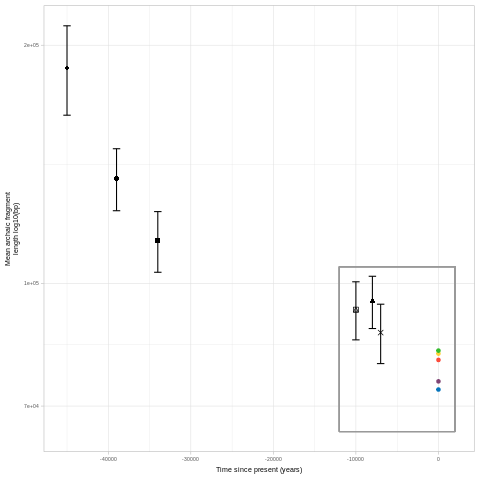
    


```r
%%R


rbind(
    read.table("SITab2.txt", header = T) %>% select(samples = region, mean_len_mean, mean_len_se) %>% mutate(time = 0),
    read.table("SITab3.txt", header = T) %>% select(samples, mean_len_mean = len_mean, mean_len_se = len_se) %>% mutate(time = ifelse(samples == "UstIshim", -45000, 
                                                                                                                                  ifelse(samples == "Yana1", -39000,
                                                                                                                                        ifelse(samples == "Sunghir3", -34000,
                                                                                                                                              ifelse(samples == "Anzick1", -13000,
                                                                                                                                                    ifelse(samples == "Kolyma", -10000, 
                                                                                                                                                        ifelse(samples == "Loschbour", -8000, 
                                                                                                                                                            ifelse(samples == "Stuttgart", -7000, 0))))))))) -> ancient_extant_mean_frag_len
plot_grid(
    ancient_extant_mean_frag_len%>%
        ggplot() +
        geom_rect(aes(xmin = -12000, xmax = 2000, ymin = 65000, ymax = 105000), color = "grey60", alpha = 0) +
        geom_errorbar(data = . %>% filter(time != 0), aes(x = time, ymax = mean_len_mean+(1.96*mean_len_se), ymin = mean_len_mean-(1.96*mean_len_se))) +
        geom_point(data = . %>% filter(time != 0),    aes(x = time, y = mean_len_mean, shape = samples), size = 2) +
        geom_point(data = . %>% filter(time == 0),    aes(x = time, y = mean_len_mean, color = samples)) +
        scale_y_continuous(trans = "log10") +
        ylab("Mean archaic fragment\nlength log10(bp)") +
        xlab("Time since present (years)") +
        scale_color_manual(values = reg_colors) +
        scale_shape_manual(values = c("UstIshim" = 18, "Yana1" = 16, "Sunghir3" = 15, "Kolyma" = 14, "Loschbour" = 17, "Stuttgart" = 4)) +
        theme(legend.position = "none"),
    
    NULL,
    
    
    archaicfragmentstatisticsperind() %>% 
        ggplot() +
        geom_violin(aes(x = region,  y = mean_len, fill = region, color = region), alpha = 0.2, draw_quantiles = c(0.5)) +
        geom_dotplot(aes(x = region, y = mean_len, fill = region),                 binaxis = "y", stackdir='center', alpha = 0.5,
                        binwidth = round((max(archaicfragmentstatisticsperind()$mean_len)-min(archaicfragmentstatisticsperind()$mean_len))/50, digits = 0)) +
        geom_errorbar(data = ancient_extant_mean_frag_len %>% filter(time > -14000), aes(x = samples, ymin = mean_len_mean-(1.96*mean_len_se), ymax = mean_len_mean+(1.96*mean_len_se)), width = 0.25) + 
        geom_point(   data = ancient_extant_mean_frag_len %>% filter(time == 0),     aes(x = samples, y = mean_len_mean, fill = samples),                                                 color = "black", shape = 22, size = 2) +
        geom_point(   data = ancient_extant_mean_frag_len %>% filter(time != 0, time > -14000), aes(x = samples, y = mean_len_mean, shape = samples),                                 color = "black",             size = 2) +
        scale_x_discrete(limits = c("Kolyma", "Loschbour", "Stuttgart", "WestEurasia", "SouthAsia", "America", "CentralAsiaSiberia", "EastAsia")) +
        scale_fill_manual(values  = reg_colors) +
        scale_color_manual(values = reg_colors) +
        scale_shape_manual(values = c("UstIshim" = 18, "Yana1" = 16, "Sunghir3" = 15, "Kolyma" = 14, "Loschbour" = 17, "Stuttgart" = 4)) +
        theme(panel.grid.major.x = element_blank(), panel.grid.minor.x = element_blank(),  plot.background = element_rect(colour = "grey60")) +
        ylab("Mean archaic\nfragment length (bp)"),
    
    nrow = 1, rel_widths = c(1.5, 0.25, 3.5), align = c("h"), labels = c("b"), label_size = 8, label_fontfamily = "Helvetica") -> Figure1b

Figure1b
```


    
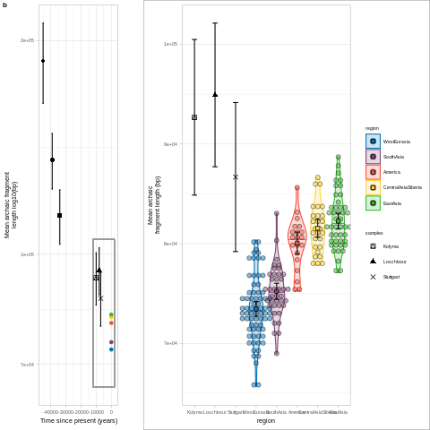
    


##### Figure 1c and d


```r
%%R

plot_grid(

    archaicfragmentstatisticsperind() %>% 
        ggplot() +
        geom_violin(aes(x = region,  y = num_frag, fill = region, color = region), alpha = 0.2, draw_quantiles = c(0.5)) +
        geom_dotplot(aes(x = region, y = num_frag, fill = region),                 binaxis = "y", stackdir='center', alpha = 0.5,
                        binwidth = round((max(archaicfragmentstatisticsperind()$num_frag)-min(archaicfragmentstatisticsperind()$num_frag))/50, digits = 0)) +
        geom_errorbar(data = read.table("SITab2.txt", header = T), aes(x = region, ymin = n_frag_mean-(1.96*n_frag_se), ymax = n_frag_mean+(1.96*n_frag_se)), width = 0.25) + 
        geom_point(   data = read.table("SITab2.txt", header = T), aes(x = region, y = n_frag_mean, fill = region),                                                 color = "black", shape = 22, size = 2) +
        scale_fill_manual(values  = reg_colors) +
        scale_color_manual(values = reg_colors) +
        theme(panel.grid.major.x = element_blank(), panel.grid.minor.x = element_blank(),
              legend.position = "none", , axis.ticks.x = element_blank(), axis.title.x = element_blank(), axis.text.x = element_blank()) +
        ylab("Number of\narchaic fragments"),

    archaicfragmentstatisticsperind() %>% 
        ggplot() +
        geom_violin(aes(x = region,  y = arch_seq, fill = region, color = region), alpha = 0.2, draw_quantiles = c(0.5)) +
        geom_dotplot(aes(x = region, y = arch_seq, fill = region),                 binaxis = "y", stackdir='center', alpha = 0.5,
                        binwidth = round((max(archaicfragmentstatisticsperind()$arch_seq)-min(archaicfragmentstatisticsperind()$arch_seq))/50, digits = 0)) +
        geom_errorbar(data = read.table("SITab2.txt", header = T), aes(x = region, ymin = arch_seq_mean-(1.96*arch_seq_se), ymax = arch_seq_mean+(1.96*arch_seq_se)), width = 0.25) + 
        geom_point(   data = read.table("SITab2.txt", header = T), aes(x = region, y = arch_seq_mean, fill = region),                                                 color = "black", shape = 22, size = 2) +
        scale_fill_manual(values  = reg_colors) +
        scale_color_manual(values = reg_colors) +
        theme(panel.grid.major.x = element_blank(), panel.grid.minor.x = element_blank(),
              legend.position = "none", , axis.ticks.x = element_blank(), axis.title.x = element_blank(), axis.text.x = element_blank()) +
        ylab("Total archaic\n sequence (bp)"),

nrow = 1, labels = c("c", "d"),label_size = 8, label_fontfamily = "Helvetica") -> Figure1cd

Figure1cd
```


    

    


```r
%%R

plot_grid(Figure1a, Figure1b, Figure1cd, ncol = 1, rel_heights = c(3, 1.5, 1.25), labels = c("a"), label_size = 8, label_fontfamily = "Helvetica") -> Figure1

Figure1

ggsave("Figure1.pdf", width = 18, height = 18, units = "cm")

Figure1
```


    
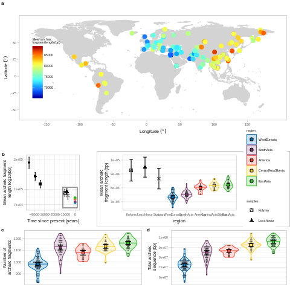
    


<a name="MaiFig2"></a>
#### Figure 2
##### Figure 2a


```r
%%R

read.table("SITab6.txt", header = T) %>% filter(type == "Shared", region == "WestEurasia") %>% pull(arch_seq) -> shared_seq
read.table("SITab6.txt", header = T) %>% filter(type == "Private", region == "WestEurasia") %>% pull(arch_seq) -> private_seq_WE
read.table("SITab6.txt", header = T) %>% filter(type == "Private", region == "EastAsia") %>% pull(arch_seq) -> private_seq_EA

data.frame(archseq = c(private_seq_EA, private_seq_WE, shared_seq,    shared_seq),
           region  = c(    "EastAsia",  "WestEurasia", "EastAsia", "WestEurasia"),
           type    = c(     "private",      "private",   "shared",      "shared")) %>%
    mutate(region = factor(region, levels = c("WestEurasia", "EastAsia"))) %>%
    ggplot() +
    geom_bar(stat = "identity", aes(x = region, y = archseq), fill = "white") +
    geom_bar(stat = "identity", aes(x = region, y = archseq, fill = region, alpha = type), color = "black") +
    geom_text(data = . %>% filter(type == "private"), aes(x = region, y = 6.8e8, label = round(archseq/1000000, digits = 0)), size = 5, family = "Helvetica") +
    geom_text(data = . %>% filter(type != "private"), aes(x = region, y = 3e8, label = round(archseq/1000000, digits = 0)),   size = 5, family = "Helvetica") +
    scale_fill_manual(values = reg_colors) +
    ylab("Population joined\narchaic sequence (bp)") +
    theme(axis.text.x  = element_blank(), axis.title.x = element_blank(), 
          axis.ticks.x = element_blank(), panel.grid.major.x = element_blank(), panel.grid.minor.x = element_blank(), legend.position = "none") -> Figure2a

Figure2a
```


    

    


##### Figure 2b


```r
%%R

read.table("archaicfragments_ind_shared_WEEA.txt", header = T) %>% 
    group_by(name, region) %>%
    summarize(mean_len = mean(length)) %>%
    mutate(region = factor(region, levels = c("WestEurasia", "EastAsia")))-> archfrag_ind_shared_WEEA

archfrag_ind_shared_WEEA %>%
    ggplot() +
    geom_violin(aes(x = region,  y = mean_len, fill = region, color = region), alpha = 0.2, draw_quantiles = c(0.5)) +
    geom_dotplot(aes(x = region, y = mean_len, fill = region),                 binaxis = "y", stackdir='center', alpha = 0.5,
                    binwidth = round((max(archfrag_ind_shared_WEEA$mean_len)-min(archfrag_ind_shared_WEEA$mean_len))/50, digits = 0)) +
    geom_errorbar(data = read.table("SITab7.txt", header = T) %>% filter(type == "Shared"), aes(x = region, ymin = mean_len_mean-(1.96*mean_len_se), ymax = mean_len_mean+(1.96*mean_len_se)), width = 0.25) +
    geom_point(   data = read.table("SITab7.txt", header = T) %>% filter(type == "Shared"), aes(x = region, y = mean_len_mean, fill = region),                                                 color = "black", shape = 22, size = 2) +
    scale_fill_manual(values  = reg_colors) +
    scale_color_manual(values = reg_colors) +
    theme(panel.grid.major.x = element_blank(), panel.grid.minor.x = element_blank(),
          legend.position = "none", axis.ticks.x = element_blank(), axis.title.x = element_blank(), axis.text.x = element_blank()) +
    ylab("Mean shared archaic\n fragment length (bp)") -> Figure2b

Figure2b
```


    

    


##### Figure 2c


```bash
%%bash

bedtools intersect -c -a <(awk '{for(i = $2; i < $3; i = i+1000){print $1"\t"i"\t"i+1000}}' archaicfragments_joined_WE.bed) \
                      -b <(awk '{print $3"\t"$4"\t"$5}' archaicfragments_WE.txt | bedtools sort) > archaicfragments_freq_WE_all_fragments.txt

awk '{print $4}' archaicfragments_freq_WE_all_fragments.txt | sort -k1,1n | uniq -c | awk 'BEGIN{print "freq\tcounts\treg"}{print $2"\t"$1"\tWestEurasia"}' > archaicfragments_freq_WEEA.txt

bedtools intersect -c -a <(awk '{for(i = $2; i < $3; i = i+1000){print $1"\t"i"\t"i+1000}}' archaicfragments_joined_EA.bed) \
                      -b <(awk '{print $3"\t"$4"\t"$5}' archaicfragments_EA.txt | bedtools sort) > archaicfragments_freq_EA_all_fragments.txt

awk '{print $4}' archaicfragments_freq_EA_all_fragments.txt | sort -k1,1n | uniq -c | awk '{print $2"\t"$1"\tEastAsia"}' >> archaicfragments_freq_WEEA.txt

awk 'BEGIN{print "chrom\tstart\tend\tfreq\tregion"}' > archaicfragments_freq_WEEA_all_fragments.txt
awk '{print $0"\tWestEurasia"}' archaicfragments_freq_WE_all_fragments.txt >> archaicfragments_freq_WEEA_all_fragments.txt
awk '{print $0"\tEastAsia"}'    archaicfragments_freq_EA_all_fragments.txt >> archaicfragments_freq_WEEA_all_fragments.txt
```


```r
%%R -w 1000

read.table("archaicfragments_freq_WEEA.txt", header = T) %>% group_by(reg) %>% mutate(median = cumsum(counts)/sum(counts)) %>% filter(median > 0.5) %>% summarize(median = min(freq)) -> median_freq
read.table("archaicfragments_freq_WEEA.txt", header = T) %>% group_by(reg) %>% summarize(mean = sum(freq*counts)/sum(counts)) -> mean_freq
full_join(median_freq, mean_freq, by = c("reg")) %>% gather("stat", "value", median, mean) -> mean_median_freq

read.table("archaicfragments_freq_WEEA.txt", header = T) %>% 
    mutate(reg = factor(reg, levels = c("WestEurasia", "EastAsia"))) %>%
    ggplot() +
    geom_bar(stat = "identity", aes(x = freq, y = counts, fill = reg), position = position_dodge(), show.legend = F) +
    geom_vline(data = mean_median_freq, aes(xintercept = value, color = reg, linetype = stat), show.legend = F) +
    scale_fill_manual(values = reg_colors) +
    scale_color_manual(values = reg_colors) +
    ylab("Counts") +
    xlab("Fragment frequency") -> main
    
main
    
```


    
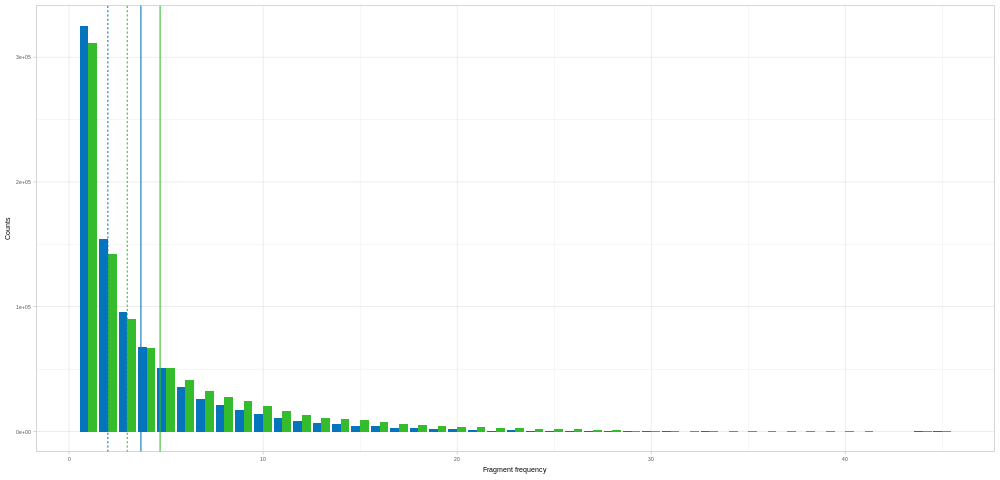
    


```r
%%R

main +  coord_cartesian(xlim = c(15, 45), ylim = c(0, 5000)) +
    theme(axis.title = element_blank(), plot.background = element_rect(colour = "grey60")) -> insert
    
insert
```


    

    


```r
%%R

ggdraw(main + geom_rect(aes(xmin = 14.5, xmax = 46, ymin = -2000, ymax = 12500), color = "grey60", alpha = 0, size = 0.25) + draw_plot(insert, 8, 5e4, 40, 2.75e5)) -> Figure2c

Figure2c
```


    

    


```r
%%R

plot_grid(plot_grid(Figure2a, Figure2b, nrow = 1, rel_widths= c(1, 1.3), labels = c("a", "b"), label_size = 8, label_fontfamily = "Helvetica"),
          Figure2c,
          rel_heights = c(1, 1.5), ncol = 1, labels = c("", "c"), label_size = 8, label_fontfamily = "Helvetica") -> Figure2

Figure2

ggsave("Figure2.pdf", width = 8, height = 7, units = "cm")

Figure2
```


    

    


<a name="MaiFig3"></a>
#### Figure 3
##### Figure 3a


```r
%%R

read.table("Data2_mutation_spectrum.txt", header = T) %>% filter(chrom != "X", chrom != "Y") %>% group_by(ind, reg) %>% summarise(counts = sum(counts)) %>% ungroup() %>% pull(counts) %>% max() -> max_plot
read.table("Data2_mutation_spectrum.txt", header = T) %>% filter(chrom != "X", chrom != "Y") %>% group_by(ind, reg) %>% summarise(counts = sum(counts)) %>% ungroup() %>% pull(counts) %>% min() -> min_plot

read.table("Data2_mutation_spectrum.txt", header = T) %>%
    filter(chrom != "X", chrom != "Y") %>%
    group_by(ind, reg) %>%
    summarise(counts = sum(counts)) %>%
    ungroup() %>%
    mutate(reg = factor(reg, levels = c("WestEurasia", "SouthAsia", "America", "CentralAsiaSiberia", "EastAsia"))) %>% 
    ggplot() +
    geom_violin(aes(x = reg, y = counts, color = reg, fill = reg), alpha = 0.1, draw_quantiles = c(0.5)) +
    geom_dotplot(aes(y = counts, x = reg, fill = reg), binaxis = "y", stackdir='center', dotsize = 1, binwidth = (max_plot-min_plot)/50, alpha = 0.5) +
    ylab("Derived allele acumulation") +
    theme(legend.title = element_blank(), axis.text.x = element_blank(), axis.ticks.x = element_blank(), axis.title.x = element_blank(),
          panel.grid.major.x = element_blank(), panel.grid.minor.x = element_blank()) +
    scale_color_manual(values = reg_colors)+
    scale_fill_manual(values = reg_colors) + 
    geom_errorbar(data = read.table("SITab9.txt", header =  T), aes(x = reg, ymin = derallele_mean-(1.96*derallele_se), ymax = derallele_mean+(1.96*derallele_se)), width = 0.25, size = 0.5) +
    geom_point(data = read.table("SITab9.txt", header =  T), aes(x = reg, y = derallele_mean, fill = reg), color = "black", size = 2, shape = 22) -> Figure3a

Figure3a
```


    
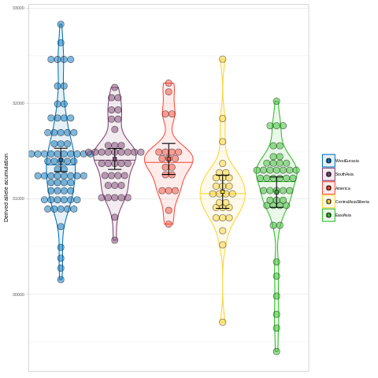
    


##### Figure 3b

Reads the DNM file from the deCODE paper and annotates the 5' and 3' base pairs of each mutation. It also takes the strand complementary mutation so that all mutations ancestral allele are represented by C or T.


```python
c = {"A" : "T",
     "T" : "A", 
     "C" : "G",
     "G" : "C"}

def get_href(chrom_num):
    href = ""
    with open("/home/moicoll/GenerationTime/faststorage/02MutationProfile/data/GRCh38_hg38/chr{}.fa".format(chrom_num)) as fasta:
        for i, line in enumerate(fasta):
            if i:
                href += line.strip()
    return href
    

prev_chrom = None
out        = open("aau1043_DataS5_revision1_context.tsv", "w")
with open("/home/moicoll/GenerationTime/faststorage/02MutationProfile/data/DNM_deCODE_new_data/aau1043_DataS5_revision1.tsv") as file:
    for i, line in enumerate(file):
            
        if line.strip()[0] != "#" and line.strip()[0:3] != "Chr":
            chrom = line.strip().split("\t")[0]
            pos   = int(line.strip().split("\t")[1])-1
            ref   = line.strip().split("\t")[2]
            alt   = line.strip().split("\t")[3]
            if chrom != prev_chrom:
                href = get_href(chrom[3:])
                prev_chrom = chrom
            if len(ref) > 1 or len(alt) > 1:
                out.write("\t".join([    chrom, str(pos),   fiv,    ref,    thr,    alt,  "T"] + line.strip().split("\t")[4:-1] + [line.strip().split("\t")[-1].replace(" ", "_")])+"\n")
            else:
                fiv   = href[pos-1].upper()
                thr   = href[pos+1].upper()
                if ref in ["C", "T"]:
                    out.write("\t".join([chrom, str(pos),   fiv,    ref,    thr,    alt,  "F"] + line.strip().split("\t")[4:-1] + [line.strip().split("\t")[-1].replace(" ", "_")])+"\n")
                else:
                    out.write("\t".join([chrom, str(pos), c[thr], c[ref], c[fiv], c[alt], "F"] + line.strip().split("\t")[4:-1] + [line.strip().split("\t")[-1].replace(" ", "_")])+"\n")
        else:
            if line.strip()[0:3] == "Chr":
                out.write("\t".join(["chrom", "pos", "fiv", "ref", "thr", "alt", "indel", "Proband_id", "Phase_combined", "Crossover", "Sanger"])+"\n")
out.close()
```


```r
%%R

plot_SGDP_corr <- function(m){
    
    #Returns the correlation between mutation spectrum fraction and the mean archaic fragment length plot for the SGDP data
    
    read.table("SITab10.txt", header = T) %>% 
    gather("mut_stat", "value", 2:37) %>%
    separate(mut_stat, c("mutation", "countfrac", "stat"), sep = "_") %>%
    filter(countfrac == "frac") %>%
    select(-c(countfrac)) %>%
    mutate(mutation = str_replace(mutation, "\\.", ">"),
            stat = ifelse(stat == "mean", "frac_mean", "frac_se")) %>%
    spread(stat, value) %>%
    full_join(read.table("SITab2.txt", header = T) %>% select(reg = region, mean_len_mean, mean_len_se), by = c("reg")) %>%
    filter(mutation == m) -> mutation_spectrum_mean_len_perreg
    
    mutation_spectrum_mean_len_perind() %>%
        mutate(mean_len = mean_len/1000) %>%
        filter(mutation == m) %>%
        ggplot() +
        geom_point(aes(y = frac, x = mean_len, color = reg), alpha = 0.5) +
        geom_smooth(method = "lm", formula = 'y ~ x', aes(y = frac, x = mean_len), color = "black", se = TRUE) +
        geom_errorbarh(data = mutation_spectrum_mean_len_perreg %>% mutate(mean_len_mean = mean_len_mean/1000, mean_len_se = mean_len_se/1000), aes(xmin = mean_len_mean-(1.96*mean_len_se), xmax = mean_len_mean+(1.96*mean_len_se), y = frac_mean)) +
        geom_errorbar( data = mutation_spectrum_mean_len_perreg %>% mutate(mean_len_mean = mean_len_mean/1000), aes(x    = mean_len_mean,                                                             ymin = frac_mean-(1.96*frac_se), ymax = frac_mean+(1.96*frac_se))) +
        geom_point(    data = mutation_spectrum_mean_len_perreg %>% mutate(mean_len_mean = mean_len_mean/1000), aes(x    = mean_len_mean,                                                             y = frac_mean, fill = reg), shape = 22, color = "black", size = 3) +
        theme(aspect.ratio = 1, legend.position = "none", 
              axis.title = element_blank()) +
        facet_wrap(~mutation, nrow = 1)  +
        scale_color_manual(values = reg_colors) +
        scale_fill_manual(values = reg_colors)
}


plot_deCODE_corr <- function(m){
    
    #Returns the correlation between mutation spectrum fraction (de novo mutations) and the mean parental age plot for the deCODE data
    
    deCODE_mutation_spectrum_mean_age() %>%                     
        filter(mutation == m) %>%
        ggplot() +
        geom_smooth(method = "lm",  formula = y ~ x, aes(x = age, y = frac, weight=n_probands), se = T) +
        xlab("") +
        ylab("") +
        theme(aspect.ratio     = 1, plot.background = element_blank(),
              legend.position  = "none", 
              axis.title       = element_blank()) 
}


max_min_SGDP <- function(mut){
    
    #Defines the maximum and minimum of the y axis of the SGDP plot
    
    mutation_spectrum_mean_len_perind() %>% 
        group_by(mutation) %>% 
        summarize(max = max(frac), min = min(frac), diff = (max-min)/2, middle = min+diff) %>% 
        mutate(max = middle+max(diff), min = middle-max(diff)) %>%
        filter(mutation == mut) %>%
        select(max, min)
}

max_min_deCODE <- function(mut){
    
    #Defines the maximum and minimum of the y axis of the deCODE plot
    
    mutation_spectrum_mean_len_perind() %>% 
        group_by(mutation) %>% 
        summarize(diff = (max(frac)-min(frac))/2) %>%
        pull(diff) %>%
        max() -> max_diff_SGDP
    
    read.table("SITab11.txt", header = T) %>%
        filter(data_set == "deCODE") %>%
        select(coefficient, mutation, estimate) %>%
        spread(coefficient, estimate) %>%
        mutate(middle = (slope*30)+intercept,
               max    = middle+max_diff_SGDP,
               min    = middle-max_diff_SGDP) %>%
        filter(mutation == mut) %>%
        select(max, min)
}

plot_mutspect_two_datasets <- function(m, x = .52, y = .15, len = .45, high = .45){
    
    #Puts together the SGDP and the deCODE plot
    
    plot_deCODE_corr(m) + 
        coord_cartesian(ylim = c(max_min_deCODE(m)$min, max_min_deCODE(m)$max)) -> insert

    plot_SGDP_corr(m) + 
        coord_cartesian(ylim = c(max_min_SGDP(m)$min,   max_min_SGDP(m)$max)) -> main

    ggdraw(main) + draw_plot(insert, x, y, len, high)
}

```


```r
%%R

plot_grid(
plot_mutspect_two_datasets("T>A",     .50, .05, .45, .45),
plot_mutspect_two_datasets("T>C",     .50, .05, .45, .45),
plot_mutspect_two_datasets("T>G",     .50, .45, .45, .45),
plot_mutspect_two_datasets("C>A",     .50, .05, .45, .45),
plot_mutspect_two_datasets("C>T",     .15, .05, .45, .45),
plot_mutspect_two_datasets("C>G",     .50, .05, .45, .45),
plot_mutspect_two_datasets("CpG>TpG", .50, .05, .45, .45),
plot_mutspect_two_datasets("C>T'",    .15, .05, .45, .45),
plot_mutspect_two_datasets("TCC>TTC", .15, .05, .45, .45), nrow = 3) -> Figure3b

Figure3b
```


    

    


```r
%%R

Figure3 <- plot_grid(Figure3a, Figure3b, ncol = 1, rel_heights = c(4, 17), labels = c("a", "b"), label_size = 8, label_fontfamily = "Helvetica")

Figure3

ggsave("Figure3.pdf", width = 17, height = 21, units = "cm")

Figure3
```


    
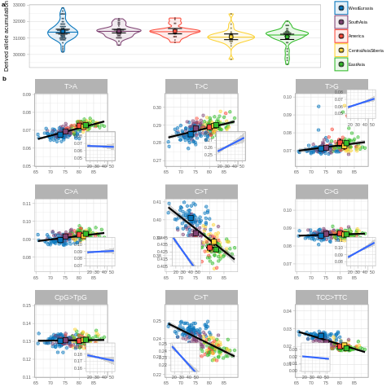
    


<a name="MaiFig4"></a>
#### Figure 4
##### Figure 4a


```python
def get_call(chrom):
    total = 0
    calla = 0

    with open("reproducible/chr{}_masked.fa".format(chrom), "r") as file:
        for line in file:
            if line[0] != ">":
                for c in line.strip():
                    if c in ["A", "C", "T", "G"]:
                        calla += 1
                    total += 1
    return [total, calla]

if not os.path.isfile('callability_per_chromosome.txt'):
    callable_bases = []
    chromosomes    = [str(c) for c in range(1, 23)]+["X"]
    for chrom in chromosomes:
        callable_bases.append(get_call(chrom))

    callable_bases = np.array(callable_bases)

    call_per_chrom = pd.DataFrame({
        "chrom"  : chromosomes,
        "length" : callable_bases[:, 0],
        "callab" : callable_bases[:, 1],
    })

    call_per_chrom.to_csv("callability_per_chromosome.txt", sep='\t', index=False)
else:
    call_per_chrom = pd.read_csv("callability_per_chromosome.txt", sep='\t')
    
call_per_chrom
```


<div>
<style scoped>
    .dataframe tbody tr th:only-of-type {
        vertical-align: middle;
    }

    .dataframe tbody tr th {
        vertical-align: top;
    }

    .dataframe thead th {
        text-align: right;
    }
</style>
<table border="1" class="dataframe">
  <thead>
    <tr style="text-align: right;">
      <th></th>
      <th>chrom</th>
      <th>length</th>
      <th>callab</th>
    </tr>
  </thead>
  <tbody>
    <tr>
      <th>0</th>
      <td>1</td>
      <td>249250621</td>
      <td>43986308</td>
    </tr>
    <tr>
      <th>1</th>
      <td>2</td>
      <td>243199373</td>
      <td>51348560</td>
    </tr>
    <tr>
      <th>2</th>
      <td>3</td>
      <td>198022430</td>
      <td>37889565</td>
    </tr>
    <tr>
      <th>3</th>
      <td>4</td>
      <td>191154276</td>
      <td>35316823</td>
    </tr>
    <tr>
      <th>4</th>
      <td>5</td>
      <td>180915260</td>
      <td>34083932</td>
    </tr>
    <tr>
      <th>5</th>
      <td>6</td>
      <td>171115067</td>
      <td>26973302</td>
    </tr>
    <tr>
      <th>6</th>
      <td>7</td>
      <td>159138663</td>
      <td>34768386</td>
    </tr>
    <tr>
      <th>7</th>
      <td>8</td>
      <td>146364022</td>
      <td>37499556</td>
    </tr>
    <tr>
      <th>8</th>
      <td>9</td>
      <td>141213431</td>
      <td>24635048</td>
    </tr>
    <tr>
      <th>9</th>
      <td>10</td>
      <td>135534747</td>
      <td>25103125</td>
    </tr>
    <tr>
      <th>10</th>
      <td>11</td>
      <td>135006516</td>
      <td>23933732</td>
    </tr>
    <tr>
      <th>11</th>
      <td>12</td>
      <td>133851895</td>
      <td>19895095</td>
    </tr>
    <tr>
      <th>12</th>
      <td>13</td>
      <td>115169878</td>
      <td>18751542</td>
    </tr>
    <tr>
      <th>13</th>
      <td>14</td>
      <td>107349540</td>
      <td>13762766</td>
    </tr>
    <tr>
      <th>14</th>
      <td>15</td>
      <td>102531392</td>
      <td>17031008</td>
    </tr>
    <tr>
      <th>15</th>
      <td>16</td>
      <td>90354753</td>
      <td>19135999</td>
    </tr>
    <tr>
      <th>16</th>
      <td>17</td>
      <td>81195210</td>
      <td>21709551</td>
    </tr>
    <tr>
      <th>17</th>
      <td>18</td>
      <td>78077248</td>
      <td>16714987</td>
    </tr>
    <tr>
      <th>18</th>
      <td>19</td>
      <td>59128983</td>
      <td>11730052</td>
    </tr>
    <tr>
      <th>19</th>
      <td>20</td>
      <td>63025520</td>
      <td>12647770</td>
    </tr>
    <tr>
      <th>20</th>
      <td>21</td>
      <td>48129895</td>
      <td>9232253</td>
    </tr>
    <tr>
      <th>21</th>
      <td>22</td>
      <td>51304566</td>
      <td>6802723</td>
    </tr>
    <tr>
      <th>22</th>
      <td>X</td>
      <td>155270560</td>
      <td>59371681</td>
    </tr>
  </tbody>
</table>
</div>


```r
%%R

X_to_A_ratio_perind <- function(){
    read.table("callability_per_chromosome.txt", header = T) %>%
        mutate(chrom = ifelse(chrom == "X", "X", "A")) %>%
        group_by(chrom) %>%
        summarize(callab = sum(callab)) -> call_X_A

    read.table("Data2_mutation_spectrum.txt", header = T) %>%
        filter(chrom != "Y", sex == "F") %>% 
        mutate(chrom = ifelse(chrom == "X", "X", "A")) %>%
        group_by(ind, reg, chrom) %>%
        summarize(counts = sum(counts)) %>% 
        mutate(call = ifelse(chrom == "A", call_X_A %>% filter(chrom == "A") %>% pull(callab), call_X_A %>% filter(chrom == "X") %>% pull(callab))) %>%
        mutate(prop = counts/call) %>%
        select(-c(counts, call)) %>%
        spread(chrom, prop) %>%
        mutate(ratio = X/A) %>% 
        left_join(archaicfragmentstatisticsperind() %>% select(ind = name, mean_len), by = c("ind"))
}
```


```python
X_to_A_ratio_perind = %R X_to_A_ratio_perind()

X_to_A_ratio_perind
```


<div>
<style scoped>
    .dataframe tbody tr th:only-of-type {
        vertical-align: middle;
    }

    .dataframe tbody tr th {
        vertical-align: top;
    }

    .dataframe thead th {
        text-align: right;
    }
</style>
<table border="1" class="dataframe">
  <thead>
    <tr style="text-align: right;">
      <th></th>
      <th>ind</th>
      <th>reg</th>
      <th>A</th>
      <th>X</th>
      <th>ratio</th>
      <th>mean_len</th>
    </tr>
  </thead>
  <tbody>
    <tr>
      <th>1</th>
      <td>S_Adygei-2</td>
      <td>WestEurasia</td>
      <td>0.000060</td>
      <td>0.000046</td>
      <td>0.774969</td>
      <td>75672.380952</td>
    </tr>
    <tr>
      <th>2</th>
      <td>S_Albanian-1</td>
      <td>WestEurasia</td>
      <td>0.000057</td>
      <td>0.000051</td>
      <td>0.899544</td>
      <td>78357.217030</td>
    </tr>
    <tr>
      <th>3</th>
      <td>S_Aleut-2</td>
      <td>CentralAsiaSiberia</td>
      <td>0.000057</td>
      <td>0.000047</td>
      <td>0.829191</td>
      <td>79658.304498</td>
    </tr>
    <tr>
      <th>4</th>
      <td>S_Basque-2</td>
      <td>WestEurasia</td>
      <td>0.000058</td>
      <td>0.000044</td>
      <td>0.770934</td>
      <td>75028.397566</td>
    </tr>
    <tr>
      <th>5</th>
      <td>S_BedouinB-2</td>
      <td>WestEurasia</td>
      <td>0.000057</td>
      <td>0.000047</td>
      <td>0.833592</td>
      <td>69807.692308</td>
    </tr>
    <tr>
      <th>...</th>
      <td>...</td>
      <td>...</td>
      <td>...</td>
      <td>...</td>
      <td>...</td>
      <td>...</td>
    </tr>
    <tr>
      <th>76</th>
      <td>S_Ulchi-2</td>
      <td>CentralAsiaSiberia</td>
      <td>0.000056</td>
      <td>0.000049</td>
      <td>0.867239</td>
      <td>82059.181897</td>
    </tr>
    <tr>
      <th>77</th>
      <td>S_Uygur-1</td>
      <td>EastAsia</td>
      <td>0.000055</td>
      <td>0.000047</td>
      <td>0.867482</td>
      <td>78245.107176</td>
    </tr>
    <tr>
      <th>78</th>
      <td>S_Yakut-1</td>
      <td>CentralAsiaSiberia</td>
      <td>0.000055</td>
      <td>0.000045</td>
      <td>0.818291</td>
      <td>86639.240506</td>
    </tr>
    <tr>
      <th>79</th>
      <td>S_Yemenite_Jew-1</td>
      <td>WestEurasia</td>
      <td>0.000058</td>
      <td>0.000045</td>
      <td>0.778728</td>
      <td>69215.827338</td>
    </tr>
    <tr>
      <th>80</th>
      <td>S_Yi-2</td>
      <td>EastAsia</td>
      <td>0.000056</td>
      <td>0.000048</td>
      <td>0.861515</td>
      <td>82528.365792</td>
    </tr>
  </tbody>
</table>
<p>80 rows × 6 columns</p>
</div>


```python
X_to_A_ratio_perreg = defaultdict(lambda : None)

for stat in ["ratio", "mean_len"]:
    X_to_A_ratio_perreg[stat] = boot_perregion(X_to_A_ratio_perind, regions, stat)
    
X_to_A_ratio_perreg_df = pd.DataFrame({
    "reg"           : regions,
    "ratio_mean"    : X_to_A_ratio_perreg["ratio"][:, 0],
    "ratio_se"      : X_to_A_ratio_perreg["ratio"][:, 1],
    "mean_len_mean" : X_to_A_ratio_perreg["mean_len"][:, 0],
    "mean_len_se"   : X_to_A_ratio_perreg["mean_len"][:, 1],
})

X_to_A_ratio_perreg_df
```


<div>
<style scoped>
    .dataframe tbody tr th:only-of-type {
        vertical-align: middle;
    }

    .dataframe tbody tr th {
        vertical-align: top;
    }

    .dataframe thead th {
        text-align: right;
    }
</style>
<table border="1" class="dataframe">
  <thead>
    <tr style="text-align: right;">
      <th></th>
      <th>reg</th>
      <th>ratio_mean</th>
      <th>ratio_se</th>
      <th>mean_len_mean</th>
      <th>mean_len_se</th>
    </tr>
  </thead>
  <tbody>
    <tr>
      <th>0</th>
      <td>WestEurasia</td>
      <td>0.820304</td>
      <td>0.007203</td>
      <td>73911.473602</td>
      <td>647.662843</td>
    </tr>
    <tr>
      <th>1</th>
      <td>SouthAsia</td>
      <td>0.846987</td>
      <td>0.007702</td>
      <td>73268.441894</td>
      <td>942.262390</td>
    </tr>
    <tr>
      <th>2</th>
      <td>America</td>
      <td>0.825802</td>
      <td>0.005845</td>
      <td>80300.900063</td>
      <td>700.142358</td>
    </tr>
    <tr>
      <th>3</th>
      <td>CentralAsiaSiberia</td>
      <td>0.833722</td>
      <td>0.005088</td>
      <td>81934.632043</td>
      <td>639.378369</td>
    </tr>
    <tr>
      <th>4</th>
      <td>EastAsia</td>
      <td>0.856058</td>
      <td>0.004910</td>
      <td>81586.849607</td>
      <td>611.433929</td>
    </tr>
  </tbody>
</table>
</div>


```r
%%R -i X_to_A_ratio_perreg_df

X_to_A_ratio_perind() %>% 
    ggplot() +
    geom_point(aes(x = mean_len, y = ratio, color = reg), alpha = 0.5) +
    geom_errorbar( data = X_to_A_ratio_perreg_df, aes(ymin = ratio_mean-(1.96*ratio_se),       ymax = ratio_mean+(1.96*ratio_se),       x = mean_len_mean)) +
    geom_errorbarh(data = X_to_A_ratio_perreg_df, aes(xmin = mean_len_mean-(1.96*mean_len_se), xmax = mean_len_mean+(1.96*mean_len_se), y = ratio_mean), height = .0015) +
    geom_point(    data = X_to_A_ratio_perreg_df, aes(x = mean_len_mean, y = ratio_mean, fill = reg), size = 3, shape = 22) +
    scale_color_manual(values = reg_colors) +
    scale_fill_manual(values = reg_colors) +
    xlab("Mean Neanderthal Fragment Length (bp)") +
    ylab("X-to-A ratio") +
    theme(legend.position = "none") +
    xlim(c(65000, 90000)) -> Fig4a

Fig4a
```


    

    


##### Figure 4b


```r
%%R

CGenrichment_perind <- function(){
    read.table("CGenrichment.txt", header = T) %>% 
        group_by(ind, reg) %>% 
        summarize(nonEnrCG = sum(nonEnrCG), nonEnrnonCG = sum(nonEnrnonCG), EnrCG = sum(EnrCG), EnrnonCG = sum(EnrnonCG)) %>%
        mutate(ratio = (EnrCG/(EnrCG+EnrnonCG))/(nonEnrCG/(nonEnrCG+nonEnrnonCG))) 
}
```


```python
CGenrichment_perind = %R CGenrichment_perind()
CGenrichment_perind
```


<div>
<style scoped>
    .dataframe tbody tr th:only-of-type {
        vertical-align: middle;
    }

    .dataframe tbody tr th {
        vertical-align: top;
    }

    .dataframe thead th {
        text-align: right;
    }
</style>
<table border="1" class="dataframe">
  <thead>
    <tr style="text-align: right;">
      <th></th>
      <th>ind</th>
      <th>reg</th>
      <th>nonEnrCG</th>
      <th>nonEnrnonCG</th>
      <th>EnrCG</th>
      <th>EnrnonCG</th>
      <th>ratio</th>
    </tr>
  </thead>
  <tbody>
    <tr>
      <th>1</th>
      <td>S_Abkhasian-1</td>
      <td>WestEurasia</td>
      <td>2015</td>
      <td>22578</td>
      <td>346</td>
      <td>2761</td>
      <td>1.359162</td>
    </tr>
    <tr>
      <th>2</th>
      <td>S_Abkhasian-2</td>
      <td>WestEurasia</td>
      <td>2073</td>
      <td>22814</td>
      <td>364</td>
      <td>2879</td>
      <td>1.347497</td>
    </tr>
    <tr>
      <th>3</th>
      <td>S_Adygei-1</td>
      <td>WestEurasia</td>
      <td>2135</td>
      <td>23603</td>
      <td>374</td>
      <td>2947</td>
      <td>1.357624</td>
    </tr>
    <tr>
      <th>4</th>
      <td>S_Adygei-2</td>
      <td>WestEurasia</td>
      <td>2228</td>
      <td>23941</td>
      <td>363</td>
      <td>2880</td>
      <td>1.314715</td>
    </tr>
    <tr>
      <th>5</th>
      <td>S_Albanian-1</td>
      <td>WestEurasia</td>
      <td>2056</td>
      <td>22795</td>
      <td>350</td>
      <td>2868</td>
      <td>1.314628</td>
    </tr>
    <tr>
      <th>...</th>
      <td>...</td>
      <td>...</td>
      <td>...</td>
      <td>...</td>
      <td>...</td>
      <td>...</td>
      <td>...</td>
    </tr>
    <tr>
      <th>198</th>
      <td>S_Yemenite_Jew-2</td>
      <td>WestEurasia</td>
      <td>2100</td>
      <td>23077</td>
      <td>354</td>
      <td>2825</td>
      <td>1.335050</td>
    </tr>
    <tr>
      <th>199</th>
      <td>S_Yi-1</td>
      <td>EastAsia</td>
      <td>1909</td>
      <td>21549</td>
      <td>398</td>
      <td>2816</td>
      <td>1.521676</td>
    </tr>
    <tr>
      <th>200</th>
      <td>S_Yi-2</td>
      <td>EastAsia</td>
      <td>2018</td>
      <td>22401</td>
      <td>355</td>
      <td>2694</td>
      <td>1.408892</td>
    </tr>
    <tr>
      <th>201</th>
      <td>S_Zapotec-1</td>
      <td>America</td>
      <td>2108</td>
      <td>23233</td>
      <td>375</td>
      <td>2814</td>
      <td>1.413611</td>
    </tr>
    <tr>
      <th>202</th>
      <td>S_Zapotec-2</td>
      <td>America</td>
      <td>2056</td>
      <td>22698</td>
      <td>384</td>
      <td>2774</td>
      <td>1.464001</td>
    </tr>
  </tbody>
</table>
<p>202 rows × 7 columns</p>
</div>


```python
CGenrichment_perreg = boot_perregion(CGenrichment_perind, regions, "ratio")
    
CGenrichment_perreg_df = pd.DataFrame({
    "reg"        : regions,
    "ratio_mean" : CGenrichment_perreg[:, 0],
    "ratio_se"   : CGenrichment_perreg[:, 1]})

CGenrichment_perreg_df
```


<div>
<style scoped>
    .dataframe tbody tr th:only-of-type {
        vertical-align: middle;
    }

    .dataframe tbody tr th {
        vertical-align: top;
    }

    .dataframe thead th {
        text-align: right;
    }
</style>
<table border="1" class="dataframe">
  <thead>
    <tr style="text-align: right;">
      <th></th>
      <th>reg</th>
      <th>ratio_mean</th>
      <th>ratio_se</th>
    </tr>
  </thead>
  <tbody>
    <tr>
      <th>0</th>
      <td>WestEurasia</td>
      <td>1.366740</td>
      <td>0.008577</td>
    </tr>
    <tr>
      <th>1</th>
      <td>SouthAsia</td>
      <td>1.385192</td>
      <td>0.008972</td>
    </tr>
    <tr>
      <th>2</th>
      <td>America</td>
      <td>1.433314</td>
      <td>0.014913</td>
    </tr>
    <tr>
      <th>3</th>
      <td>CentralAsiaSiberia</td>
      <td>1.387291</td>
      <td>0.011162</td>
    </tr>
    <tr>
      <th>4</th>
      <td>EastAsia</td>
      <td>1.396747</td>
      <td>0.010538</td>
    </tr>
  </tbody>
</table>
</div>


```r
%%R -i CGenrichment_perreg_df

CGenrichment_perind() %>% 
    select(reg, ind, ratio) %>%
    full_join(archaicfragmentstatisticsperind() %>% select(ind = name, mean_len), by = c("ind")) %>%
    ggplot() +
    geom_point(aes(x = mean_len, y = ratio, color = reg), alpha = 0.5) +
    geom_errorbar( data = CGenrichment_perreg_df %>% full_join(read.table("SITab2.txt", header = T) %>% select(reg = region, mean_len_mean, mean_len_se), by = c("reg")), 
                  aes(ymin = ratio_mean-(1.96*ratio_se),       ymax = ratio_mean+(1.96*ratio_se),       x = mean_len_mean)) +
    geom_errorbarh(data = CGenrichment_perreg_df %>% full_join(read.table("SITab2.txt", header = T) %>% select(reg = region, mean_len_mean, mean_len_se), by = c("reg")), 
                   aes(xmin = mean_len_mean-(1.96*mean_len_se), xmax = mean_len_mean+(1.96*mean_len_se), y = ratio_mean), height = .0015) +
    geom_point(    data = CGenrichment_perreg_df %>% full_join(read.table("SITab2.txt", header = T) %>% select(reg = region, mean_len_mean, mean_len_se), by = c("reg")) ,
                   aes(x = mean_len_mean, y = ratio_mean, fill = reg), size = 3, shape = 22) +
    scale_color_manual(values = reg_colors) +
    scale_fill_manual(values = reg_colors) +
    xlab("Mean Neanderthal Fragment Length (bp)") +
    ylab("C>G relative propotion") +
    theme(legend.position = "none") +
    xlim(c(65000, 90000)) -> Fig4b

Fig4b
```


    
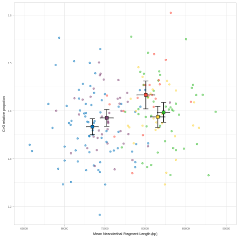
    


```r
%%R

plot_grid(Fig4a, Fig4b, labels = c("a", "b"), ncol = 1, label_size = 8, label_fontfamily = "Helvetica") -> Fig4
Fig4
ggsave("Figure4.pdf", width = 8, height = 10, units = "cm")
Fig4
```


    
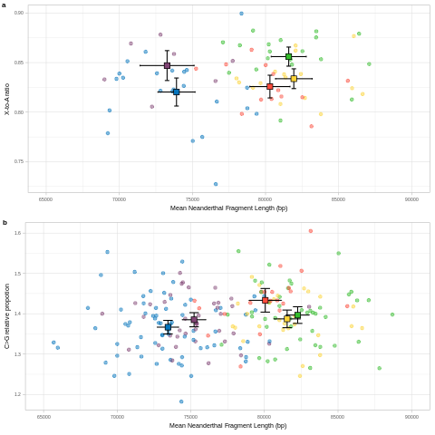
    


[](#HomeHome) &nbsp;

&nbsp;

<a name="SupFig"></a>
### B. Supplementary Figures

<a name="SupFig1"></a>
#### SI Figure 1


```r
%%R -w 1000 -h 1000


read.table("Data1_archaicfragments.txt", header = T) %>%
    filter(name %in% c("UstIshim", "Yana1", "Sunghir3", "Kolyma", "Loschbour", "Stuttgart")) %>%
    mutate(chrom = -1*as.numeric(factor(chrom, c(as.character(1:22), "X"))),
           chrom = ifelse(name == "UstIshim", chrom, ifelse(name == "Yana1", chrom-0.125, ifelse(name == "Sunghir3", chrom-0.25, ifelse(name == "Kolyma", chrom-0.375, ifelse(name == "Loschbour", chrom-0.5, ifelse(name == "Stuttgart", chrom-0.625, chrom))))))) %>% 
    ggplot() +
    geom_rect(aes(xmin = start, xmax = end, ymin = chrom, ymax = chrom-0.125, fill = name)) +
    geom_rect(data = non_callable, aes(xmin = start, xmax = end, ymin = chrom, ymax = chrom-0.75), fill = "gray") +
    geom_segment(data = chrom_len, aes(x = 0,    xend = chrom_len, y    = chrom-0.125, yend = chrom-0.125),  color = "gray") +
    geom_segment(data = chrom_len, aes(x = 0,    xend = chrom_len, y    = chrom-0.25,  yend = chrom-0.25) , color = "gray") +
    geom_segment(data = chrom_len, aes(x = 0,    xend = chrom_len, y    = chrom-0.375, yend = chrom-0.375),  color = "gray") +
    geom_segment(data = chrom_len, aes(x = 0,    xend = chrom_len, y    = chrom-0.50,  yend = chrom-0.50) , color = "gray") +
    geom_segment(data = chrom_len, aes(x = 0,    xend = chrom_len, y    = chrom-0.625, yend = chrom-0.625) , color = "gray") +
    geom_rect(data    = chrom_len, aes(xmin = 0, xmax = chrom_len, ymin = chrom-0.75, ymax = chrom),       color = "black", alpha = 0) +
    theme(panel.grid = element_blank(), axis.ticks.y= element_blank(),  axis.line.x= element_line(colour = "black"), 
          panel.border = element_blank(), legend.position = c(0.75, 0.5), legend.title=element_blank()) +
    scale_y_continuous(breaks = seq(-1.375, -23.375, -1), labels = c(1:22, "X"))  +
    xlab("Position (bp)") +
    ylab("Chromosome") +
    scale_fill_manual(values = c("UstIshim" = "#072448", "Yana1" = "#54D2D2", "Sunghir3" = "#58B368", "Kolyma" = "#FFCB00", "Loschbour" = "#F8AA4B", "Stuttgart" = "#FF6150"),
                      breaks = c("UstIshim", "Yana1", "Sunghir3", "Kolyma", "Loschbour", "Stuttgart")) -> SIFig1

SIFig1
    
ggsave("SIFig1.pdf",  width = 19, height = 19, units = "cm") 

SIFig1
```


    
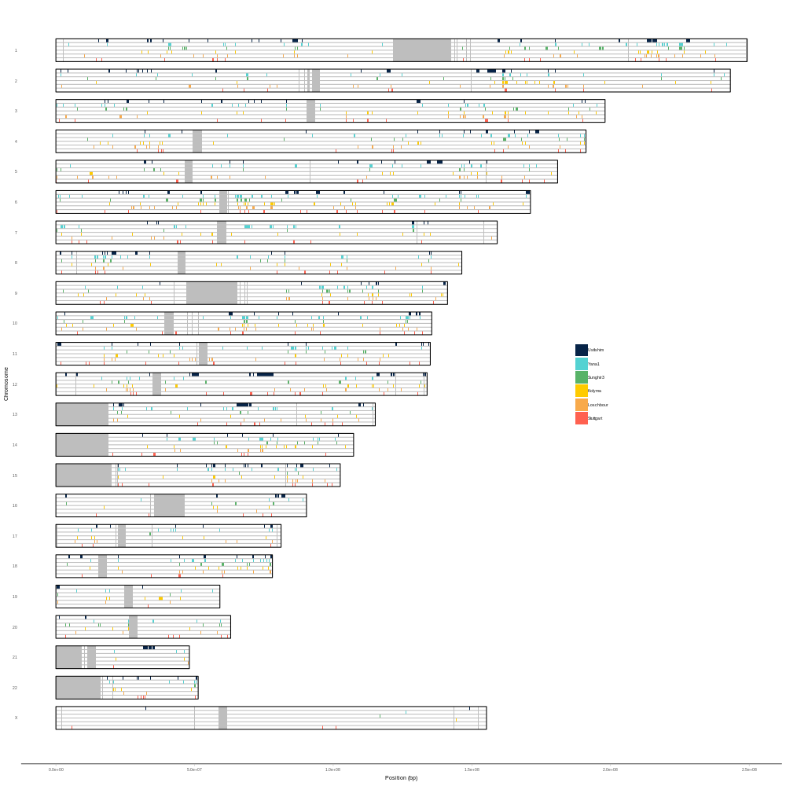
    


<a name="SupFig2"></a>
#### SI Figure 2


```r
%%R

plot_grid(
    plot_map_fragment_length("Data1_archaicfragments.txt",           stat = "median", post_prob = 0.50, nean = FALSE) + ggtitle("Median Archaic Fragment Length"             ),
    plot_map_fragment_length("Data1_archaicfragments.txt",           stat = "mean",   post_prob = 0.50, nean = TRUE ) + ggtitle("Vindija-like fragments"                     ),
    plot_map_fragment_length("Data1_archaicfragments.txt",           stat = "mean",   post_prob = 0.90, nean = FALSE) + ggtitle("High-confidence fragments"                  ), 
    plot_map_fragment_length("archaicfragments_ind_shared_WEEA.txt", stat = "mean",   post_prob = 0.50, nean = FALSE) + ggtitle("East Asia and West Eurasia shared fragments"), 
ncol = 1, labels = c("a", "b", "c", "d"), label_size = 8, label_fontfamily = "Helvetica") -> ExtFig1

ExtFig1

ggsave("SIFig2.pdf",  width = 14, height = 24, units = "cm")

SIFig2
```


    

    


<a name="SupFig3"></a>
#### SI Figure 3

Intersect recombination blocks with archaic fragments for every individual in each population


```bash
%%bash

awk 'BEGIN{print "chrom\tstart\tend\twindow\trec_rate\tname\tregion"}' > recombination_length_archfrag.txt

for pop in "Bengali" "Dai" "Han" "Finnish" "English" "Spanish" "Japanese" "Kinh" "Punjabi" "Tuscan";
do

echo ${pop}

bedtools intersect -wo -a <(cat hg19/${pop}/*_recombination_map_hapmap_format_hg19_chr_*.txt \
                                | egrep -v "Chromosome" \
                                | awk 'BEGIN{chrom = 0}{if(chrom != $1){print $1"\t0\t"$2"\t0";chrom = $1; start = $2}else{print $1"\t"start"\t"$2"\t"rec_rate}; start = $2; rec_rate = $3}' \
                                | bedtools sort) \
                        -b <(egrep -v name Data1_archaicfragments.txt \
                                | egrep ${pop} \
                                | awk '{print "chr"$3"\t"$4"\t"$5"\t"$1"\t"$2}' \
                                | bedtools sort) \
    | awk '{print $5"\t"$6"\t"$7"\t"$10"\t"$4"\t"$8"\t"$9}'| sort -k6,6 -k1,1V -k2,2n >> recombination_length_archfrag.txt

done
```

    Bengali
    Dai
    Han
    Finnish
    English
    Spanish
    Japanese
    Kinh
    Punjabi
    Tuscan


```bash
%%bash

head recombination_length_archfrag.txt
```

    chrom	start	end	window	rec_rate	name	region
    chr1	2023000	2026000	3000	0.782040651152	S_Bengali-1	SouthAsia
    chr1	3057000	3064000	10	2.99273035728	S_Bengali-1	SouthAsia
    chr1	3057000	3064000	130	2.88278581866	S_Bengali-1	SouthAsia
    chr1	3057000	3064000	1353	22.0124523097	S_Bengali-1	SouthAsia
    chr1	3057000	3064000	1913	41.539968433	S_Bengali-1	SouthAsia
    chr1	3057000	3064000	196	3.19028454368	S_Bengali-1	SouthAsia
    chr1	3057000	3064000	2309	1.66954413591	S_Bengali-1	SouthAsia
    chr1	3057000	3064000	240	3.06090034239	S_Bengali-1	SouthAsia
    chr1	3057000	3064000	403	6.77818270745	S_Bengali-1	SouthAsia


Extact the total chromosome length in phisical and genetic distance for each population


```bash
%%bash

awk 'BEGIN{print "pop\tchrom\tphysical_length\tgenetic_length"}' > physical_genetic_len_perchrom.txt

for pop in "Bengali" "Dai" "Han" "Finnish" "English" "Spanish" "Japanese" "Kinh" "Punjabi" "Tuscan";
do 
    for chrom in `seq 1 22`;
    do 

        tail -n 1 hg19/${pop}/*_recombination_map_hapmap_format_hg19_chr_${chrom}.txt | awk '{print "'${pop}'\t"$1"\t"$2"\t"$4}' >> physical_genetic_len_perchrom.txt
        
    done;
done 
```


```r
%%R

read.table("physical_genetic_len_perchrom.txt", header = T) %>%
    group_by(chrom) %>%
    mutate(gen_len_ratio = genetic_length/min(genetic_length)) %>%
    select(pop, chrom, gen_len_ratio)-> gen_len_ratio_chrom
    
head(gen_len_ratio_chrom)
```

          pop chrom gen_len_ratio
    1 Bengali  chr1      1.062857
    2 Bengali  chr2      1.159219
    3 Bengali  chr3      1.176536
    4 Bengali  chr4      1.007053
    5 Bengali  chr5      1.148713
    6 Bengali  chr6      1.154604


Scale recombination rates per chromosome minimum length and compute physical and genetic distances for each archaic fragment


```r
%%R

read.table("recombination_length_archfrag.txt", header = T) %>% 
    separate(name, c("a", "b"), sep = "_", remove = F) %>%
    select(-c(a)) %>%
    separate(b, c("pop", "a"), sep = "-") %>%
    select(-c(a)) %>%
    left_join(gen_len_ratio_chrom, by = c("chrom", "pop")) %>%
    group_by(name, region, chrom, start, end) %>%
    summarize(mean_rec_rate = sum((window*(rec_rate/gen_len_ratio))/sum(window)) ) %>%
    mutate(physical_dist = end-start,
           genetic_dist  = physical_dist*mean_rec_rate/1e6) %>%
    group_by(name, region) %>%
    summarize(mean_genetic_dist = mean(genetic_dist), mean_physical_dist = mean(physical_dist)) %>%
    mutate(region = factor(region, levels = c("WestEurasia", "SouthAsia", "EastAsia"))) %>%
    ungroup() -> physical_genetic_dist_archfrag
```


```python
physical_genetic_dist_archfrag  = %R physical_genetic_dist_archfrag %>% rename(reg = region)
physical_genetic_dist_archfrag
```


<div>
<style scoped>
    .dataframe tbody tr th:only-of-type {
        vertical-align: middle;
    }

    .dataframe tbody tr th {
        vertical-align: top;
    }

    .dataframe thead th {
        text-align: right;
    }
</style>
<table border="1" class="dataframe">
  <thead>
    <tr style="text-align: right;">
      <th></th>
      <th>name</th>
      <th>reg</th>
      <th>mean_genetic_dist</th>
      <th>mean_physical_dist</th>
    </tr>
  </thead>
  <tbody>
    <tr>
      <th>1</th>
      <td>S_Bengali-1</td>
      <td>SouthAsia</td>
      <td>0.053308</td>
      <td>73673.251029</td>
    </tr>
    <tr>
      <th>2</th>
      <td>S_Bengali-2</td>
      <td>SouthAsia</td>
      <td>0.055561</td>
      <td>77558.872305</td>
    </tr>
    <tr>
      <th>3</th>
      <td>S_Dai-1</td>
      <td>EastAsia</td>
      <td>0.054927</td>
      <td>82013.852814</td>
    </tr>
    <tr>
      <th>4</th>
      <td>S_Dai-2</td>
      <td>EastAsia</td>
      <td>0.054945</td>
      <td>81771.604938</td>
    </tr>
    <tr>
      <th>5</th>
      <td>S_Dai-3</td>
      <td>EastAsia</td>
      <td>0.054556</td>
      <td>79261.824324</td>
    </tr>
    <tr>
      <th>6</th>
      <td>S_English-1</td>
      <td>WestEurasia</td>
      <td>0.043062</td>
      <td>71144.210526</td>
    </tr>
    <tr>
      <th>7</th>
      <td>S_English-2</td>
      <td>WestEurasia</td>
      <td>0.042990</td>
      <td>69879.629630</td>
    </tr>
    <tr>
      <th>8</th>
      <td>S_Finnish-1</td>
      <td>WestEurasia</td>
      <td>0.048348</td>
      <td>73960.921844</td>
    </tr>
    <tr>
      <th>9</th>
      <td>S_Finnish-2</td>
      <td>WestEurasia</td>
      <td>0.050669</td>
      <td>73225.716929</td>
    </tr>
    <tr>
      <th>10</th>
      <td>S_Finnish-3</td>
      <td>WestEurasia</td>
      <td>0.051133</td>
      <td>78566.546763</td>
    </tr>
    <tr>
      <th>11</th>
      <td>S_Han-1</td>
      <td>EastAsia</td>
      <td>0.059706</td>
      <td>86199.664430</td>
    </tr>
    <tr>
      <th>12</th>
      <td>S_Han-2</td>
      <td>EastAsia</td>
      <td>0.055997</td>
      <td>79949.823944</td>
    </tr>
    <tr>
      <th>13</th>
      <td>S_Japanese-1</td>
      <td>EastAsia</td>
      <td>0.054112</td>
      <td>82203.849519</td>
    </tr>
    <tr>
      <th>14</th>
      <td>S_Japanese-2</td>
      <td>EastAsia</td>
      <td>0.054257</td>
      <td>77278.503046</td>
    </tr>
    <tr>
      <th>15</th>
      <td>S_Japanese-3</td>
      <td>EastAsia</td>
      <td>0.057077</td>
      <td>80978.475336</td>
    </tr>
    <tr>
      <th>16</th>
      <td>S_Kinh-1</td>
      <td>EastAsia</td>
      <td>0.056588</td>
      <td>83751.666667</td>
    </tr>
    <tr>
      <th>17</th>
      <td>S_Kinh-2</td>
      <td>EastAsia</td>
      <td>0.058018</td>
      <td>79603.727715</td>
    </tr>
    <tr>
      <th>18</th>
      <td>S_Punjabi-1</td>
      <td>SouthAsia</td>
      <td>0.051986</td>
      <td>80511.705686</td>
    </tr>
    <tr>
      <th>19</th>
      <td>S_Punjabi-2</td>
      <td>SouthAsia</td>
      <td>0.049260</td>
      <td>75603.723404</td>
    </tr>
    <tr>
      <th>20</th>
      <td>S_Punjabi-3</td>
      <td>SouthAsia</td>
      <td>0.049597</td>
      <td>73382.978723</td>
    </tr>
    <tr>
      <th>21</th>
      <td>S_Punjabi-4</td>
      <td>SouthAsia</td>
      <td>0.048857</td>
      <td>72587.758776</td>
    </tr>
    <tr>
      <th>22</th>
      <td>S_Spanish-1</td>
      <td>WestEurasia</td>
      <td>0.049100</td>
      <td>77081.370450</td>
    </tr>
    <tr>
      <th>23</th>
      <td>S_Spanish-2</td>
      <td>WestEurasia</td>
      <td>0.048964</td>
      <td>70200.841220</td>
    </tr>
    <tr>
      <th>24</th>
      <td>S_Tuscan-1</td>
      <td>WestEurasia</td>
      <td>0.050025</td>
      <td>75153.115100</td>
    </tr>
    <tr>
      <th>25</th>
      <td>S_Tuscan-2</td>
      <td>WestEurasia</td>
      <td>0.050296</td>
      <td>74700.111483</td>
    </tr>
  </tbody>
</table>
</div>


```python
regions_physical_genetic  = ["WestEurasia", "SouthAsia", "EastAsia"]
physical_dist_boot_result = boot_perregion(physical_genetic_dist_archfrag, regions_physical_genetic, "mean_physical_dist",  iterations = 100000)
genetic_dist_boot_result  = boot_perregion(physical_genetic_dist_archfrag, regions_physical_genetic, "mean_genetic_dist", iterations = 100000)
```


```python
physical_genetic_dist_archfrag_meanse = pd.DataFrame({"region"                  : regions_physical_genetic,
                                                      "mean_physical_dist_mean" : physical_dist_boot_result[:, 0],
                                                      "mean_physical_dist_se"   : physical_dist_boot_result[:, 1],
                                                      "mean_genetic_dist_mean"  : genetic_dist_boot_result[:, 0],
                                                      "mean_genetic_dist_se"    : genetic_dist_boot_result[:, 1]})

physical_genetic_dist_archfrag_meanse
```


<div>
<style scoped>
    .dataframe tbody tr th:only-of-type {
        vertical-align: middle;
    }

    .dataframe tbody tr th {
        vertical-align: top;
    }

    .dataframe thead th {
        text-align: right;
    }
</style>
<table border="1" class="dataframe">
  <thead>
    <tr style="text-align: right;">
      <th></th>
      <th>region</th>
      <th>mean_physical_dist_mean</th>
      <th>mean_physical_dist_se</th>
      <th>mean_genetic_dist_mean</th>
      <th>mean_genetic_dist_se</th>
    </tr>
  </thead>
  <tbody>
    <tr>
      <th>0</th>
      <td>WestEurasia</td>
      <td>73768.830156</td>
      <td>939.712826</td>
      <td>0.048283</td>
      <td>0.000979</td>
    </tr>
    <tr>
      <th>1</th>
      <td>SouthAsia</td>
      <td>75553.057378</td>
      <td>1125.278347</td>
      <td>0.051428</td>
      <td>0.000993</td>
    </tr>
    <tr>
      <th>2</th>
      <td>EastAsia</td>
      <td>81301.706748</td>
      <td>751.704948</td>
      <td>0.056021</td>
      <td>0.000551</td>
    </tr>
  </tbody>
</table>
</div>


```r
%%R -i physical_genetic_dist_archfrag_meanse

plot_grid(

    physical_genetic_dist_archfrag %>%
        ggplot() +
        geom_violin(aes(x = region,  y = mean_physical_dist, fill = region, color = region), alpha = 0.2, draw_quantiles = c(0.5)) +
        geom_dotplot(aes(x = region, y = mean_physical_dist, fill = region),                 binaxis = "y", stackdir='center', alpha = 0.5) +
        geom_errorbar(data = physical_genetic_dist_archfrag_meanse, aes(x = region, ymin = mean_physical_dist_mean-(1.96*mean_physical_dist_se), ymax = mean_physical_dist_mean+(1.96*mean_physical_dist_se)), width = 0.2) +
        geom_point(data = physical_genetic_dist_archfrag_meanse,    aes(x = region, y = mean_physical_dist_mean, fill = region), color = "black", shape = 22, size = 2) +
        scale_fill_manual(values  = reg_colors) +
        scale_color_manual(values = reg_colors) +
        theme(panel.grid.major.x = element_blank(), panel.grid.minor.x = element_blank(), legend.position = c(0.85, 0.15),
              axis.ticks.x = element_blank(), axis.title.x = element_blank(), axis.text.x = element_blank()) +
        ylab("Mean archaic\nfragment length (bp)") +
        ggtitle("Phisical distance"),
    
    physical_genetic_dist_archfrag %>%
        ggplot() +
        geom_violin(aes(x = region,  y = mean_genetic_dist, fill = region, color = region), alpha = 0.2, draw_quantiles = c(0.5)) +
        geom_dotplot(aes(x = region, y = mean_genetic_dist, fill = region),                 binaxis = "y", stackdir='center', alpha = 0.5) +
        geom_errorbar(data = physical_genetic_dist_archfrag_meanse, aes(x = region, ymin = mean_genetic_dist_mean-(1.96*mean_genetic_dist_se), ymax = mean_genetic_dist_mean+(1.96*mean_genetic_dist_se)), width = 0.2) +
        geom_point(data = physical_genetic_dist_archfrag_meanse,    aes(x = region, y = mean_genetic_dist_mean, fill = region), color = "black", shape = 22, size = 2) +
        scale_fill_manual(values  = reg_colors) +
        scale_color_manual(values = reg_colors) +
        theme(panel.grid.major.x = element_blank(), panel.grid.minor.x = element_blank(), legend.position = c(0.85, 0.15),
              axis.ticks.x = element_blank(), axis.title.x = element_blank(), axis.text.x = element_blank()) +
        ylab("Mean archaic\nfragment length (cM)") +
        ggtitle("Genetic distance, scaled genetic map"), nrow = 1, labels = "auto", label_size = 8, label_fontfamily = "Helvetica") -> SIFig3

SIFig3
    
ggsave("SIFig3.pdf",  width = 19, height = 10, units = "cm") 

SIFig3
```

    R[write to console]: `stat_bindot()` using `bins = 30`. Pick better value with `binwidth`.
    
    R[write to console]: `stat_bindot()` using `bins = 30`. Pick better value with `binwidth`.
    


    
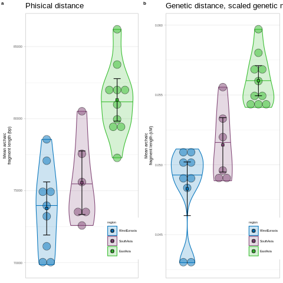
    


<a name="SupFig4"></a>
#### SI Figure 4


```r
%%R

physical_genetic_dist_archfrag %>%     
    ggplot() +
    geom_point(aes(x = mean_physical_dist,  y = mean_genetic_dist, fill = region, color = region), size = 2) +
    scale_color_manual(values = reg_colors) +
    ylab("Mean Genetic\nArchaic Fragment Length (cM)") +
    xlab("Mean Physical\nArchaic Fragment Length (bp)") -> SIFig4

SIFig4
    
ggsave("SIFig4.pdf",  width = 9, height = 7, units = "cm") 

SIFig4
```


    
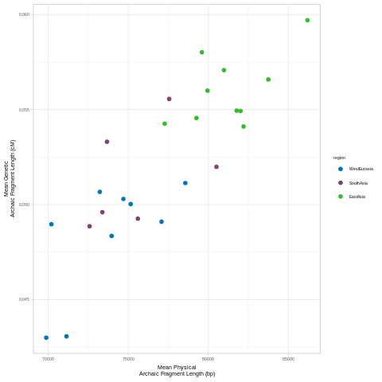
    


<a name="SupFig5"></a>
#### SI Figure 5


```r
%%R

read.table("Data1_archaicfragments.txt", header = T) %>%
    filter(region %in% c(                     "WestEurasia", "SouthAsia", "America", "CentralAsiaSiberia", "EastAsia")) %>%
    mutate(region = factor(region, levels = c("WestEurasia", "SouthAsia", "America", "CentralAsiaSiberia", "EastAsia"))) %>%
    mutate(pop = gsub("^S_", "", name)) %>% 
    mutate(pop = gsub("-[0-9]*", "", pop)) %>% 
    group_by(name, pop, region) %>%
    summarize(mean_len = mean(length)) %>%  
    ungroup() %>%
    group_by(pop, region) %>%
    summarize(mean_len_mean = mean(mean_len)) %>%
    ungroup() %>%
    arrange(region, mean_len_mean) %>%
    pull(pop) -> mean_fraglen_population_order
    
read.table("Data1_archaicfragments.txt", header = T) %>%
    filter(region %in% c(                     "WestEurasia", "SouthAsia", "America", "CentralAsiaSiberia", "EastAsia")) %>%
    mutate(region = factor(region, levels = c("WestEurasia", "SouthAsia", "America", "CentralAsiaSiberia", "EastAsia"))) %>%
    mutate(pop = gsub("^S_", "", name)) %>% 
    mutate(pop = gsub("-[0-9]*", "", pop)) %>% 
    group_by(name, pop, region) %>%
    summarize(mean_len = mean(length)) %>% 
    ungroup() %>%
    mutate(pop = factor(pop, levels = mean_fraglen_population_order)) %>% 
    ggplot() +
    geom_dotplot(aes(x = as.factor(pop), y = mean_len, fill = region, group = pop), binaxis = "y", stackdir = "center", binwidth = 500, alpha = 0.75) +
    ylab("Mean Archaic\nFragment Length (bp)") +
    xlab("Population") +
    scale_fill_manual(values = reg_colors) +
    theme(axis.text.x = element_text(angle = 45, hjust = 1, size = 4), legend.position = c(0.08, 0.8), legend.background = element_blank(), legend.title = element_blank()) -> SIFig5

SIFig5
    
ggsave("SIFig5.pdf",  width = 19, height = 10, units = "cm") 

SIFig5
```


    
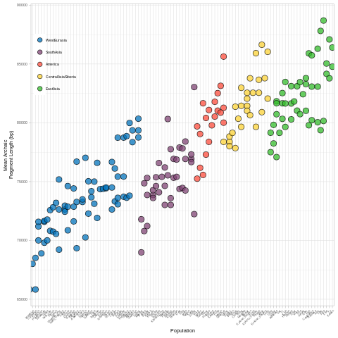
    


<a name="SupFig6"></a>
#### SI Figure 6


```r
%%R

plot_dist_HGDP <- function(df, title){
    df %>%
        ggplot() +
        geom_violin(aes(x = population,  y = value, fill = region, color = region), alpha = 0.2, draw_quantiles = c(0.5)) +
        geom_dotplot(aes(x = population, y = value, fill = region),                 binaxis = "y", stackdir='center', alpha = 0.5) +
        theme(panel.grid.major.x = element_blank(), panel.grid.minor.x = element_blank()) +
    ylab(title) +
    xlab("")
}

read.table("Data3_HGDParchaicfragments.txt", header = T) %>%
    group_by(name, population, region) %>%
    summarize(n_frag = n(), total_seq = sum(length), mean_len = mean(length)) %>%
    mutate(population = factor(population, level = c("Palestinian", "Sardinian", "Han", "Lahu"))) -> HGDParchaicfragments

plot_grid(plot_dist_HGDP(HGDParchaicfragments %>% select(name, population, region, value = mean_len), "Mean Archaic\nFragment Length (bp)"),
          plot_dist_HGDP(HGDParchaicfragments %>% select(name, population, region, value = n_frag), "Number Archaic\nFragments"),
          plot_dist_HGDP(HGDParchaicfragments %>% select(name, population, region, value = total_seq), "Archaic\nSequence (bp)"), ncol = 1, labels = c("a", "b", "c"), label_size = 8, label_fontfamily = "Helvetica")  -> SIFig6

SIFig6
    
ggsave("SIFig6.pdf",  width = 12, height = 15, units = "cm") 

SIFig6
```

    R[write to console]: `stat_bindot()` using `bins = 30`. Pick better value with `binwidth`.
    
    R[write to console]: `stat_bindot()` using `bins = 30`. Pick better value with `binwidth`.
    
    R[write to console]: `stat_bindot()` using `bins = 30`. Pick better value with `binwidth`.
    


    
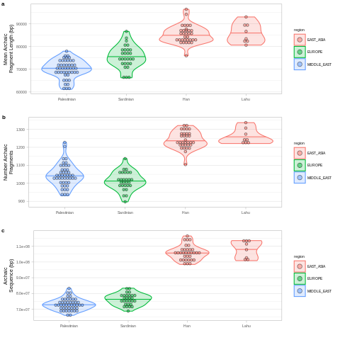
    


<a name="SupFig7"></a>
#### SI Figure 7

##### SI Figure 7a


```r
%%R

rbind(data.frame(y = c(4),label = c("ind01"),region = c("WestEurasia"), xmin = c(3),xmax = c(8), stringsAsFactors = F),
                 c(4, "ind01",  "WestEurasia", 32, 36),
                 c(4, "ind01",  "WestEurasia", 85, 95),
      
                 c(3, "ind02",  "WestEurasia", 78, 90),
                 c(2, "ind45",  "WestEurasia",  5, 11),
                 #c(2, "ind45",  "WestEurasia", 60, 65),
                 c(1, "merged", "WestEurasia",  3, 11),
                 c(1, "merged", "WestEurasia", 32, 36),
                 #c(1, "merged", "WestEurasia", 60, 65),
                 c(1, "merged", "WestEurasia", 78, 95)) %>%
    mutate(y = as.numeric(y), xmin = as.numeric(xmin), xmax = as.numeric(xmax)) %>%
    ggplot() +
    geom_hline(aes(yintercept = y, color = region), show.legend = F) +
    geom_rect(aes(xmin = xmin, xmax = xmax, ymin = y-0.15, ymax = y+0.15, color = region), fill = "white", show.legend = F) +
    geom_rect(aes(xmin = xmin, xmax = xmax, ymin = y-0.15, ymax = y+0.15, color = region, fill = region), alpha = 0.5, show.legend = F) +
    geom_rect(data = . %>% filter(label == "merged"), aes(xmin = xmin, xmax = xmax, ymin = y-0.15, ymax = y+0.15, color = region, fill = region), show.legend = F) +
    geom_vline(data = . %>% filter(label == "merged"), aes(xintercept = xmax), linetype = "dotted", color = "gray50") +
    geom_vline(data = . %>% filter(label == "merged"), aes(xintercept = xmin), linetype = "dotted", color = "gray50") +
    geom_hline(yintercept = 1.5, color = "gray40") +
    xlim(c(0, 100)) +
    scale_fill_manual(values = reg_colors) +
    scale_color_manual(values = reg_colors) +
    scale_y_continuous(labels = c("", "joined", "ind45", "ind02", "ind01", ""), limits = c(0, 5)) +
    theme_classic() +
    theme(axis.line = element_blank(), axis.ticks = element_blank(), axis.text.x = element_blank()) -> SIFig7a

SIFig7a
```


    

    


##### SI Figure 7b


```r
%%R

rbind(data.frame(y = c(4),label = c("merged"),region = c("EastAsia"), xmin = c(17),xmax = c(40), stringsAsFactors = F),
                 c(4, "merged",  "EastAsia", 50, 72),
                 c(4, "merged",  "EastAsia", 80, 98),
      
                 c(3, "merged", "WestEurasia",  3, 11),
                 c(3, "merged", "WestEurasia", 32, 36),
                 c(3, "merged", "WestEurasia", 78, 95),

                 c(2, "merged",  "both", 32, 36),
                 c(2, "merged",  "both", 80, 95),
                  
                 c(1, "merged",  "WestEurasia",  3, 11),
                 c(1, "merged",  "EastAsia",    17, 32),
                 c(1, "merged",  "EastAsia",    36, 40),
                 c(1, "merged",  "EastAsia",    50, 72),
                 c(1, "merged",  "WestEurasia", 78, 80),
                 c(1, "merged",  "EastAsia",    95, 98)) %>%
    mutate(y = as.numeric(y), xmin = as.numeric(xmin), xmax = as.numeric(xmax)) %>%
    ggplot() +
    geom_hline(data = . %>% filter(y != 1), aes(yintercept = y, color = region), show.legend = F) +
    geom_hline(data = . %>% filter(y == 1), aes(yintercept = y), color = "grey", show.legend = F) +
    geom_rect(aes(xmin = xmin, xmax = xmax, ymin = y-0.15, ymax = y+0.15, color = region), fill = "white", show.legend = F) +
    geom_rect(aes(xmin = xmin, xmax = xmax, ymin = y-0.15, ymax = y+0.15, color = region, fill = region), alpha = 0.5, show.legend = F) +
    geom_rect(data = . %>% filter(label == "merged"), aes(xmin = xmin, xmax = xmax, ymin = y-0.15, ymax = y+0.15, color = region, fill = region), show.legend = F) +
    geom_vline(data = . %>% filter(y < 3), aes(xintercept = xmax), linetype = "dotted", color = "gray50") +
    geom_vline(data = . %>% filter(y < 3), aes(xintercept = xmin), linetype = "dotted", color = "gray50") +
    xlim(c(0, 100)) +
    scale_fill_manual(values = c(reg_colors, "both" = "grey")) +
    scale_color_manual(values = c(reg_colors, "both" = "grey")) +
    scale_y_continuous(labels = c("", "private", "shared", "joined", "joined", ""), limits = c(0, 5)) +
    geom_hline(yintercept = 2.5, color = "gray40") +
    theme_classic() +
    theme(axis.line = element_blank(), axis.ticks = element_blank(), axis.text.x = element_blank()) -> SIFig7b

SIFig7b
```


    

    


##### SI Figure 7c


```r
%%R

rbind(data.frame(y = c(4),label = c("ind01"),region = c("WestEurasia"), xmin = c(3),xmax = c(8), stringsAsFactors = F),
                 c(4, "ind01",  "WestEurasia", 32, 36),
                 c(4, "ind01",  "WestEurasia", 85, 95),
                 c(3, "merged", "EastAsia", 17, 40),
                 c(3, "merged", "EastAsia", 50, 72),
                 c(3, "merged", "EastAsia", 80, 98),
                 c(2, "shared",  "WestEurasia", 32, 36),
                 c(2, "shared",  "WestEurasia", 85, 95),
                 c(1, "private", "WestEurasia",  3, 8)) %>%
    mutate(y = as.numeric(y), xmin = as.numeric(xmin), xmax = as.numeric(xmax)) %>%
    ggplot() +
    geom_hline(aes(yintercept = y, color = region), show.legend = F) +
    geom_rect(aes(xmin = xmin, xmax = xmax, ymin = y-0.15, ymax = y+0.15, color = region), fill = "white", show.legend = F) +
    geom_rect(aes(xmin = xmin, xmax = xmax, ymin = y-0.15, ymax = y+0.15, color = region, fill = region), alpha = 0.5, show.legend = F) +
    geom_rect(data = . %>% filter(label == "merged"), aes(xmin = xmin, xmax = xmax, ymin = y-0.15, ymax = y+0.15, color = region, fill = region), show.legend = F) +
    geom_vline(data = . %>% filter(label == "ind01"), aes(xintercept = xmax), linetype = "dotted", color = "gray50") +
    geom_vline(data = . %>% filter(label == "ind01"), aes(xintercept = xmin), linetype = "dotted", color = "gray50") +
    xlim(c(0, 100)) +
    scale_fill_manual(values = reg_colors) +
    scale_color_manual(values = reg_colors) +
    scale_y_continuous(labels = c(" ", "ind01\nprivate", "ind01\nshared", "joined", "ind01", " "), limits = c(0, 5)) +
    geom_hline(yintercept = 2.5, color = "gray40") +
    theme_classic() +
    theme(axis.line = element_blank(), axis.ticks = element_blank(), axis.text.x = element_blank()) -> SIFig7c

SIFig7c
```


    

    


##### SI Figure 7d


```r
%%R

rbind(data.frame(y = c(4),label = c("ind01"),region = c("EastAsia"), xmin = c(20),xmax = c(40), stringsAsFactors = F),
                 c(4, "ind01",  "EastAsia", 55, 69),
                 c(4, "ind01",  "EastAsia", 85, 98),
                 c(3, "ind02",  "EastAsia", 25, 35),
                 c(3, "ind02",  "EastAsia", 80, 95),
                 c(2, "ind45",  "EastAsia", 17, 40),
                 c(2, "ind45",  "EastAsia", 50, 72),
                 c(2, "ind45",  "EastAsia", 85, 90),
                 c(1, "merged", "EastAsia", 17, 40),
                 c(1, "merged", "EastAsia", 50, 72),
                 c(1, "merged", "EastAsia", 80, 98)) %>%
    mutate(y = as.numeric(y), xmin = as.numeric(xmin), xmax = as.numeric(xmax)) %>%
    ggplot() +
    geom_hline(aes(yintercept = y, color = region), show.legend = F) +
    geom_rect(aes(xmin = xmin, xmax = xmax, ymin = y-0.15, ymax = y+0.15, color = region), fill = "white", show.legend = F) +
    geom_rect(aes(xmin = xmin, xmax = xmax, ymin = y-0.15, ymax = y+0.15, color = region, fill = region), alpha = 0.5, show.legend = F) +
    geom_rect(data = . %>% filter(label == "merged"), aes(xmin = xmin, xmax = xmax, ymin = y-0.15, ymax = y+0.15, color = region, fill = region), show.legend = F) +
    geom_vline(aes(xintercept = seq(0, 100, 10)), linetype = "dotted", color = "gray50") +
    xlim(c(0, 100)) +
    scale_fill_manual(values = reg_colors) +
    scale_color_manual(values = reg_colors) +
    scale_y_continuous(labels = c("", "joined", "ind45", "ind02", "ind01", ""), limits = c(0, 5)) +
    geom_hline(yintercept = 1.5, color = "gray40") +
    geom_text(data = data.frame(lab = c(0, 1, 3, 3, 0, 2, 2, 1, 3, 2), x = seq(5, 95, 10)), aes(x = x, y = 0, label = lab)) +
    theme_classic() +
    theme(axis.line = element_blank(), axis.ticks = element_blank(), axis.text.x = element_blank(), axis.title = element_blank()) -> SIFig7d

SIFig7d
```


    

    


```r
%%R

plot_grid(SIFig7a, SIFig7b, SIFig7c, SIFig7d, labels = c("a", "b", "c", "d")) -> SIFig7

ggsave("SIFig7.pdf",  width = 18, height = 8, units = "cm")

SIFig7
```


    

    


<a name="SupFig8"></a>
#### SI Figure 8


```python
is_not_callable = False
character_num   = 0
start           = 0

bases = ["A", "T", "C", "G"]

out = open("hg19_noncall.bed", "w")

with open("Href.fa", "r") as file:
        for line in file:
                if line.strip()[0] == ">":
                        if is_not_callable:
                                out.write("{}\t{}\t{}\n".format(chrom, start, character_num))
                        chrom = line.strip().split(" ")[0][1:]
                        is_not_callable = False
                        character_num   = 0
                        start           = 0
                else:
                        for character in line.strip():
                                if character not in bases and not is_not_callable:
                                        is_not_callable = True
                                        start = character_num
                                if character in bases and is_not_callable:
                                        out.write("{}\t{}\t{}\n".format(chrom, start, character_num))
                                        is_not_callable = False
                                character_num += 1

if is_not_callable:
        out.write("{}\t{}\t{}\n".format(chrom, start, character_num))

out.close()
```


```python
prev_chrom = ""
prev_end   = 0
with open("archaicfragments_freq_WEEA_all_fragments_plot.txt", "w") as out: 
    with open("archaicfragments_freq_WEEA_all_fragments.txt") as file:
        for i, line in enumerate(file):
            if not i:
                out.write(line)
            else:
                chrom, start, end, freq, region = line.strip().split()
                start = int(start)
                if chrom != prev_chrom:
                    prev_chrom = chrom
                    prev_end   = 0
                if prev_end != start:
                    if prev_end:
                        out.write("\t".join([chrom, str(prev_end), str(prev_end+1000), "0", region])+"\n")
                    out.write("\t".join([chrom, str(start-1000), str(start), "0", region])+"\n")
                prev_end = int(end)
                out.write(line)
        out.write("\t".join([chrom, str(prev_end), str(prev_end-1000), "0", region])+"\n")
```


```r
%%R

data.frame(chrom = -1:-23, 
           chrom_len = c(249250621, 243199373, 198022430, 191154276, 180915260, 171115067, 159138663, 146364022, 141213431, 135534747, 135006516, 
                         133851895, 115169878, 107349540, 102531392, 90354753,   81195210,  78077248,  59128983,  63025520,  48129895,  51304566, 
                         155270560)) -> chrom_len

read.table("hg19_noncall.bed", col.names = c("chrom", "start", "end")) %>% 
    filter(chrom %in% c(as.character(1:22), "X"), end-start > 25000) %>%
    mutate(chrom = -1*as.numeric(factor(chrom, c(as.character(1:22), "X")))) -> non_callable
```


```r
%%R -h 1000 -w 1000

middle = 4
joined = 7
total  = 60

read.table("archaicfragments_joined_WE.bed",   col.names = c("chrom", "start", "end")) %>% mutate(chrom = -100*as.numeric(factor(chrom, c(as.character(1:22), "X")))) %>% mutate(chrom = chrom+(middle+joined), region = "WestEurasia") -> joinedWE
read.table("archaicfragments_joined_EA.bed",   col.names = c("chrom", "start", "end")) %>% mutate(chrom = -100*as.numeric(factor(chrom, c(as.character(1:22), "X")))) %>% mutate(chrom = chrom-(middle+joined), region = "EastAsia")    -> joinedEA
read.table("archaicfragments_shared_WEEA.bed", col.names = c("chrom", "start", "end")) %>% mutate(chrom = -100*as.numeric(factor(chrom, c(as.character(1:22), "X")))) -> sharedWEEA

read.table("archaicfragments_freq_WEEA_all_fragments_plot.txt", header = T) %>% 
    mutate(chrom = -100*as.numeric(factor(chrom, c(as.character(1:22), "X")))) %>%
    mutate(freq = ifelse(region == "WestEurasia", ((freq*(total-(middle+joined))/45)+(middle+joined))+chrom,   (-1*(freq*(total-(middle+joined))/45)-(middle+joined))+chrom)) %>%
    ggplot() +
    geom_line(data = . %>% filter(region == "WestEurasia"), aes(x = start+500, y = freq, color = region, group = chrom)) +
    geom_line(data = . %>% filter(region == "EastAsia"),    aes(x = start+500, y = freq, color = region, group = chrom)) +
    geom_rect(data = joinedWE,     aes(xmin = start, xmax = end,       ymin = chrom-joined,                ymax = chrom,                        fill = region)) +
    geom_rect(data = joinedEA,     aes(xmin = start, xmax = end,       ymin = chrom+joined,                ymax = chrom,                        fill = region)) +
    geom_rect(data = sharedWEEA,   aes(xmin = start, xmax = end,       ymin = chrom+middle,                ymax = chrom-middle),                fill = "black") +
    geom_rect(data = non_callable, aes(xmin = start, xmax = end,       ymin = 100*chrom-(middle+joined),   ymax = 100*chrom+(middle+joined)),   fill = "gray") +
    geom_rect(data = chrom_len,    aes(xmin = 0,     xmax = chrom_len, ymin = (100*chrom)+(middle+joined), ymax = (100*chrom)-(middle+joined)), color = "black", alpha = 0, size = 0.5) +
    theme(panel.grid = element_blank(), axis.ticks.y= element_blank(),  axis.line.x= element_line(colour = "black"), 
          panel.border = element_blank(), legend.position = c(0.75, 0.5), legend.title=element_blank()) +
    scale_y_continuous(breaks = (c(1:23)*-100), labels = c(1:22, "X")) +
    scale_fill_manual(values = reg_colors) +
    scale_color_manual(values = reg_colors) +
    xlab("Position (bp)") +
    ylab("Chromosome") -> SIFig8

SIFig8
    
ggsave("SIFig8.pdf",  width = 19, height = 19, units = "cm") 

SIFig8
```


    
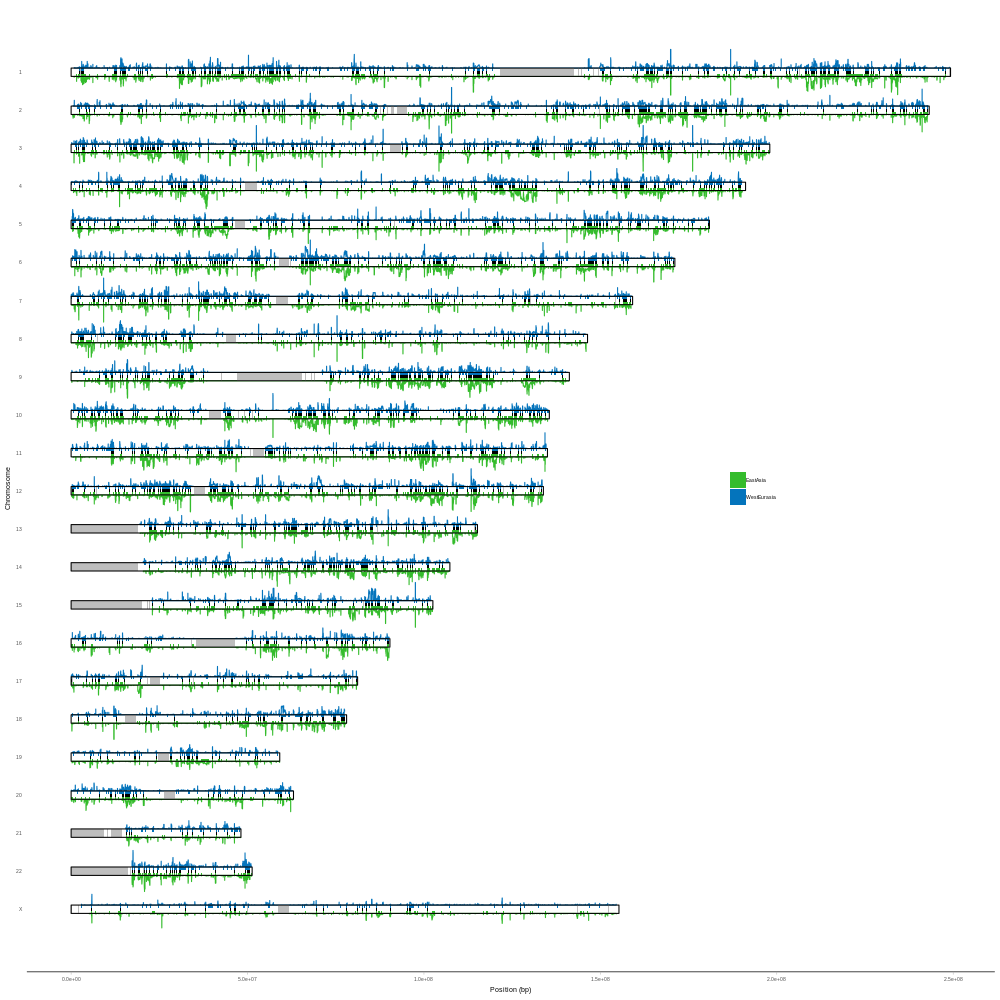
    


<a name="SupFig9"></a>
#### SI Figure 9

<a name="SupFig10"></a>
#### SI Figure 10


```r
%%R

simulation_fragstats_twopops <- function(stat_filter, ylab_title){
    read.table("SimulationsArchaicFragments.txt", header = T) %>% 
        gather("stat", "value", mean_len, total_seq, n_frag) %>%
        mutate(iteration = ifelse(pop == "EA", iteration+0.15, iteration-0.15)) %>%
        filter(stat == stat_filter) %>%
        ggplot() +
        geom_point(aes(x = iteration, y = value, color = pop)) +
        geom_errorbar(data = . %>%  group_by(scenario, iteration, stat, pop) %>% summarize(se = sd(value)/sqrt(n()), mean_value = mean(value)), 
                          aes(x = iteration, ymin = mean_value-(se*1.96), ymax = mean_value+(se*1.96))) +
        geom_point(data = . %>%  group_by(scenario, iteration, stat, pop) %>% summarize(value = mean(value)), aes(x = iteration, y = value, fill = pop), shape = 22, size = 2) +
        ylab(ylab_title) +
        labs(fill = "Populations", color = "Populations") +
        facet_wrap(.~scenario, nrow = 1) +
        scale_x_continuous(breaks = 0:9) +
        theme(strip.text = element_text(size = 5,  family = "Helvetica"), axis.title.x = element_blank())
        
}

simulation_fragstats_ratio <- function(stat_filter, ylab_title){

    read.table("SimulationsArchaicFragments.txt", header = T) %>% 
        gather("stat", "value", mean_len, total_seq, n_frag) %>%
        filter(stat == stat_filter) %>%
        group_by(scenario, iteration, stat, pop) %>% 
        summarize(mean_value = mean(value)) %>%
        spread(pop, mean_value) %>%
        mutate(ratio = EA/WE) %>%
        ggplot() +
        geom_point(aes(x = iteration, y = ratio, color = "EA/WE")) +
        geom_hline(yintercept = c(1), linetype = "dashed") +
        ylab(ylab_title) +
        facet_wrap(.~scenario, nrow = 1) +
        scale_x_continuous(breaks = 0:9) +
        scale_color_manual(values = c("black")) +
        theme(legend.title = element_blank(), strip.text = element_text(size = 5,  family = "Helvetica"), axis.title.x = element_blank())
}

plot_grid(
    simulation_fragstats_twopops("mean_len", "Mean Archaic\nFragment Length (bp)"),
    simulation_fragstats_ratio("mean_len", "\nRatio"),
    simulation_fragstats_twopops("n_frag", "Number Archaic\nFragments"),
    simulation_fragstats_ratio("n_frag", "\nRatio"),
    simulation_fragstats_twopops("total_seq", "Archaic\nSequence (bp)"),
    simulation_fragstats_ratio("total_seq", "\nRatio"), 
    ncol = 1, align = c("v"), rel_heights = c(1, 0.5, 1, 0.5, 1, 0.5), labels = c("a", "", "b", "", "c"), label_size = 8, label_fontfamily = "Helvetica") -> SIFig10

SIFig10
    
ggsave("SIFig10.pdf",  width = 18, height = 21, units = "cm") 

SIFig10
```


    
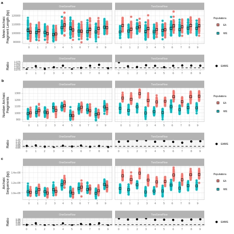
    


<a name="SupFig11"></a>
#### SI Figure 11


```r
%%R

plot_grid(
    read.table("SimulationsArchaicFragments_compare.txt", header = T) %>%
        mutate(shared_WE = shared, shared_EA = shared) %>% 
        select(-c(shared, WE_EA_ratio)) %>% 
        gather("type_frag", "value", total_EA,  shared_EA, total_WE, shared_WE) %>%
        separate(type_frag, c("totalshared", "pop"), sep = "_") %>%
        ggplot() +
        geom_bar(data = . %>% filter(totalshared == "total"),  stat = "identity", aes(x = iteration, y = value, fill = pop), position = position_dodge2(), alpha = 0.5, color = 1) +
        geom_bar(data = . %>% filter(totalshared == "shared"), stat = "identity", aes(x = iteration, y = value, fill = pop), position = position_dodge2(), color = 1) +
        facet_wrap(scenario~.) +
        scale_x_continuous(breaks = 0:9) +
        ylab("Joined Archaic\nSequence (bp)") +
        theme(strip.text = element_text(size = 5,  family = "Helvetica"), axis.title.x = element_blank(), legend.title = element_blank()),


    read.table("SimulationsArchaicFragments_compare.txt", header = T) %>% 
        ggplot() +
        geom_point(aes(x = iteration, y = shared_WE*100, color = "WE")) +
        geom_point(aes(x = iteration, y = shared_EA*100, color = "EA")) +
        facet_wrap(scenario~.) +
        scale_x_continuous(breaks = 0:9) +
        ylab("Shared Joined\nArchaic Sequence (%)") +
        theme(strip.text = element_text(size = 5,  family = "Helvetica"), axis.title.x = element_blank(), legend.title = element_blank()), 
    
    ncol = 1, labels = c("a", "b"), align = c("v"), rel_heights = c(1, 0.5), label_size = 8, label_fontfamily = "Helvetica") -> SIFig11

SIFig11
    
ggsave("SIFig11.pdf",  width = 18, height = 15, units = "cm") 

SIFig11
```


    
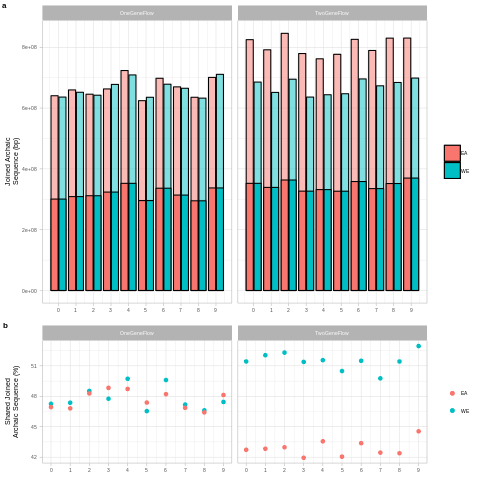
    


<a name="SupFig12"></a>
#### SI Figure 12

##### SI Figure 12a


```r
%%R

mutation_spectrum_pereg <- function(){
    read.table("SITab10.txt", header = T) %>% 
        gather("mut_stat", "value", 2:37) %>%
        separate(mut_stat, c("mutation", "countfrac", "stat"), sep = "_") %>%
        spread(stat, value) %>%
        filter(countfrac == "counts") %>%
        select(-c(countfrac)) %>%
        mutate(mutation = str_replace(mutation, "\\.", ">"),
               mutation = str_replace(mutation, "\\.", "'"),
               mutation = factor(mutation, levels = c("T>A", "T>C", "T>G", "C>A", "C>T", "C>G", "CpG>TpG", "C>T'", "TCC>TTC")),
               reg = factor(reg, levels = c("WestEurasia", "SouthAsia", "America", "CentralAsiaSiberia", "EastAsia")))
}


mutation_spectrum_pereg() %>%
    ggplot() +
    geom_bar(stat = "identity", aes(x = mutation, y = mean,                fill = reg), position = position_dodge()) +
    geom_errorbar(              aes(x = mutation, ymin = mean-(1.96*se), ymax = mean+(1.96*se), group = reg), position = position_dodge()) +
    ylab("Mean number of derived alleles") +
    theme(axis.title.x = element_blank(),panel.grid.major.x = element_blank(), panel.grid.minor.x = element_blank(), legend.position = "none") +
    scale_fill_manual(values = reg_colors) -> SIFig12a
    
SIFig12a
```


    
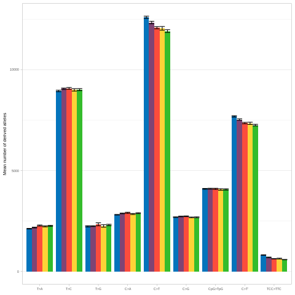
    


##### SI Figure 12b


```r
%%R

plot_mutation_spectrum_dist <- function(mut){
   mutation_spectrum_mean_len_perind() %>%
    filter(mutation == mut) %>%
    mutate(reg = factor(reg, levels = c("WestEurasia", "SouthAsia", "America", "CentralAsiaSiberia", "EastAsia"))) %>% 
    ggplot() +
    geom_violin(aes(x = reg, y = counts, color = reg, fill = reg), alpha = 0.1, draw_quantiles = c(0.5)) +
    geom_dotplot(aes(y = counts, x = reg, fill = reg), binaxis = "y", stackdir='center', dotsize = 1, alpha = 0.5, 
                 binwidth = mutation_spectrum_mean_len_perind() %>% filter(mutation == "C>A") %>% summarize(binwidth = (max(counts)-min(counts))/50) %>% pull(binwidth)) +

    geom_errorbar(data = mutation_spectrum_pereg() %>% filter(mutation == mut), aes(x = reg, ymin = mean-(1.96*se), ymax = mean+(1.96*se)), width = 0.25, size = 0.5) +
    geom_point(data = mutation_spectrum_pereg() %>% filter(mutation == mut),    aes(x = reg, y = mean, fill = reg), color = "black", size = 2, shape = 22) +

    scale_color_manual(values = reg_colors)+
    scale_fill_manual(values = reg_colors) +
    theme(legend.title = element_blank(), axis.text.x = element_blank(), axis.ticks.x = element_blank(), axis.title.x = element_blank(),
          panel.grid.major.x = element_blank(), panel.grid.minor.x = element_blank(), legend.position = "none") +
    facet_wrap(.~mutation) 
}

plot_grid(plot_mutation_spectrum_dist("T>A"), 
          plot_mutation_spectrum_dist("T>C"),
          plot_mutation_spectrum_dist("T>G"),
          plot_mutation_spectrum_dist("C>A"),
          plot_mutation_spectrum_dist("C>T"),
          plot_mutation_spectrum_dist("C>G"),
          plot_mutation_spectrum_dist("CpG>TpG"),
          plot_mutation_spectrum_dist("C>T'"),
          plot_mutation_spectrum_dist("TCC>TTC"), nrow = 3) -> SIFig12b
    
SIFig12b
```


    
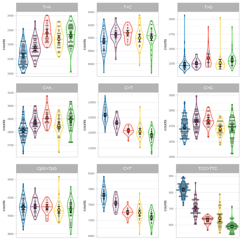
    


```r
%%R

plot_grid(SIFig9a , SIFig9b, labels = c("a", "b"), rel_heights = c(1.5, 3), ncol = 1) -> SIFig12

SIFig12

ggsave("SIFig12.pdf",  width = 18, height = 20, units = "cm")

SIFig12
```


    
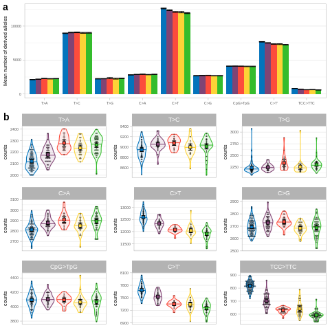
    


<a name="SupFig13"></a>
#### SI Figure 13

<a name="SupFig14"></a>
#### SI Figure 14


```r
%%R

read.table("SITab11.txt", header = T) %>% 
    filter(coefficient == "slope") %>%
    select(mutation, data_set, estimate, std) %>%
    gather("stat", "value", estimate, std) %>%
    unite("stat", data_set, stat) %>%
    spread(stat, value) %>%
    ggplot() +
    geom_smooth(method = "lm", aes(x = SGDP_estimate, y = deCODE_estimate)) +
    geom_hline(yintercept = 0, color = "red", alpha = 0.2) +
    geom_vline(xintercept = 0, color = "red", alpha = 0.2) +
    geom_abline(intercept = 0, slope = 1, color = "black", linetype = "dashed") +
    geom_errorbar( aes(x = SGDP_estimate,   ymax = deCODE_estimate+(1.96*deCODE_std), ymin = deCODE_estimate-(1.96*deCODE_std))) +
    geom_errorbarh(aes(y = deCODE_estimate, xmax = SGDP_estimate+(1.96*SGDP_std),     xmin = SGDP_estimate-(1.96*SGDP_std))) +
    geom_point(aes(x = SGDP_estimate, y = deCODE_estimate, color = mutation), size = 2) +
    theme(aspect.ratio =  1) +
    xlab("SGDP") +
    ylab("deCODE") -> SIFig14
    
SIFig14

ggsave("SIFig14.pdf",  width = 8, height = 8, units = "cm")

SIFig14
```


    
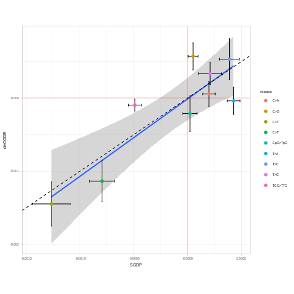
    


<a name="SupFig15"></a>
#### SI Figure 15


```r
%%R -w 20 -h 8 -u cm

plot_grid(read.table("aau1043_DataS7.tsv", header = T, sep = "\t") %>%
  filter(!is.na(Mother_age), !is.na(Father_age)) %>%
  ggplot() +
  geom_histogram(aes(x = Father_age-Mother_age), binwidth = 1) +
  geom_vline(data = . %>% summarise(mean = mean(Father_age-Mother_age)), aes(xintercept = mean), linetype = "dashed", color = "gray") +
  geom_text(data = . %>% summarise(mean = mean(Father_age-Mother_age)), aes(x = mean+22, y = 11500, label = paste("Mean = ", round(mean, digits = 2), sep = ""))) +
  geom_text(data = . %>% summarise(mean = mean(Father_age-Mother_age), sd = sd(Father_age-Mother_age)), aes(x = mean+22, y = 10500, label = paste("sd = ", round(sd, digits = 2), sep = ""))) +
  ylab("Counts") +
  xlab("Father age - Mother age"),

read.table("aau1043_DataS7.tsv", header = T, sep = "\t") %>%
  filter(!is.na(Mother_age), !is.na(Father_age)) %>%
  mutate(diff = abs(Father_age-Mother_age)) %>%
  count(diff) %>%
  mutate(perc = (100*cumsum(n))/sum(n),
         plot = (perc/100)*max(n))  %>%
  ggplot() +
  geom_bar(stat = "identity", aes(y = n, x = diff)) +
  geom_point(aes(x = diff, y = plot), color = "red") +
  geom_hline(aes(yintercept = max(n)/2), linetype = "dashed", color = "gray") +
  geom_text(data = . %>% summarize(y = max(n)/2), aes(y = y+750, x = 40, label = "50% data")) +
  ylab("Counts") +
  xlab("| Father age - Mother age |"),

read.table("aau1043_DataS7.tsv", header = T, sep = "\t") %>%
  filter(!is.na(Mother_age), !is.na(Father_age), abs(Father_age-Mother_age) < 4) %>%
  ggplot() +
  geom_histogram(aes(x = Father_age-Mother_age), binwidth = 1) +
  geom_vline(data = . %>% summarise(mean = mean(Father_age-Mother_age)), aes(xintercept = mean), linetype = "dashed", color = "gray") +
  geom_text(data = . %>% summarise(mean = mean(Father_age-Mother_age)), aes(x = mean-2.5, y = 11500, label = paste("Mean = ", round(mean, digits = 2), sep = ""))) +
  geom_text(data = . %>% summarise(mean = mean(Father_age-Mother_age), sd = sd(Father_age-Mother_age)), aes(x = mean-2.5, y = 10500, label = paste("sd = ", round(sd, digits = 2), sep = ""))) +
  ylab("Counts") +
  xlab("Father age - Mother age"), labels = "auto", nrow = 1, label_size = 8, label_fontfamily = "Helvetica") -> SIFig15

SIFig15

ggsave("SIFig15.pdf",  width = 17, height = 7, units = "cm")

SIFig15
```


    
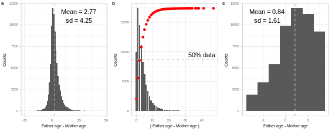
    


<a name="SupFig16"></a>
#### SI Figure 16


```r
%%R

linear_model_table(list(deCODE_mutation_spectrum_mean_age(), deCODE_mutation_spectrum_mean_age(min_probands = 2, max_age_diff = 4)), c("deCODE_0",    "deCODE_4")) %>%
    mutate(mutation = factor(mutation, levels = c("T>A", "T>C", "T>G", "C>A", "C>T", "C>G", "CpG>TpG", "C>T'", "TCC>TTC"))) %>%
    arrange(coefficient, mutation, data_set) %>%
    select(coefficient, mutation, data_set, estimate, std, t_val, p_val) %>%
    gather(stat, value, 4:7) %>%
    spread(stat, value) %>%
    select(coefficient, mutation, data_set, estimate, std, t_val, p_val) %>%
    filter(coefficient == "slope") %>%
    select(mutation, data_set, estimate, std) %>%
    gather("stat", "value", estimate, std) %>%
    unite("stat", data_set, stat) %>%
    spread(stat, value) %>%
    ggplot() +
    geom_hline(yintercept = 0, color = "red", alpha = 0.2) +
    geom_vline(xintercept = 0, color = "red", alpha = 0.2) +
    geom_abline(intercept = 0, slope = 1, color = "gray", linetype = "dashed") +
    geom_errorbar( aes(x = deCODE_4_estimate, ymax = deCODE_0_estimate+(1.96*deCODE_0_std), ymin = deCODE_0_estimate-(1.96*deCODE_0_std))) +
    geom_errorbarh(aes(y = deCODE_0_estimate, xmax = deCODE_4_estimate+(1.96*deCODE_4_std), xmin = deCODE_4_estimate-(1.96*deCODE_4_std))) +
    geom_point(aes(x = deCODE_4_estimate, y = deCODE_0_estimate, color = mutation), size = 2) +
    theme(aspect.ratio =  1) +
    xlab("deCODE, parental age difference < 4 years") +
    ylab("deCODE") -> SIFig16
    
SIFig16

ggsave("SIFig16.pdf",  width = 8, height = 8, units = "cm")

SIFig16
```


    
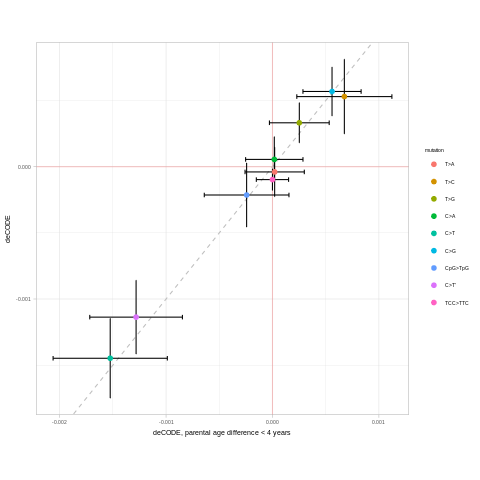
    


<a name="SupFig17"></a>
#### SI Figure 17


```r
%%R

read.table("Data2_mutation_spectrum.txt", header = T) %>% head()
```

                ind                reg sex chrom fiv anc thr der counts
    1 S_Abkhasian-1        WestEurasia   M     1   A   C   A   A     17
    2 S_Abkhasian-2        WestEurasia   M     1   A   C   A   A     13
    3    S_Adygei-1        WestEurasia   M     1   A   C   A   A     21
    4    S_Adygei-2        WestEurasia   F     1   A   C   A   A     24
    5  S_Albanian-1        WestEurasia   F     1   A   C   A   A     27
    6     S_Aleut-1 CentralAsiaSiberia   M     1   A   C   A   A     17


```r
%%R

read.table("Data2_mutation_spectrum.txt", header = T) %>% filter(chrom == "Y") %>% group_by(ind, reg) %>% summarise(counts = sum(counts)) %>% ungroup() %>% pull(counts) %>% max() -> max_plot
read.table("Data2_mutation_spectrum.txt", header = T) %>% filter(chrom == "Y") %>% group_by(ind, reg) %>% summarise(counts = sum(counts)) %>% ungroup() %>% pull(counts) %>% min() -> min_plot


read.table("Data2_mutation_spectrum.txt", header = T) %>%
    filter(chrom == "Y") %>%
    group_by(ind, reg) %>%
    summarise(counts = sum(counts)) %>%
    ungroup() %>%
    mutate(reg = factor(reg, levels = c("WestEurasia", "SouthAsia", "America", "CentralAsiaSiberia", "EastAsia"))) %>% 
    ggplot() +
    geom_violin(aes(x = reg, y = counts, color = reg, fill = reg), alpha = 0.1, draw_quantiles = c(0.5)) +
    geom_dotplot(aes(y = counts, x = reg, fill = reg), binaxis = "y", stackdir='center', dotsize = 1, binwidth = (max_plot-min_plot)/50, alpha = 0.5) +
    ylab("Derived allele acumulation") +
    theme(legend.title = element_blank(), axis.ticks.x = element_blank(), axis.title.x = element_blank(),
          panel.grid.major.x = element_blank(), panel.grid.minor.x = element_blank(), legend.position = "none") +
    scale_color_manual(values = reg_colors)+
    scale_fill_manual(values = reg_colors) +
    geom_errorbar(data = read.table("SITab13.txt", header =  T), aes(x = reg, ymin = derallele_mean-(1.96*derallele_se), ymax = derallele_mean+(1.96*derallele_se)), width = 0.25, size = 0.5) +
    geom_point(data = read.table("SITab13.txt", header =  T), aes(x = reg, y = derallele_mean, fill = reg), color = "black", size = 2, shape = 22)  -> SIFig17

SIFig17
    
ggsave("SIFig17.pdf", width = 8, height = 4, units = "cm")

SIFig17
```


    
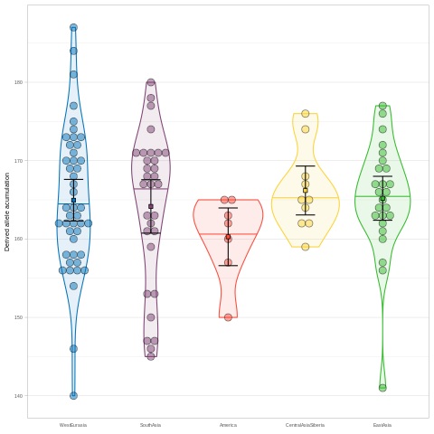
    


[](#HomeHome) &nbsp;

&nbsp;


<a name="Sta"></a>
## 4. Statistical tests
<a name="Sta1"></a>
### A. Difference average archaic fragment length among regions


```python
archfrag_mean_len_perind = %R archaicfragmentstatisticsperind() %>% ungroup() %>% select(group = region, value = mean_len)
archfrag_mean_len_perind
```


<div>
<style scoped>
    .dataframe tbody tr th:only-of-type {
        vertical-align: middle;
    }

    .dataframe tbody tr th {
        vertical-align: top;
    }

    .dataframe thead th {
        text-align: right;
    }
</style>
<table border="1" class="dataframe">
  <thead>
    <tr style="text-align: right;">
      <th></th>
      <th>group</th>
      <th>value</th>
    </tr>
  </thead>
  <tbody>
    <tr>
      <th>1</th>
      <td>WestEurasia</td>
      <td>73479.708637</td>
    </tr>
    <tr>
      <th>2</th>
      <td>WestEurasia</td>
      <td>73061.889251</td>
    </tr>
    <tr>
      <th>3</th>
      <td>WestEurasia</td>
      <td>75186.897881</td>
    </tr>
    <tr>
      <th>4</th>
      <td>WestEurasia</td>
      <td>75672.380952</td>
    </tr>
    <tr>
      <th>5</th>
      <td>WestEurasia</td>
      <td>78357.217030</td>
    </tr>
    <tr>
      <th>...</th>
      <td>...</td>
      <td>...</td>
    </tr>
    <tr>
      <th>198</th>
      <td>WestEurasia</td>
      <td>75183.457052</td>
    </tr>
    <tr>
      <th>199</th>
      <td>EastAsia</td>
      <td>80335.557674</td>
    </tr>
    <tr>
      <th>200</th>
      <td>EastAsia</td>
      <td>82528.365792</td>
    </tr>
    <tr>
      <th>201</th>
      <td>America</td>
      <td>75568.083261</td>
    </tr>
    <tr>
      <th>202</th>
      <td>America</td>
      <td>81663.602941</td>
    </tr>
  </tbody>
</table>
<p>202 rows × 2 columns</p>
</div>


```python
Fobs, p = permutation_fstat(archfrag_mean_len_perind, 100000)
print("Fobs    = {}".format(Fobs))
print("P value = {}".format(p/100000))
```

    Fobs    = 92.748106105547
    P value = 0.0


<a name="Sta2"></a>
### B. Difference mean number archaic fragments among regions


```python
archfrag_num_frag_perind = %R archaicfragmentstatisticsperind() %>% ungroup() %>% select(group = region, value = num_frag)
archfrag_num_frag_perind
```


<div>
<style scoped>
    .dataframe tbody tr th:only-of-type {
        vertical-align: middle;
    }

    .dataframe tbody tr th {
        vertical-align: top;
    }

    .dataframe thead th {
        text-align: right;
    }
</style>
<table border="1" class="dataframe">
  <thead>
    <tr style="text-align: right;">
      <th></th>
      <th>group</th>
      <th>value</th>
    </tr>
  </thead>
  <tbody>
    <tr>
      <th>1</th>
      <td>WestEurasia</td>
      <td>961</td>
    </tr>
    <tr>
      <th>2</th>
      <td>WestEurasia</td>
      <td>921</td>
    </tr>
    <tr>
      <th>3</th>
      <td>WestEurasia</td>
      <td>1038</td>
    </tr>
    <tr>
      <th>4</th>
      <td>WestEurasia</td>
      <td>1050</td>
    </tr>
    <tr>
      <th>5</th>
      <td>WestEurasia</td>
      <td>963</td>
    </tr>
    <tr>
      <th>...</th>
      <td>...</td>
      <td>...</td>
    </tr>
    <tr>
      <th>198</th>
      <td>WestEurasia</td>
      <td>943</td>
    </tr>
    <tr>
      <th>199</th>
      <td>EastAsia</td>
      <td>1049</td>
    </tr>
    <tr>
      <th>200</th>
      <td>EastAsia</td>
      <td>1181</td>
    </tr>
    <tr>
      <th>201</th>
      <td>America</td>
      <td>1153</td>
    </tr>
    <tr>
      <th>202</th>
      <td>America</td>
      <td>1088</td>
    </tr>
  </tbody>
</table>
<p>202 rows × 2 columns</p>
</div>


```python
Fobs, p = permutation_fstat(archfrag_num_frag_perind, 100000)
print("Fobs    = {}".format(Fobs))
print("P value = {}".format(p/100000))
```

    Fobs    = 90.02644219860417
    P value = 0.0


<a name="Sta3"></a>
### C. Difference mean archaic sequence among regions 


```python
archfrag_arch_seq_perind = %R archaicfragmentstatisticsperind() %>% ungroup() %>% select(group = region, value = arch_seq)
archfrag_arch_seq_perind
```


<div>
<style scoped>
    .dataframe tbody tr th:only-of-type {
        vertical-align: middle;
    }

    .dataframe tbody tr th {
        vertical-align: top;
    }

    .dataframe thead th {
        text-align: right;
    }
</style>
<table border="1" class="dataframe">
  <thead>
    <tr style="text-align: right;">
      <th></th>
      <th>group</th>
      <th>value</th>
    </tr>
  </thead>
  <tbody>
    <tr>
      <th>1</th>
      <td>WestEurasia</td>
      <td>70614000</td>
    </tr>
    <tr>
      <th>2</th>
      <td>WestEurasia</td>
      <td>67290000</td>
    </tr>
    <tr>
      <th>3</th>
      <td>WestEurasia</td>
      <td>78044000</td>
    </tr>
    <tr>
      <th>4</th>
      <td>WestEurasia</td>
      <td>79456000</td>
    </tr>
    <tr>
      <th>5</th>
      <td>WestEurasia</td>
      <td>75458000</td>
    </tr>
    <tr>
      <th>...</th>
      <td>...</td>
      <td>...</td>
    </tr>
    <tr>
      <th>198</th>
      <td>WestEurasia</td>
      <td>70898000</td>
    </tr>
    <tr>
      <th>199</th>
      <td>EastAsia</td>
      <td>84272000</td>
    </tr>
    <tr>
      <th>200</th>
      <td>EastAsia</td>
      <td>97466000</td>
    </tr>
    <tr>
      <th>201</th>
      <td>America</td>
      <td>87130000</td>
    </tr>
    <tr>
      <th>202</th>
      <td>America</td>
      <td>88850000</td>
    </tr>
  </tbody>
</table>
<p>202 rows × 2 columns</p>
</div>


```python
Fobs, p = permutation_fstat(archfrag_arch_seq_perind, 100000)
print("Fobs    = {}".format(Fobs))
print("P value = {}".format(p/100000))
```

    Fobs    = 133.029907805895
    P value = 0.0


<a name="Sta4"></a>
### D. Difference average overlapping archaic fragment length among West Eurasians and East Asians


```python
archfrag_mean_len_perind_shared_WEEA = %R read.table("archaicfragments_ind_shared_WEEA.txt", header = T) %>% group_by(name, region) %>% summarize(mean_len = mean(length)) %>% ungroup() %>% select(group = region, value = mean_len)
archfrag_mean_len_perind_shared_WEEA
```


<div>
<style scoped>
    .dataframe tbody tr th:only-of-type {
        vertical-align: middle;
    }

    .dataframe tbody tr th {
        vertical-align: top;
    }

    .dataframe thead th {
        text-align: right;
    }
</style>
<table border="1" class="dataframe">
  <thead>
    <tr style="text-align: right;">
      <th></th>
      <th>group</th>
      <th>value</th>
    </tr>
  </thead>
  <tbody>
    <tr>
      <th>1</th>
      <td>WestEurasia</td>
      <td>80126.649077</td>
    </tr>
    <tr>
      <th>2</th>
      <td>WestEurasia</td>
      <td>81693.181818</td>
    </tr>
    <tr>
      <th>3</th>
      <td>WestEurasia</td>
      <td>81943.902439</td>
    </tr>
    <tr>
      <th>4</th>
      <td>WestEurasia</td>
      <td>86032.042724</td>
    </tr>
    <tr>
      <th>5</th>
      <td>EastAsia</td>
      <td>88361.268403</td>
    </tr>
    <tr>
      <th>...</th>
      <td>...</td>
      <td>...</td>
    </tr>
    <tr>
      <th>86</th>
      <td>EastAsia</td>
      <td>90859.913793</td>
    </tr>
    <tr>
      <th>87</th>
      <td>EastAsia</td>
      <td>90319.735391</td>
    </tr>
    <tr>
      <th>88</th>
      <td>WestEurasia</td>
      <td>73782.481752</td>
    </tr>
    <tr>
      <th>89</th>
      <td>EastAsia</td>
      <td>89043.209877</td>
    </tr>
    <tr>
      <th>90</th>
      <td>EastAsia</td>
      <td>90170.329670</td>
    </tr>
  </tbody>
</table>
<p>90 rows × 2 columns</p>
</div>


```python
diffobs, p = permutation_two_group_diff(archfrag_mean_len_perind_shared_WEEA, 100000)
print("diffobs = {}".format(diffobs))
print("P value = {}".format(p*2/100000))
```

    diffobs = -10387.481881864747
    P value = 0.0


<a name="Sta5"></a>
### E. Difference accumulation of derived alleles among regions


```python
derallel_perind = %R read.table("Data2_mutation_spectrum.txt", header = T) %>% filter(chrom != "X", chrom != "Y") %>% group_by(ind, reg) %>% summarize(counts = sum(counts)) %>% ungroup() %>% select(group = reg, value = counts)

derallel_perind
```


<div>
<style scoped>
    .dataframe tbody tr th:only-of-type {
        vertical-align: middle;
    }

    .dataframe tbody tr th {
        vertical-align: top;
    }

    .dataframe thead th {
        text-align: right;
    }
</style>
<table border="1" class="dataframe">
  <thead>
    <tr style="text-align: right;">
      <th></th>
      <th>group</th>
      <th>value</th>
    </tr>
  </thead>
  <tbody>
    <tr>
      <th>1</th>
      <td>WestEurasia</td>
      <td>30491</td>
    </tr>
    <tr>
      <th>2</th>
      <td>WestEurasia</td>
      <td>30920</td>
    </tr>
    <tr>
      <th>3</th>
      <td>WestEurasia</td>
      <td>32200</td>
    </tr>
    <tr>
      <th>4</th>
      <td>WestEurasia</td>
      <td>32463</td>
    </tr>
    <tr>
      <th>5</th>
      <td>WestEurasia</td>
      <td>31007</td>
    </tr>
    <tr>
      <th>...</th>
      <td>...</td>
      <td>...</td>
    </tr>
    <tr>
      <th>198</th>
      <td>WestEurasia</td>
      <td>31425</td>
    </tr>
    <tr>
      <th>199</th>
      <td>EastAsia</td>
      <td>29398</td>
    </tr>
    <tr>
      <th>200</th>
      <td>EastAsia</td>
      <td>30189</td>
    </tr>
    <tr>
      <th>201</th>
      <td>America</td>
      <td>31483</td>
    </tr>
    <tr>
      <th>202</th>
      <td>America</td>
      <td>30879</td>
    </tr>
  </tbody>
</table>
<p>202 rows × 2 columns</p>
</div>


```python
Fobs, p = permutation_fstat(derallel_perind, 100000)
print("Fobs    = {}".format(Fobs))
print("P value = {}".format(p/100000))
```

    Fobs    = 5.73687762592627
    P value = 0.0003


<a name="Sta6"></a>
### F. Difference accumulation of derived alleles among West Eurasians and East Asians


```python
derallel_perind_WE_EA = %R read.table("Data2_mutation_spectrum.txt", header = T) %>% filter(chrom != "X", chrom != "Y", reg %in% c("WestEurasia", "EastAsia")) %>% group_by(ind, reg) %>% summarize(counts = sum(counts)) %>% ungroup() %>% select(group = reg, value = counts) %>% mutate(group = as.character(group))

derallel_perind_WE_EA
```


<div>
<style scoped>
    .dataframe tbody tr th:only-of-type {
        vertical-align: middle;
    }

    .dataframe tbody tr th {
        vertical-align: top;
    }

    .dataframe thead th {
        text-align: right;
    }
</style>
<table border="1" class="dataframe">
  <thead>
    <tr style="text-align: right;">
      <th></th>
      <th>group</th>
      <th>value</th>
    </tr>
  </thead>
  <tbody>
    <tr>
      <th>1</th>
      <td>WestEurasia</td>
      <td>30491</td>
    </tr>
    <tr>
      <th>2</th>
      <td>WestEurasia</td>
      <td>30920</td>
    </tr>
    <tr>
      <th>3</th>
      <td>WestEurasia</td>
      <td>32200</td>
    </tr>
    <tr>
      <th>4</th>
      <td>WestEurasia</td>
      <td>32463</td>
    </tr>
    <tr>
      <th>5</th>
      <td>WestEurasia</td>
      <td>31007</td>
    </tr>
    <tr>
      <th>...</th>
      <td>...</td>
      <td>...</td>
    </tr>
    <tr>
      <th>112</th>
      <td>EastAsia</td>
      <td>31067</td>
    </tr>
    <tr>
      <th>113</th>
      <td>WestEurasia</td>
      <td>31496</td>
    </tr>
    <tr>
      <th>114</th>
      <td>WestEurasia</td>
      <td>31425</td>
    </tr>
    <tr>
      <th>115</th>
      <td>EastAsia</td>
      <td>29398</td>
    </tr>
    <tr>
      <th>116</th>
      <td>EastAsia</td>
      <td>30189</td>
    </tr>
  </tbody>
</table>
<p>116 rows × 2 columns</p>
</div>


```python
diffobs, p = permutation_two_group_diff(derallel_perind_WE_EA, 100000)
print("diffobs = {}".format(diffobs))
print("P value = {}".format(p*2/100000))
```

    diffobs = 338.20907668231666
    P value = 0.0013


<a name="Sta7"></a>
### G. Linear model slopes correlation between the SGDP and deCODE


```r
%%R

read.table("SITab11.txt", header = T) %>% 
    filter(coefficient == "slope") %>%
    select(mutation, data_set, estimate) %>%
    spread(data_set, estimate) %>%
    lm(formula = deCODE~SGDP) %>%
    summary()
```

    
    Call:
    lm(formula = deCODE ~ SGDP, data = .)
    
    Residuals:
           Min         1Q     Median         3Q        Max 
    -0.0004783 -0.0002236 -0.0000957  0.0001334  0.0005286 
    
    Coefficients:
                  Estimate Std. Error t value Pr(>|t|)   
    (Intercept) -1.196e-05  1.227e-04  -0.098  0.92505   
    SGDP         1.058e+00  2.163e-01   4.892  0.00177 **
    ---
    Signif. codes:  0 ‘***’ 0.001 ‘**’ 0.01 ‘*’ 0.05 ‘.’ 0.1 ‘ ’ 1
    
    Residual standard error: 0.0003565 on 7 degrees of freedom
    Multiple R-squared:  0.7737,	Adjusted R-squared:  0.7414 
    F-statistic: 23.94 on 1 and 7 DF,  p-value: 0.001768
    


<a name="Sta8"></a>
### H. Difference X-to-A ratio among regions


```python
X_to_A_ratio_perind = %R X_to_A_ratio_perind() %>% ungroup() %>% select(group = reg, value = ratio)

X_to_A_ratio_perind
```


<div>
<style scoped>
    .dataframe tbody tr th:only-of-type {
        vertical-align: middle;
    }

    .dataframe tbody tr th {
        vertical-align: top;
    }

    .dataframe thead th {
        text-align: right;
    }
</style>
<table border="1" class="dataframe">
  <thead>
    <tr style="text-align: right;">
      <th></th>
      <th>group</th>
      <th>value</th>
    </tr>
  </thead>
  <tbody>
    <tr>
      <th>1</th>
      <td>WestEurasia</td>
      <td>0.774969</td>
    </tr>
    <tr>
      <th>2</th>
      <td>WestEurasia</td>
      <td>0.899544</td>
    </tr>
    <tr>
      <th>3</th>
      <td>CentralAsiaSiberia</td>
      <td>0.829191</td>
    </tr>
    <tr>
      <th>4</th>
      <td>WestEurasia</td>
      <td>0.770934</td>
    </tr>
    <tr>
      <th>5</th>
      <td>WestEurasia</td>
      <td>0.833592</td>
    </tr>
    <tr>
      <th>...</th>
      <td>...</td>
      <td>...</td>
    </tr>
    <tr>
      <th>76</th>
      <td>CentralAsiaSiberia</td>
      <td>0.867239</td>
    </tr>
    <tr>
      <th>77</th>
      <td>EastAsia</td>
      <td>0.867482</td>
    </tr>
    <tr>
      <th>78</th>
      <td>CentralAsiaSiberia</td>
      <td>0.818291</td>
    </tr>
    <tr>
      <th>79</th>
      <td>WestEurasia</td>
      <td>0.778728</td>
    </tr>
    <tr>
      <th>80</th>
      <td>EastAsia</td>
      <td>0.861515</td>
    </tr>
  </tbody>
</table>
<p>80 rows × 2 columns</p>
</div>


```python
Fobs, p = permutation_fstat(X_to_A_ratio_perind, 100000)
print("Fobs    = {}".format(Fobs))
print("P value = {}".format(p/100000))
```

    Fobs    = 5.657711298590471
    P value = 0.00044


<a name="Sta9"></a>
### I. Difference CGenrichment ratio among regions


```python
CGenrichment_perind = %R CGenrichment_perind() %>% ungroup() %>% select(group = reg, value = ratio)

CGenrichment_perind
```


<div>
<style scoped>
    .dataframe tbody tr th:only-of-type {
        vertical-align: middle;
    }

    .dataframe tbody tr th {
        vertical-align: top;
    }

    .dataframe thead th {
        text-align: right;
    }
</style>
<table border="1" class="dataframe">
  <thead>
    <tr style="text-align: right;">
      <th></th>
      <th>group</th>
      <th>value</th>
    </tr>
  </thead>
  <tbody>
    <tr>
      <th>1</th>
      <td>WestEurasia</td>
      <td>1.359162</td>
    </tr>
    <tr>
      <th>2</th>
      <td>WestEurasia</td>
      <td>1.347497</td>
    </tr>
    <tr>
      <th>3</th>
      <td>WestEurasia</td>
      <td>1.357624</td>
    </tr>
    <tr>
      <th>4</th>
      <td>WestEurasia</td>
      <td>1.314715</td>
    </tr>
    <tr>
      <th>5</th>
      <td>WestEurasia</td>
      <td>1.314628</td>
    </tr>
    <tr>
      <th>...</th>
      <td>...</td>
      <td>...</td>
    </tr>
    <tr>
      <th>198</th>
      <td>WestEurasia</td>
      <td>1.335050</td>
    </tr>
    <tr>
      <th>199</th>
      <td>EastAsia</td>
      <td>1.521676</td>
    </tr>
    <tr>
      <th>200</th>
      <td>EastAsia</td>
      <td>1.408892</td>
    </tr>
    <tr>
      <th>201</th>
      <td>America</td>
      <td>1.413611</td>
    </tr>
    <tr>
      <th>202</th>
      <td>America</td>
      <td>1.464001</td>
    </tr>
  </tbody>
</table>
<p>202 rows × 2 columns</p>
</div>


```python
Fobs, p = permutation_fstat(CGenrichment_perind, 100000)
print("Fobs    = {}".format(Fobs))
print("P value = {}".format(p/100000))
```

    Fobs    = 4.193996425536348
    P value = 0.0031


<a name="Sta10"></a>
### J. Difference accumulation of derived alleles on Y chromosome among regions


```python
derallel_perind_Y = %R read.table("Data2_mutation_spectrum.txt", header = T) %>% filter(chrom == "Y") %>% group_by(ind, reg) %>% summarize(counts = sum(counts)) %>% ungroup() %>% select(group = reg, value = counts)

derallel_perind_Y
```


<div>
<style scoped>
    .dataframe tbody tr th:only-of-type {
        vertical-align: middle;
    }

    .dataframe tbody tr th {
        vertical-align: top;
    }

    .dataframe thead th {
        text-align: right;
    }
</style>
<table border="1" class="dataframe">
  <thead>
    <tr style="text-align: right;">
      <th></th>
      <th>group</th>
      <th>value</th>
    </tr>
  </thead>
  <tbody>
    <tr>
      <th>1</th>
      <td>WestEurasia</td>
      <td>173</td>
    </tr>
    <tr>
      <th>2</th>
      <td>WestEurasia</td>
      <td>154</td>
    </tr>
    <tr>
      <th>3</th>
      <td>WestEurasia</td>
      <td>167</td>
    </tr>
    <tr>
      <th>4</th>
      <td>CentralAsiaSiberia</td>
      <td>176</td>
    </tr>
    <tr>
      <th>5</th>
      <td>CentralAsiaSiberia</td>
      <td>162</td>
    </tr>
    <tr>
      <th>...</th>
      <td>...</td>
      <td>...</td>
    </tr>
    <tr>
      <th>114</th>
      <td>CentralAsiaSiberia</td>
      <td>167</td>
    </tr>
    <tr>
      <th>115</th>
      <td>WestEurasia</td>
      <td>187</td>
    </tr>
    <tr>
      <th>116</th>
      <td>EastAsia</td>
      <td>164</td>
    </tr>
    <tr>
      <th>117</th>
      <td>America</td>
      <td>162</td>
    </tr>
    <tr>
      <th>118</th>
      <td>America</td>
      <td>165</td>
    </tr>
  </tbody>
</table>
<p>118 rows × 2 columns</p>
</div>


```python
Fobs, p = permutation_fstat(derallel_perind_Y, 100000)
print("Fobs    = {}".format(Fobs))
print("P value = {}".format(p/100000))
```

    Fobs    = 0.6005197799166269
    P value = 0.66545


<a name="Sta11"></a>
### K. Adjusted R-squared for the correlation between mean archaic fragment length and fraction of TCC>TTC derived alleles


```r
%%R

mutation_spectrum_mean_len_perind() %>% 
    filter(mutation == "TCC>TTC") %>% 
    mutate(mean_len = mean_len/1000) %>% 
    lm(formula = frac~mean_len) %>%
    summary()
```

    
    Call:
    lm(formula = frac ~ mean_len, data = .)
    
    Residuals:
           Min         1Q     Median         3Q        Max 
    -0.0038305 -0.0015785 -0.0001585  0.0012974  0.0066153 
    
    Coefficients:
                  Estimate Std. Error t value Pr(>|t|)    
    (Intercept)  6.051e-02  2.408e-03   25.13   <2e-16 ***
    mean_len    -4.913e-04  3.102e-05  -15.84   <2e-16 ***
    ---
    Signif. codes:  0 ‘***’ 0.001 ‘**’ 0.01 ‘*’ 0.05 ‘.’ 0.1 ‘ ’ 1
    
    Residual standard error: 0.002088 on 200 degrees of freedom
    Multiple R-squared:  0.5564,	Adjusted R-squared:  0.5542 
    F-statistic: 250.8 on 1 and 200 DF,  p-value: < 2.2e-16
    


<a name="Sta12"></a>
### L. Difference average archaic fragment length among regions in genetic and physical distances


```python
physical_genetic_dist_archfrag
```


<div>
<style scoped>
    .dataframe tbody tr th:only-of-type {
        vertical-align: middle;
    }

    .dataframe tbody tr th {
        vertical-align: top;
    }

    .dataframe thead th {
        text-align: right;
    }
</style>
<table border="1" class="dataframe">
  <thead>
    <tr style="text-align: right;">
      <th></th>
      <th>name</th>
      <th>reg</th>
      <th>mean_genetic_dist</th>
      <th>mean_physical_dist</th>
    </tr>
  </thead>
  <tbody>
    <tr>
      <th>1</th>
      <td>S_Bengali-1</td>
      <td>SouthAsia</td>
      <td>0.053308</td>
      <td>73673.251029</td>
    </tr>
    <tr>
      <th>2</th>
      <td>S_Bengali-2</td>
      <td>SouthAsia</td>
      <td>0.055561</td>
      <td>77558.872305</td>
    </tr>
    <tr>
      <th>3</th>
      <td>S_Dai-1</td>
      <td>EastAsia</td>
      <td>0.054927</td>
      <td>82013.852814</td>
    </tr>
    <tr>
      <th>4</th>
      <td>S_Dai-2</td>
      <td>EastAsia</td>
      <td>0.054945</td>
      <td>81771.604938</td>
    </tr>
    <tr>
      <th>5</th>
      <td>S_Dai-3</td>
      <td>EastAsia</td>
      <td>0.054556</td>
      <td>79261.824324</td>
    </tr>
    <tr>
      <th>6</th>
      <td>S_English-1</td>
      <td>WestEurasia</td>
      <td>0.043062</td>
      <td>71144.210526</td>
    </tr>
    <tr>
      <th>7</th>
      <td>S_English-2</td>
      <td>WestEurasia</td>
      <td>0.042990</td>
      <td>69879.629630</td>
    </tr>
    <tr>
      <th>8</th>
      <td>S_Finnish-1</td>
      <td>WestEurasia</td>
      <td>0.048348</td>
      <td>73960.921844</td>
    </tr>
    <tr>
      <th>9</th>
      <td>S_Finnish-2</td>
      <td>WestEurasia</td>
      <td>0.050669</td>
      <td>73225.716929</td>
    </tr>
    <tr>
      <th>10</th>
      <td>S_Finnish-3</td>
      <td>WestEurasia</td>
      <td>0.051133</td>
      <td>78566.546763</td>
    </tr>
    <tr>
      <th>11</th>
      <td>S_Han-1</td>
      <td>EastAsia</td>
      <td>0.059706</td>
      <td>86199.664430</td>
    </tr>
    <tr>
      <th>12</th>
      <td>S_Han-2</td>
      <td>EastAsia</td>
      <td>0.055997</td>
      <td>79949.823944</td>
    </tr>
    <tr>
      <th>13</th>
      <td>S_Japanese-1</td>
      <td>EastAsia</td>
      <td>0.054112</td>
      <td>82203.849519</td>
    </tr>
    <tr>
      <th>14</th>
      <td>S_Japanese-2</td>
      <td>EastAsia</td>
      <td>0.054257</td>
      <td>77278.503046</td>
    </tr>
    <tr>
      <th>15</th>
      <td>S_Japanese-3</td>
      <td>EastAsia</td>
      <td>0.057077</td>
      <td>80978.475336</td>
    </tr>
    <tr>
      <th>16</th>
      <td>S_Kinh-1</td>
      <td>EastAsia</td>
      <td>0.056588</td>
      <td>83751.666667</td>
    </tr>
    <tr>
      <th>17</th>
      <td>S_Kinh-2</td>
      <td>EastAsia</td>
      <td>0.058018</td>
      <td>79603.727715</td>
    </tr>
    <tr>
      <th>18</th>
      <td>S_Punjabi-1</td>
      <td>SouthAsia</td>
      <td>0.051986</td>
      <td>80511.705686</td>
    </tr>
    <tr>
      <th>19</th>
      <td>S_Punjabi-2</td>
      <td>SouthAsia</td>
      <td>0.049260</td>
      <td>75603.723404</td>
    </tr>
    <tr>
      <th>20</th>
      <td>S_Punjabi-3</td>
      <td>SouthAsia</td>
      <td>0.049597</td>
      <td>73382.978723</td>
    </tr>
    <tr>
      <th>21</th>
      <td>S_Punjabi-4</td>
      <td>SouthAsia</td>
      <td>0.048857</td>
      <td>72587.758776</td>
    </tr>
    <tr>
      <th>22</th>
      <td>S_Spanish-1</td>
      <td>WestEurasia</td>
      <td>0.049100</td>
      <td>77081.370450</td>
    </tr>
    <tr>
      <th>23</th>
      <td>S_Spanish-2</td>
      <td>WestEurasia</td>
      <td>0.048964</td>
      <td>70200.841220</td>
    </tr>
    <tr>
      <th>24</th>
      <td>S_Tuscan-1</td>
      <td>WestEurasia</td>
      <td>0.050025</td>
      <td>75153.115100</td>
    </tr>
    <tr>
      <th>25</th>
      <td>S_Tuscan-2</td>
      <td>WestEurasia</td>
      <td>0.050296</td>
      <td>74700.111483</td>
    </tr>
  </tbody>
</table>
</div>


Physical archaic fragment length difference


```python
Fobs, p = permutation_fstat(physical_genetic_dist_archfrag.filter(["reg", "mean_physical_dist"]).rename(columns = {"reg" : "group", "mean_physical_dist" : "value"}, inplace = False), n_perm = 100000)
print("Fobs    = {}".format(Fobs))
print("P value = {}".format(p/100000))
```

    Fobs    = 18.343012721876825
    P value = 4e-05


Genetic archaic fragment length difference


```python
Fobs, p = permutation_fstat(physical_genetic_dist_archfrag.filter(["reg", "mean_genetic_dist"]).rename(columns = {"reg" : "group", "mean_genetic_dist" : "value"}, inplace = False), n_perm = 100000)
print("Fobs    = {}".format(Fobs))
print("P value = {}".format(p/100000))
```

    Fobs    = 22.05558926136133
    P value = 0.0


<a name="Sta13"></a>
### M. Difference average archaic fragment length among homogeneous populations


```python
HGDParchaicfragments = %R HGDParchaicfragments %>% ungroup() %>% select(group = population, value = mean_len) %>% mutate(group = as.character(group))
HGDParchaicfragments
```


<div>
<style scoped>
    .dataframe tbody tr th:only-of-type {
        vertical-align: middle;
    }

    .dataframe tbody tr th {
        vertical-align: top;
    }

    .dataframe thead th {
        text-align: right;
    }
</style>
<table border="1" class="dataframe">
  <thead>
    <tr style="text-align: right;">
      <th></th>
      <th>group</th>
      <th>value</th>
    </tr>
  </thead>
  <tbody>
    <tr>
      <th>1</th>
      <td>Sardinian</td>
      <td>71985.074627</td>
    </tr>
    <tr>
      <th>2</th>
      <td>Sardinian</td>
      <td>78259.701493</td>
    </tr>
    <tr>
      <th>3</th>
      <td>Sardinian</td>
      <td>78956.696878</td>
    </tr>
    <tr>
      <th>4</th>
      <td>Sardinian</td>
      <td>77378.669276</td>
    </tr>
    <tr>
      <th>5</th>
      <td>Sardinian</td>
      <td>74207.119741</td>
    </tr>
    <tr>
      <th>...</th>
      <td>...</td>
      <td>...</td>
    </tr>
    <tr>
      <th>111</th>
      <td>Lahu</td>
      <td>83404.549147</td>
    </tr>
    <tr>
      <th>112</th>
      <td>Lahu</td>
      <td>89845.161290</td>
    </tr>
    <tr>
      <th>113</th>
      <td>Lahu</td>
      <td>82525.368249</td>
    </tr>
    <tr>
      <th>114</th>
      <td>Lahu</td>
      <td>82217.845659</td>
    </tr>
    <tr>
      <th>115</th>
      <td>Lahu</td>
      <td>93013.104013</td>
    </tr>
  </tbody>
</table>
<p>115 rows × 2 columns</p>
</div>


```python
for twopop in [["Sardinian", "Palestinian"], ["Lahu", "Han"], ["Sardinian", "Lahu"]]:
    pop1, pop2 = twopop
    HGDParchaicfragments_2pop = HGDParchaicfragments.query('group in ["{}", "{}"]'.format(pop1, pop2))
    diffobs, p = permutation_two_group_diff(HGDParchaicfragments_2pop, n_perm = 100000)
    print("{} vs {}".format(pop1, pop2))
    print("diffobs = {}".format(diffobs))
    print("P value = {}\n".format(p*2/100000))
```

    Sardinian vs Palestinian
    diffobs = 5391.261317702578
    P value = 0.0
    
    Lahu vs Han
    diffobs = 553.4791046633618
    P value = 0.71018
    
    Sardinian vs Lahu
    diffobs = -10439.848711947096
    P value = 2e-05
    


[](#HomeHome) &nbsp;

&nbsp;
